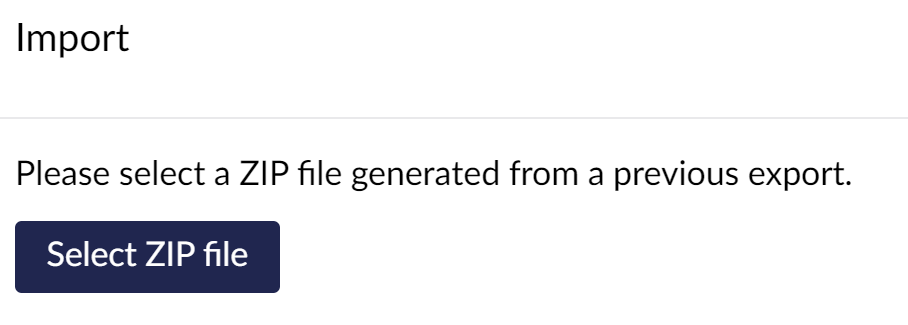
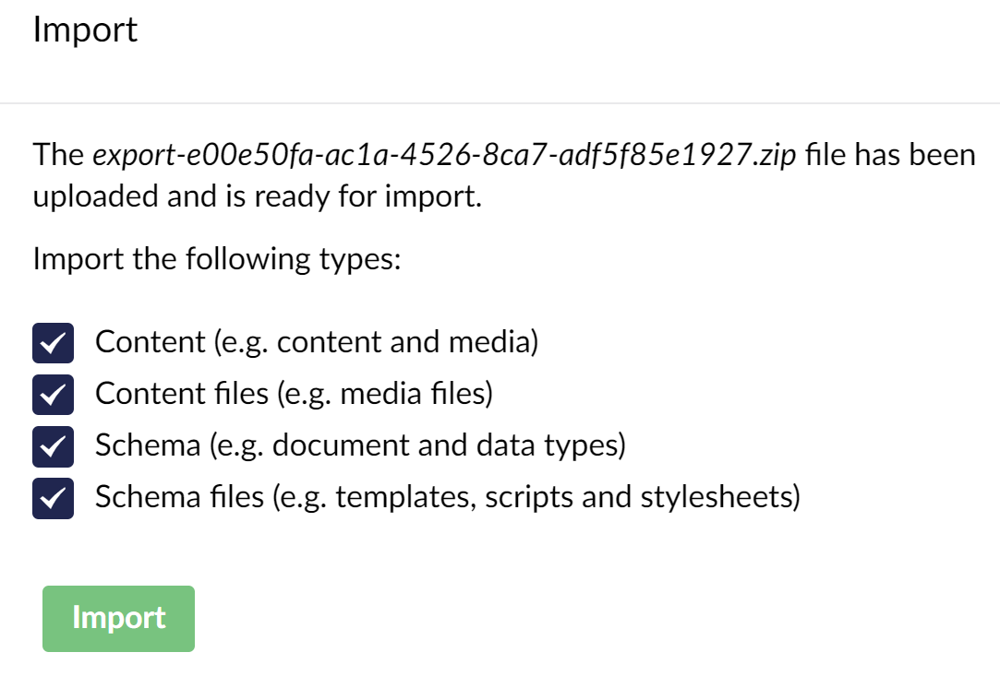

# Import and Export

## What is import and export?

The import and export feature of Umbraco Deploy allows you to transfer content and schema between Umbraco environments. Exports are made from one environment to a `.zip` file. And this file is imported into another environment to update the Umbraco data there.

## When to use import and export

Umbraco Deploy provides two primary workflows for managing different types of Umbraco data:

- Umbraco schema (such as document types and data types) are transferred [as `.uda` files serialized to disk](./deploying-changes.md). They are deployed to refresh the schema information in a destination environment along with code and template updates.
- Umbraco content (such as content and media) are [transferred by editors using backoffice operations](./content-transfer.md).

We recommend using these approaches for day-to-day editorial and developer activities.

Import and export is intended more for larger transfer options, project upgrades, or one-off tasks when setting up new environments.

As import and export is a two-step process, it doesn't require inter-environment communication. This allows us to process much larger batches of information without running into hard limits imposed by Cloud hosting platforms.

We are also able provide hooks to allow for migrations of data types and property data when importing. This should allow you to migrate your Umbraco data from one Umbraco major version to a newer one.

## Exporting content and schema

To export content and schema, you can select either a specific item of content, or a whole tree or workspace.

When exporting, you can choose to include associated media files.  Bear in mind that including media for a large site can lead to a big zip file.  So even with this option, you might want to consider methods options for transferring large amounts of media. For example using direct transfer between Cloud storage accounts or File Transfer Protocol (FTP).

If your account has access to the Settings section, you can also choose to include the schema information and related files as well.

Umbraco Deploy will then serialize all the selected items to individual files, archive them into a zip file and make that available for download.  You can download the file using the _Download_ button.

After download you should also delete the archive file from the server. You can do this immediately via the _Delete_ button available on the dialog.

If you miss doing this, you can also clean up archive files from the Umbraco Deploy dashboard in the _Settings_ section.

## Importing content and schema

Having previously exported content and schema to a zip file, you can import this into a new environment.

You can upload the file via the browser.

Similar to when exporting, you can choose to import everything from the archive file, or only content, schema or files.

We validate the file before importing.  Schema items that content depends on must either be in the upload itself, or already exist on the target environment with the same details.  If there are any issues that mean the import cannot proceed, it will be reported.  You may also be given warnings for review. You can choose to ignore these and proceed they aren't relevant for the action you are carrying out.

The import then proceeds, processing all the items provided in the zip file.

Once complete or on close of the dialog, the imported file will be deleted from the server. If this is missed, perhaps via a closed browser, you can also delete archive files from the Umbraco Deploy dashboard in the _Settings_ section.

## Migrating whilst importing

As well as importing the content and schema directly, we also provide support for modifying the items as part of the process.

For example, you may have taken an export from an Umbraco 8 site, and are looking to import it into Umbraco 10 or 12.  In this situation, most content and schema will carry over without issue. However, you may have some items that are no longer compatible.  Usually this is due to a property editor - either a built-in Umbraco one or one provided by a package. These may no longer be available in the new version.

Often though there is a similar replacement. Using Deploy's import feature we can transform the exported content for the obsolete property into that used by the new one during the import. The migration to a content set compatible with the new versions can then be completed.

For example, we can migrate from a Nested Content property in Umbraco 8 to a Block List in Umbraco 12.

[insert pic - before and after nested content and block list]

We provide the necessary migration hooks for this to happen, via the following interfaces:

[TBC - technical detail of each interface with a brief description as to what it is for]

We also provide implementations to handle common migrations:

[TBC - technical detail of each class with a brief description as to what it does]

We've also made available base implementations that you can use to build your own migrations. You can use these to migrate between any other obsolete and replacement property editors that you have in your solution:

[TBC - technica details of each class with a brief description as to what it does]

Migrators will only run if you've registered them to, hence you can enable only the ones needed for your solution:

[TBC - code sample]

### A custom migration example - Nested Content to Block List

In order to help writing your own migrations, we share here the source code of an example that ships with Umbraco Deploy. This migration converts Nested Content to Block List:

[TBC - code sample]

Moving forward, other migrators may be built by HQ or the community for property editors found in community packages. We'll make them available for [use](https://www.nuget.org/packages/Umbraco.Deploy.Contrib) and [review](https://github.com/umbraco/Umbraco.Deploy.Contrib) via the `Umbraco.Deploy.Contrib`` package.

### Migrating from Umbraco 7

The import and export feature is available from Deploy 4 (which supports Umbraco 8). It's not been ported back to Umbraco 7, hence you can't trigger an export from there in the same way.

We are still able to use this feature though to help migration from Umbraco 7 to a more recent major version.

We can generate an export zip file in the same format as that used by the content import/export feature. With that we can import it into Umbraco 8 or above.  And apply similar migrations to update obsolete data types and property data into newer equivalents.

This is possible via code - by temporarily applying a composer to an Umbraco 7 solution to generate the export file on start-up.

An example follows:

[TBC - code sample]

