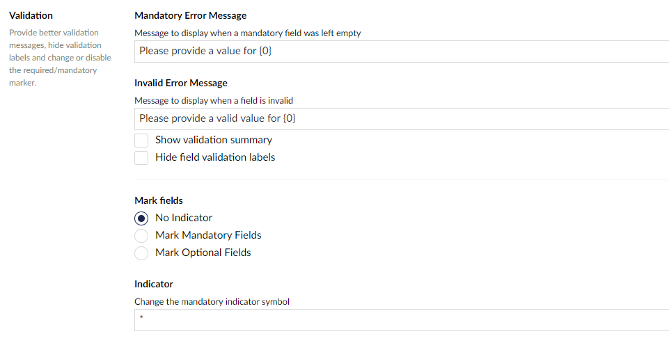

# Form Settings

In this article, you will find information about accessing the Forms Settings and the validations available to customize your Form.

To access the Form Settings:

1. Navigate to the **Forms** section.
2. Open a Form you wish to customize.
3.  Click **Settings** in the top-right corner of the screen.

    

## Settings Options

The following options are available in Forms Settings:

### Store Records

By default, all submitted records are saved in the database. This option allows you to view and export the saved records from the queries overview. If you do not want to store data (due to policies in your organisation), you can uncheck the box.

### Captions

Customize the labels of the **Submit**, **Next**, and **Previous** buttons used in your Form.

### Styling

Set a stylesheet to give your Form custom styling. You have an option to disable the default styling. Enabling the **Disable default stylesheet** option will prevent a default stylesheet to be added to the pages where the Form is placed.

### Validation

Define a message that is displayed when a field is mandatory, when a value is not supplied, or when the value is invalid.

The following Validations are available:

| Validation Type                  | Description                                                                                                                                                                                                                                         |
| -------------------------------- | --------------------------------------------------------------------------------------------------------------------------------------------------------------------------------------------------------------------------------------------------- |
| **Mandatory error message**      | The error message is displayed for a field that is marked as mandatory but a value has not been provided upon submission. This setting can be overwritten on a field level - `{0}` will be replaced with the field caption.                         |
| **Invalid error message**        | The error message is displayed for a field if the value provided is not valid (a regular expression has been setup but the input does not match). This setting can be overwritten on a field level - `{0}` will be replaced with the field caption. |
| **Show validation summary**      | Enable this option if you wish to display a summary of all the error messages on top of the Form.                                                                                                                                                   |
| **Hide field validation labels** | Enable this option if you wish to hide individual field error messages from being displayed.                                                                                                                                                        |
| **Mark fields**                  | You can choose to not mark any fields or only mark mandatory or optional fields.                                                                                                                                                                    |
| **Indicator**                    | Choose which indicator to use when a field has been marked as mandatory. The default indicator is `*`                                                                                                                                               |

### Autocomplete

The autocomplete setting for the overall form can be changed from the default of "None" to "On" or "Off". Setting this explicitly will control how the browser offers automatic prompts to the user when completing the form.

### Moderation

Enabling this feature allows the moderator to manage the approval status of a form. This can be used in a number of scenarios. For example, if the form submission will be publicly shown, you can control which are published.

### Fields displayed

By default, a constant set of fields are displayed when form entries are shown in a list. You will see the first three fields in the form, plus some system information like the record state and the date it was created.

To customize this, turn off the "Display default fields" option and select the ones you wish to display.

### Date retentions

To help protect site visitor privacy, rules can be configured in this section for the automatic deletion of submissions. You can set how long to retain records for each state (submitted or approved).

A background service that carries out the actual removal of records needs to be [enabled in configuration](../../developer/configuration/#scheduledrecorddeletion). If that is not running, a notification will be displayed.

<figure><figcaption>
Form Settings Date Retention
</figcaption></figure>
