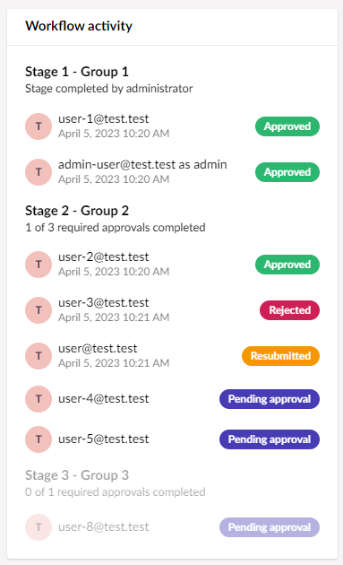
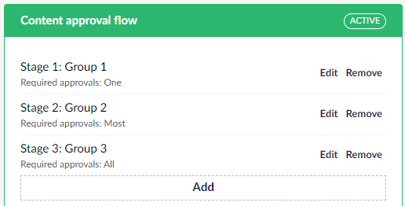

# Approval thresholds


This feature requires a license - learn more about [Workflow's licensing model](https://umbraco.com/products/umbraco-workflow)


Workflow's default behaviour requires one member of an approval group to approve a pending task to advance it through the workflow. 

The approval thresholds feature introduces configuration options to set the required number of approvals for a given workflow stage.

The threshold options are:

 - **One**: pending task requires approval from any member of the assigned approval group. This is the default behaviour for all installations (trial and licensed)
 - **Most**: pending task requires an absolute majority of group members. For example, a group with three members requires two approvals, a group with four members requires three approvals, and a group with six members requires four approvals.
 - **All**: pending task requires approval from all group members.

The workflow detail UI displays the following:

 - the status of the current task
 - approval status for members of the current group
 - progress towards meeting the threshold for the current approval stage
 - future tasks and the assigned group and its users

Approving a task as an administrator immediately satisfies the approval threshold for the task, and will advance to the next workflow stage.

When a task is rejected in a workflow stage where the approval threshold is Most or All, existing approvals can be managed via configuration:
 - Existing approvals can be reset, resetting progress towards the approval threshold. In this case all users in the approval group will be able to approve the resubmitted content.
 - Existing approvals can be kept. In this case users in the approval group who have already approved the task will not be able to approve the resubmitted content. 

## Related settings and configuration

Approval thresholds are managed via settings in the Workflow section or in `app-settings.json`. Node-specific thresholds are set directly on the workflow configuration in the Workflow content app.

### Settings
The settings below can be set from the Backoffice or via settings customisation in app-settings.json (refer to [Settings customisation](https://docs.umbraco.com/umbraco-workflow/getting-started/configuration#settingscustomization) for implementation instructions).

 - **Approval threshold**: sets the global approval threshold to One, Most or All.
 - **Rejection resets approvals**: when true, and the approval threshold is Most or All, rejecting a task resets the previous approvals for the workflow stage.
 - **Allow configuring approval threshold**: when true, enables setting the approval threshold for any stage of a workflow (on a content node or Document Type).

### Configuration
The approval threshold for an individual workflow stage can be set using the control below the stage name. Setting the stage threshold requires the **Allow configuring approval threshold** setting to be `true`.

