# Content Templates

Content Templates allows a content editor to create a blueprint for new content nodes based on an existing node.


Learn how to use the Content Templates in Umbraco.


## Create - Method 1


Before following this method you should have some [content](../data/defining-content.md) created beforehand.


Select a **Content node** from the **Content** menu:

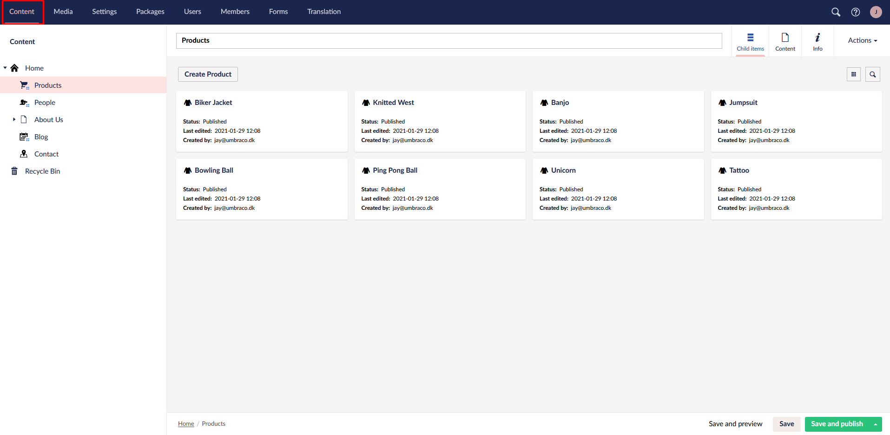

Right-click the Content node and select the **Create Content Template** option. Alternatively, select the **Actions** dropdown of the content node and select the **Create Content Template** option:

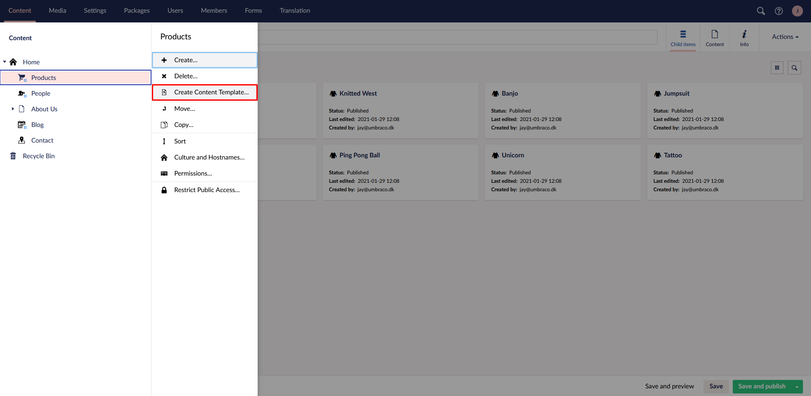

Give your content template a **Name**:

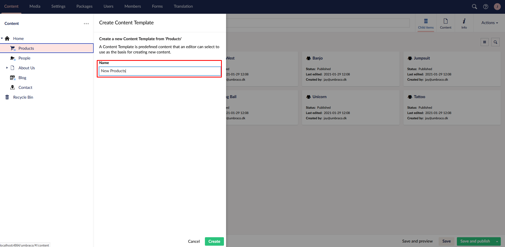

Click the **Create** button and if the creation was successful, you will see a success notification:

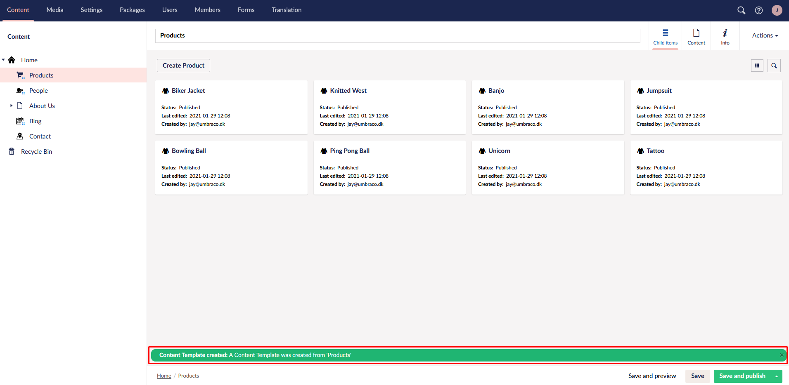

The new content template will be created in **Content Templates** node of the **Settings** tree:

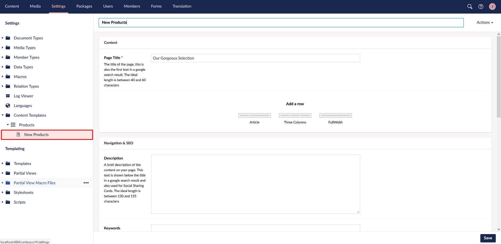


Refresh your browser, if you do not see the new content template in the **Content Templates** folder.


## Create - Method 2

Click on the **Settings** menu:

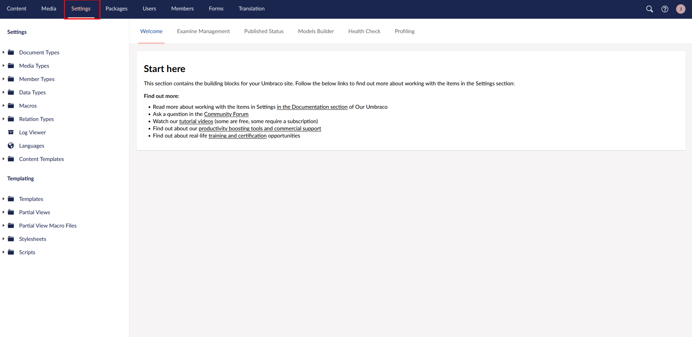

Right-click on the **Content Templates** tree and select the **Create** menu item:

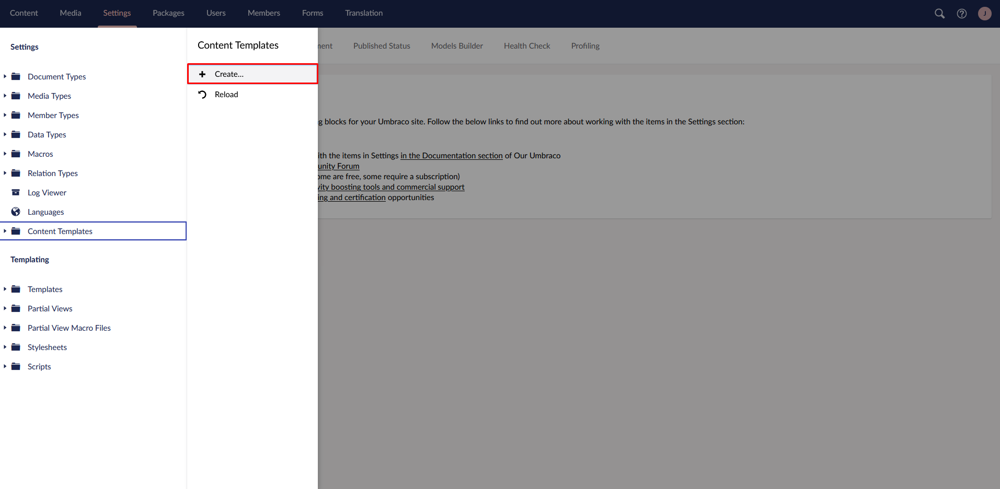

Select the Document Type you want to create a content template for:

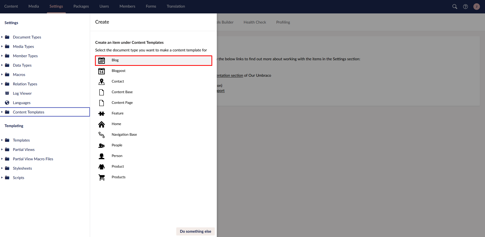

Give your content template a **Name** and click the **Save** button:

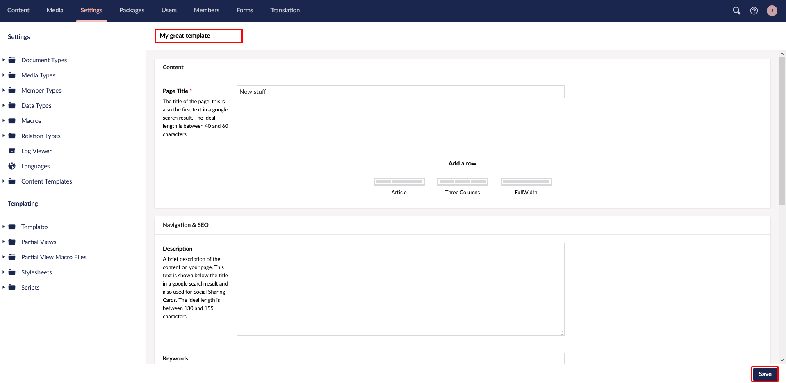

The new content template will be created in **Content Templates** folder of the **Settings** tree:

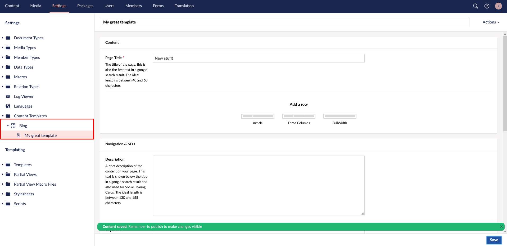

## Edit

To edit an existing content template, select a content template from the **Content Templates** folder of the **Settings** tree. When you have finished editing click the **Save** button:

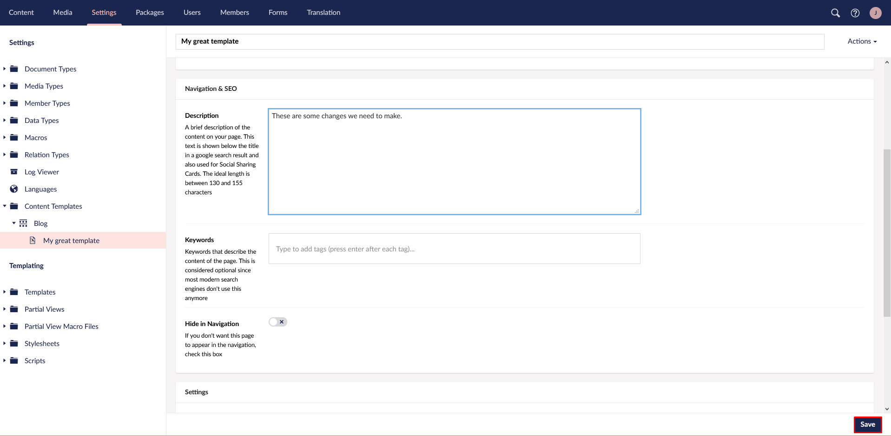

## Use

Once you have created a content template, you can use the template to create new content nodes. To use a content template, right-click the **Content** tree and select **Create**:

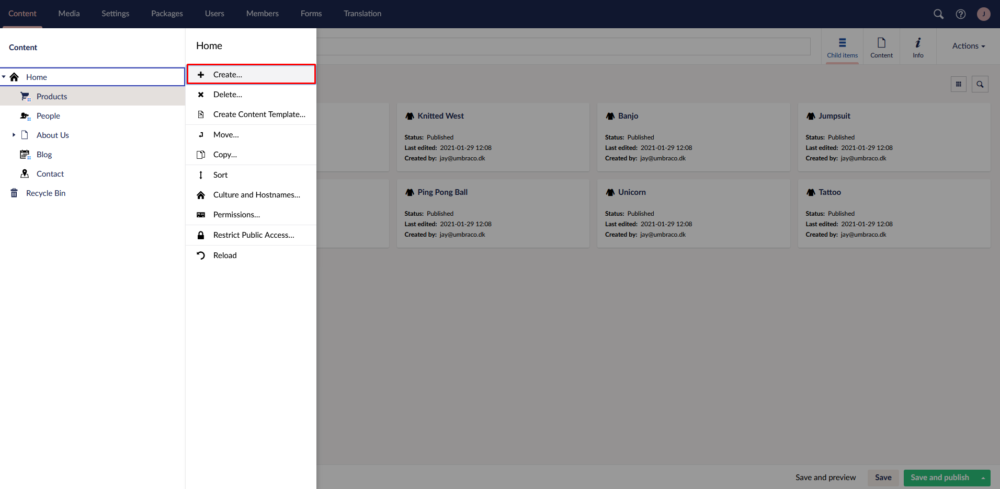

When you click on a Document Type that has a content template you will see to options:

* Create a new node based on a content template
* Create a blank one

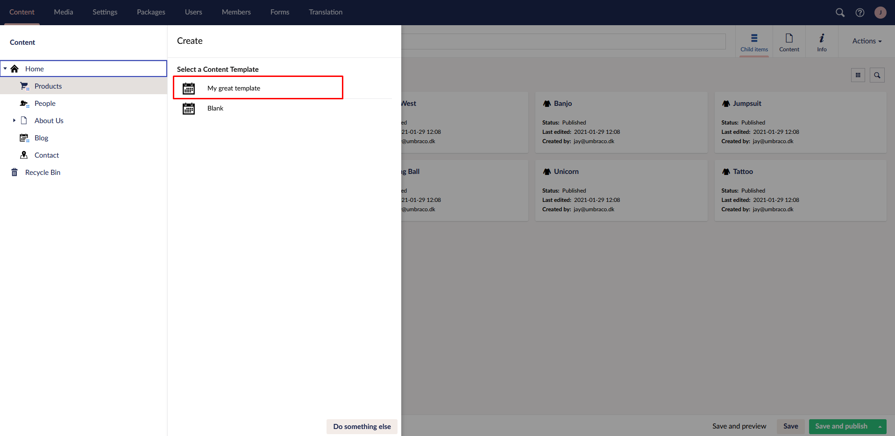
