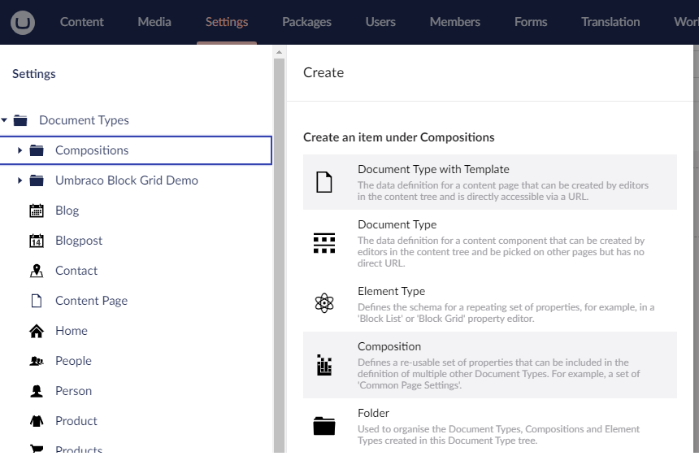
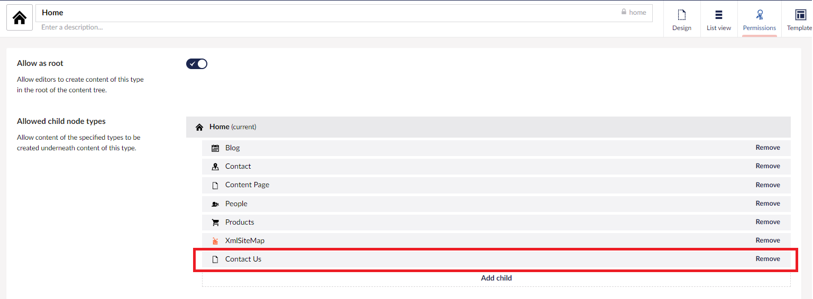
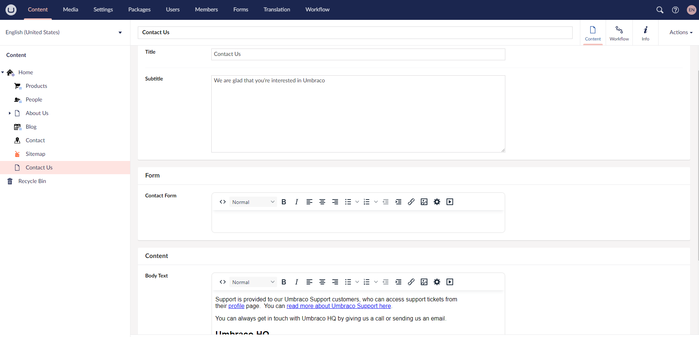
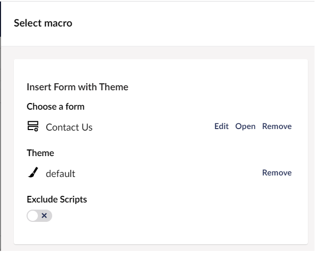

# Creating a Contact Us Form

In this article, we'll look at creating a Contact Us Form.

## Video Tutorial


How to use Language Variants in Umbraco


## Creating a Composition

To create a Composition, follow these steps:

1. Go to **Settings**.
2. Expand the **Document Types** folder in the **Settings** tree.
3. Select **...** next to the **Compositions** folder.
4. Click **Composition**.  

    
5. Enter a **Name** for the **Composition**. Let's call it _Title Box_.
6. Add the following fields with the respective specifications:

    | Group     | Field Name | Alias    | Data Type  |
    |-----------|------------|----------|------------|
    | Title Box | Title      | title    | Textstring |
    | Title Box | Subtitle   | subtitle | Textarea   |

    
7. Click **Save**.

## Creating a Contact Us Document Type

To create a **Contact Us** Document Type, follow these steps:

1. Go to **Settings**.
2. Select **...** next to the **Document Types** folder in the **Settings** tree.
3. Click **Document Type with Template**.  
4. Enter a **Name** for the **Document Type**. Let's call it _Contact Us_.
5. Click **Compositions** in the top-right corner.
6. Select the **Title Box** Composition.
7. Click **Submit**.
8. Add the following fields with the respective specifications:

    | Group   | Field Name   | Alias       | Data Type       |
    |---------|--------------|-------------|-----------------|
    | Form    | Contact Form | contactForm | Richtext Editor |
    | Content | Body Text    | bodyText    | Richtext Editor |

    
9. Click **Save**.

### Updating the Document Type Permissions

To update the **Contact Us** Document Type permissions, follow these steps:

1. Navigate to the **Home Page** Document Type.
2. Go to the **Permissions** tab.
3. Select **Add child** in the **Allowed child node types**.
4. Select **Contact Us** page.

    
5. Click **Submit**.
6. Click **Save**.

## Creating the Content Node

To add a content node, follow these steps:

1. Go to **Content**.
2. Select **...** next to the **Home Page**.
3. Select **Contact Us** page.
4. Enter the name for the content node. We are going to call it _Contact Us_.
5. Enter the **Title**, **Subtitle**, and **Body Text** values.

    
6. Click **Save and Publish**.

## Creating the Contact Us Form

To create a Form, follow these steps:

1. Navigate to the **Forms** section.
2. Click **...** next to the Forms folder.
3. Select **Empty Form**.
4. Enter the **Name** for the Form. Let's call it _Contact Us_.
5. By default, there is a **data consent** field added to all new forms.
6. _[Optional]_ Enter the **Group Name**. Let's call it _Data Consent_.
7. Click **Add new group**. Let's call it _Information_.
8. Click the **Add Question** button to add a new field.
9. Enter the following details:

    | Field Name         | Value                |
    | ------------------ | -------------------- |
    | Enter question     | Name                 |
    | Alias              | fullName             |
    | Choose answer type | Short answer         |
    | Field Type         | text                 |
    | Mandatory          | Yes                  |

10. Click **Submit**.
11. Click the **Add Question** button to add the next question.
12. Enter the following details:

    | Field Name         | Value                |
    | ------------------ | -------------------- |
    | Enter question     | Company Name         |
    | Choose answer type | Short answer         |

13. Click **Submit**.
14. Click the **Add Question** button to add the next question.
15. Enter the following details:

    | Field Name         | Value                      |
    |--------------------|----------------------------|
    | Enter question     | How should we contact you? |
    | Choose answer type | Single choice              |
    | Prevalues Items    | phone, email               |
    | Mandatory          | Yes                        |

16. Click **Submit**.
17. Click the **Add Question** button to add the next question.
18. Enter the following details:

    | Field Name         | Value                      |
    |--------------------|----------------------------|
    | Enter question     | Enter your phone number    |
    | Choose answer type | Short answer               |
    | Field Type         | tel                        |
    | Validation         | Validate as a number       |

19. Select **Enable Conditions**.
20. Click **Add Condition**.
21. Select **How should we contact you from the dropwdown**.
22. Enter **phone** in the value field.
23. Click **Submit**.
24. Click the **Add Question** button to add the next question.
25. Enter the following details:

    | Field Name         | Value                        |
    |--------------------|------------------------------|
    | Enter question     | Enter your email address     |
    | Choose answer type | Short answer                 |
    | Field Type         | email                        |
    | Validation         | Validate as an email address |

26. Select **Enable Conditions**.
27. Click **Add Condition**.
28. Select **How should we contact you from the dropwdown**.
29. Enter **email** in the value field.
30. Click **Submit**.
31. Click the **Add Question** button to add the next question.
32. Enter the following details:

    | Field Name         | Value                                                    |
    |--------------------|----------------------------------------------------------|
    | Enter question     | What is your role?                                       |
    | Choose answer type | Dropdown                                                 |
    | Prevalues Items    | manager, developer, tester, writer, marketing specialist |

33. Click **Submit**.
34. Click the **Add Question** button to add the next question.
35. Enter the following details:

    | Field Name                     | Value                    |
    |--------------------------------|--------------------------|
    | Enter question                 | Attachments (if any)     |
    | Choose answer type             | File upload              |
    | Predefined allowed file types  | pdf, png, jpg, gif, txt  |

36. Click **Submit**.
37. Click the **Add Question** button to add the next question.
38. Enter the following details:

    | Field Name         | Value               |
    |--------------------|---------------------|
    | Enter question     | Are you a Robot?    |
    | Choose answer type | reCAPTCHAv2         |
    | Theme              | light               |
    | Size               | normal              |
    | Mandatory          | Yes                 |

39. Click **Submit**.

    
40. Click **Reorder**.
41. Drag the **Data consent** group below the **Information** group.
42. Click **I am done reordering**.
43. Click **Save**.

## Configure Workflow

To configure the form workflow, follow these steps:

1. Click on **Submit message/ Go to page**.
2. Enter a customized message in the **Message on Submit** field.
3. Click **Submit**.
4. Click on **Send template email to xxx@xx.dk**.
5. Select **Example-Template.cshtml** in the **Email template** field.
6. Enable **Attachments**.
7. Enter an email address in the **Sender Email** field.
8. Click **Submit**.
9. Click **Save**.

## Configure Form Settings

To configure the form settings, follow these steps:

1. Select **Yes, keep submitted records in a database so they can be viewed and exported later** in the **Store Records** field.
2. Enter the label for **Submit**, **Next**, and **Previous** buttons in the **Captions** field.
3. Provide a stylesheet class in the **Styling** field.
4. Enter the **Mandatory Error Message** and **Invalid Error Message** in the Validation field.
5. Select **Mark Mandatory fields** in the **Mark fields**.
6. Select the **Autocomplete** attribute value if you wish to use the autocompletion behavior.
7. **Enable post moderation** if you wish the form submissions should be verified.
8. Enable **display default fields** to select which fields are displayed in the list of form entries.
9. Enable **Retain submitted records forever** and/or **Retain approved records forever** if you wish to retain data.
10. Click **Save**.

## Adding the Contact Us Form in the Content Node

To add the Contact Us Form in the Content Node, follow these steps:

1. Navigate to the **Content** section.
2. Go to the **Contact Us** Page.
3. Select **Insert macro** in the **Contact Form** field.
4. Select **Insert Form with Theme**.
5. Select **Add** in the **Choose a form** field.
6. Select the **Contact Us** Form.
7. Select **Add** in the **Theme** field.
8. Select the **default** theme.

    
9. Click **Submit**.
10. Click on **Save and Publish**.

## Configure the reCAPTCHA value

To configure the reCAPTCHA value, see the [Configuration](../../developer/configuration/README.md#recaptcha-v2-field-type-configuration) article.

## Configure Simple Mail Transfer Protocol (SMTP)

To configure the SMTP settings, see the [Global Settings](https://docs.umbraco.com/umbraco-cms/reference/configuration/globalsettings#smtp-settings) article.

## Rendering the Contact Us Form

To render the Contact us form, follow these steps:

1. Navigate to the **Settings** section.
2. Go to the **Contact Us** template in the **Templates** folder.
3. Click **Insert** and select **Value**.
4. Select **contactForm** from the **Choose field** dropdown.
5. Click **Submit**.
6. Similarly, insert the **bodyText** value.
7. Click **Submit**.
8. Click **Save**.

## View the Form on the Frontend

1. Navigate to the **Content** section.
2. Go to the **Contact Us** Page.
3. Go to the **Info** tab.
4. Click on the Published link in the **Links** section.

And you now have a full-fledged Contact Us Form ready to be used in your site.
