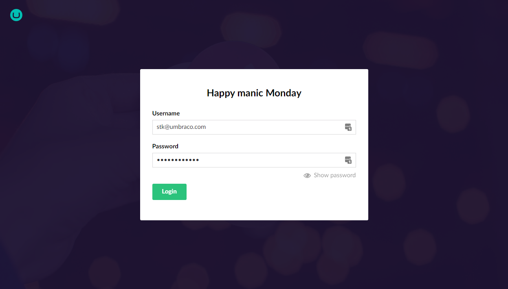

# Backoffice

In this article you can learn more about the common terms and concepts that are used throughout the Umbraco backoffice.

## [Login screen](login.md)

When you go to the backoffice for the first time, you're presented with the login screen.

[Read more about the login screen](login.md).

## [Section](sections.md)

A section in Umbraco is where you do specific tasks related to that section. For example Content, Settings and Users. You can navigate between the different sections of the backoffice by clicking the corresponding icon in the section menu.

_The **Section menu** is the horizontal menu located on the top of the backoffice._

<figure><figcaption></figcaption></figure>

[Read more about the section menu](sections.md).

## [Tree](../../extending/section-trees/)

A tree is a hierarchical list of items related (and usually restricted) to a specific concept, like for example content or media.

You can expand trees by clicking the down arrow  to the left of the node or by double-clicking the node.

<figure><figcaption></figcaption></figure>

[Read more about the Tree](../../extending/section-trees/)

## Node

A node is an item in a tree. The images and folders in the Media section are shown as nodes in the Media tree, pages and content in the Content tree, and so forth.

## [Dashboards](../../extending/dashboards.md)

A dashboard is the main view you are presented with when entering a section within the backoffice. It can be used to show valuable information to the users of the system.

_Default dashboard in the content section_

<figure><figcaption></figcaption></figure>

[Read more about Dashboards](../../extending/dashboards.md)

## Editor

An editor is what you use to edit different items within the backoffice. There are editors specific to editing stylesheets, there are editors for editing Macros, and so forth.

## [Content](../data/defining-content.md)

Content is what you find in the Content section. Each item in the tree is called a **content node**. Each content node in the content tree consists of different fields, and each of them is defined by a Document Type.

[Read more about Content](../data/defining-content.md)

## Document Type

Document Types define the types of content nodes that backoffice users can create in the content tree. Each Document Type contains different properties. Each property has a specific Data Type for example text or number.

### Properties

Every Document Type has properties. These are the fields that the content editor is allowed to edit for the content node.

### [Data Type](../data/data-types/)

Each Document Type property has a Data Type that defines the type of input of that property. Data Types reference a Property Editor and are configured in the Umbraco backoffice in the Settings section. A Data Type can be something basic (text string, number, true/false) or more complex (multi-node tree picker, image cropper, etc).

[Read more about Data Types](../data/data-types/)

### [Property Editors](property-editors/)

A property editor is a view used by Data Types to insert content into Umbraco. An example of a property editor is the _Textarea_. It's possible to have many Textarea Data Types with different settings that all use the Textarea property editor.

[Read more about Property Editors](property-editors/)

## [Media](../data/creating-media/)

Media items are used to store assets like images and video within the Media section and can be referenced from your content.

[Read more about Media](../data/creating-media/)

### Media Types

Media Types are very similar to Document Types in Umbraco, except they are specifically for media items in the Media section.

Umbraco comes with 3 default Media Types: **File**, **Folder,** and **Image**.

## [Members](../data/members.md)

A member is someone who has access to signup, register, and login into your **public website** and is not to be confused with Users.

[Read more about Members](../data/members.md)

### Member Types

Similar to a Document Type and a Media Type. You are able to define custom properties to store on a member such as Twitter username or website URL.

## [Templates](../design/templates/)

A Template is where you define the HTML markup of your website and also where you output the data from your content nodes.

[Read more about Templates](../design/templates/)

## Packages

A package is the Umbraco term for an add-on or plugin used to extend the core functionalities in Umbraco. The packages can be found on the [Umbraco Marketplace](https://marketplace.umbraco.com/), and the can also be browsed directly in the backoffice of the Umbraco CMS.

## [Macros](../../reference/templating/macros/)

A macro is a reusable piece of functionality that you can reuse throughout your site. Macros can be configured with parameters and used on content nodes that have a Rich Text Editor, a Grid editor, or a Macro Picker property. You can define what macros are available for your editors to use. When an editor inserts a macro it will prompt them to fill out any of the defined parameters for the macro.

[Read more about Macros](../../reference/templating/macros/)

### [Macro Parameter Editor](../../extending/macro-parameter-editors.md)

A parameter editor defines the usage of a property editor for use as a parameter for Macros.

[Read more about the Macro Parameter Editor](../../extending/macro-parameter-editors.md)

## Users

A user is someone who has access to the **Umbraco backoffice** and is not to be confused with Members. When Umbraco has been installed a user will automatically be generated with the login (email) and password entered during installation. Users can be created, edited, and managed in the User section.

## [Content Templates](content-templates.md)

Content Templates provide a blueprint for content nodes based on an existing node.
