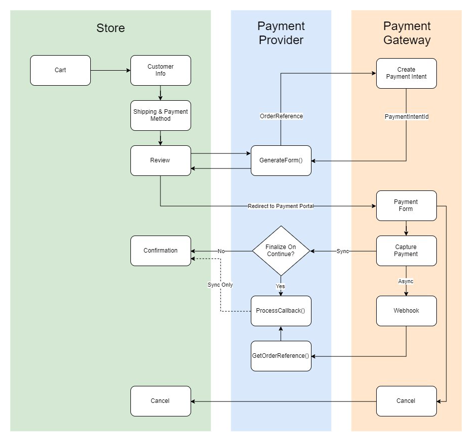
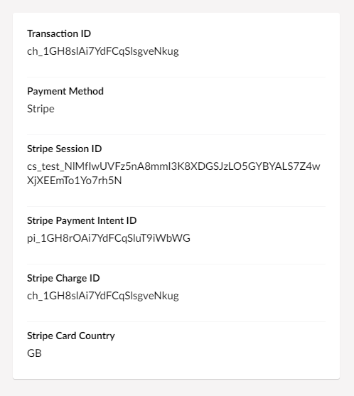

Payment Providers are how Vendr is able to accept multiple different methods of payment on a Site. Their job is to provide a standard interface between 3rd party payment gateways and Vendr itself in order to allow the passing of information between the two platforms.

How these integrations work is often different per payment gateway, however Vendr Payment Providers provide a flexible interface that should be able to work with most payment gateways.

## Example Payment Provider

An example of a bare-bones Payment Provider would look something like this:

````csharp
[PaymentProvider("my-payment-provider-alias", "My Payment Provider Name", "My Payment Provider Description")]
public class MyPaymentProvider :  AsyncPaymentProviderBase<MyPaymentProviderSettings>
{
    public MyPaymentProvider(VendrContext vendr)
        : base(vendr)
    { }

    ...
}

public class MyPaymentProviderSettings
{
    [PaymentProviderSetting(Name = "Continue URL", 
        Description = "The URL to continue to after this provider has done processing. eg: /continue/",
        SortOrder = 100)]
    public string ContinueUrl { get; set; }

    ...
}

````

All Payment Providers inherit from a base class `AsyncPaymentProviderBase<TSettings>` where `TSettings` is the Type of a POCO model class representing the Payment Providers settings. The class must be decorated with `PaymentProviderAttribute` which defines the Payment Providers `alias`, `name` and `description`, and can also specify an `icon` to be displayed in the Vendr back-office.

The settings class itself consists of a series of properties, each decorated with a `PaymentProviderSettingAttribute` defining a name, description, and possible angular editor view file which will all be used to dynamically build an editor interface for the given settings in the back-office.

## Payment Provider Responsibilities 

There are two main responsibilities of a Payment Provider, and those are:

* **Payment Capture** - Capturing the initial Order payment and finalizing the Order.
* **Payment Management** - Managing a payment post Order finalization, such as being able to Capture authorized payments or Refunding captured payments.

### Payment Capture

The Payment Capture workflow can be the hardest part of a Payment Provider, often due to the fact that no two payment gateways are alike, and so it can be difficult to figure out how best to implement the gateway into the provider format.

Generally there are three methods within a Payment Provider that you may need to implement, and each one has a specific responsibility.

* **GenerateForm \*** - The `GenerateForm` method is responsible for generating a HTML form which will redirect the customer to the given payment gateways payment form. In this method you may need to communicate with the payment gateway in order to initialize a payment, letting the payment gateway know how much to capture. This often results in some kind of code or redirect URL being returned which will need to be embedded in to the generated form. The generated form is then usually displayed on a checkout **Review** page, the last page before payment is captured, and will have an implementer defined **Continue to Payment** button to submit the form and redirect the customer to the gateway.

* **ProcessCallback \*** - The `ProcessCallback` method is responsible for handling the response coming back from the payment gateway and processing whether the payment was successful or not. This can sometimes occur *synchronously*, if the payment gateway sends information back as part of the confirmation page redirect, or can occur *asynchronously*, if the payment gateway sends the information back via an out of band webhook request.

* **GetOrderReference** - The `GetOrderReference` method is responsible for extracting an order reference number from a request when the payment gateway uses an asynchronous webhook to finalize an Order **AND** it uses a global webhook URL strategy for all notifications rather than a notification URL per transaction. Where a webhook URL can be passed per transaction, then Vendr provides you with a unique callback URL you can register with the gateway that already identifies the order reference as part of the URL parameters, making implementing this method unnecessary. 

*\* denotes a required method implementation*.

What follows is a generalized diagram in order to help in visualizing when each of these methods are called withing a regular checkout flow.



### Payment Management

In addition to the initial payment capture flow, Payment Providers can also be set up to manage the payment post checkout, such as being able to Capture an Authorized transaction, or Refund a Captured transaction.

These features are optional, so are not required for Payment Provider developers to implement, however they do provide a much nicer user experience as it allows the store owner to manage payments directly in the back-office rather than having to log into the payment gateway's portal should they need to perform these types of actions.

The implementable management methods are:

* **FetchPaymentStatus** - The `FetchPaymentStatus` method communicates with the 3rd party payment gateway in order to fetch the current status of the given transaction.

* **CapturePayment** - The `CapturePayment` method communicates with the 3rd party payment gateway to capture a previously authorized payment associated with the given transaction.

* **CancelPayment** - The `CancelPayment` method communicates with the 3rd party payment gateway to cancel a previously authorized payment associated with the given transaction.

* **RefundPayment** - The `RefundPayment` method communicates with the 3rd party payment gateway to refund a previously captured payment associated with the given transaction.

For each implemented method above, developers should also implement a corresponding boolean property returning a `true` value to let Vendr know that the given feature is supported by the Payment Provider.

* **CanFetchPaymentStatus**
* **CanCapturePayments**
* **CanCancelPayments**
* **CanRefundPayments**

## Payment Provider Meta Data

For all implemented methods of a Payment Provider, all method return types support the returning off additional Meta Data. This is to allow Payment Providers to capture and store relevant information that aid the provider in doing it's job, or for storing useful reference information to display for the retailer.

Any returned Meta Data from a Payment Provider method will be stored against the Order in it's [Properties](../properties/) collection. Should you need to retrieve these values from within some other area of the Payment Provider, you can use the passed in Orders Properties collection to do so.

<message-box type="info" heading="Top Tip">

As Meta Data is stored in an Orders Properties collection, it is recommended that you prefix your Meta Data keys with the Payment Providers alias in order to prevent possible conflicts.

</message-box>

### Meta Data Definitions

Where the Meta Data that is returned could be a useful reference for the retailer, the Payment Provider can also expose a `TransactionMetaDataDefinitions` property consisting of a list of `TransactionMetaDataDefinition` values that each define the `alias`, `name` and optional `description` of a Meta Data entry that Vendr will use to display that information in the back-office.

````csharp
public override IEnumerable<TransactionMetaDataDefinition> TransactionMetaDataDefinitions => new[]{
    new TransactionMetaDataDefinition("stripeSessionId", "Stripe Session ID"),
    new TransactionMetaDataDefinition("stripePaymentIntentId", "Stripe Payment Intent ID"),
    new TransactionMetaDataDefinition("stripeChargeId", "Stripe Charge ID"),
    new TransactionMetaDataDefinition("stripeCardCountry", "Stripe Card Country")
};
````


