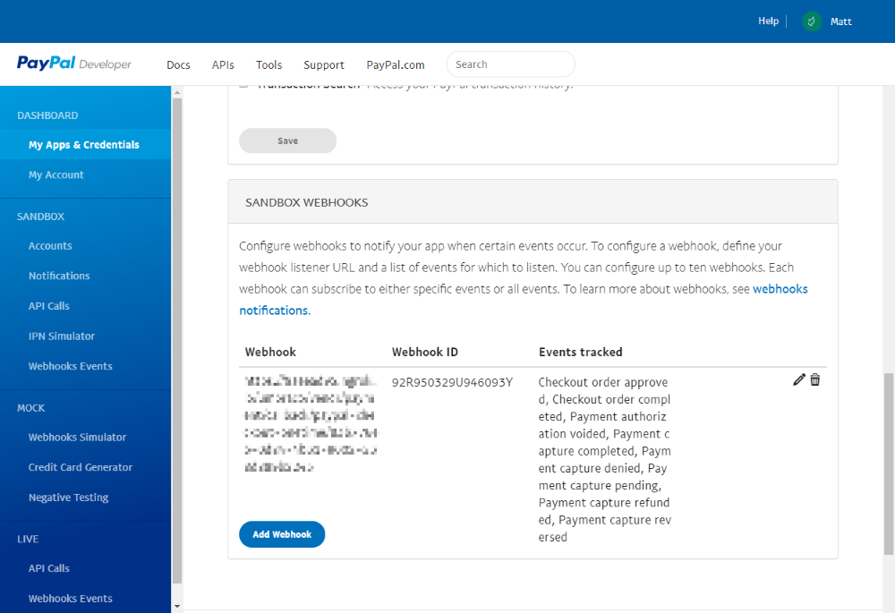

# Configure PayPal

## Step 1: Sign up & Sign In

To use the PayPal provider you will need to sign up for a Business PayPal account. If you haven't created one follow these steps:

1. Head over to the [PayPal site](https://www.paypal.com).
2. Click the **Sign-Up** button in the top corner to create an account.
3. Choose **Business Account** as the account type.


### Sandbox accounts

If you wish to test your system before going live, you need to sign up for a set of Sandbox accounts.

1. Sign in to a valid PayPal account - any account will do.
2. Follow this link: [https://developer.paypal.com/developer/accounts/](https://developer.paypal.com/developer/accounts/).


From here you can view and modify any existing Sandbox accounts you have.

3. Select **Create Account** to create both a business and a personal set of accounts.


4. Locate the **Managed Accounts** column.
5. Select **View/Edit account** for each account.
6. Note down **Email-ID** and **Password**.


## Create a PayPal App

In order for Umbraco Vendr to perform actions in your PayPal account on your behalf, we need to create a PayPal App. In fact, we'll need to create two: one for the Sandbox account and one for our Live account.

1. Access the [PayPal Developer Portal](https://developer.paypal.com/developer/applications/).


2. Create the two apps by toggling the **Sandbox\Live** toggle buttons.
3. Clicking the **Create App** button to create an App for each environment.
4. Give your app a name, and choose the **Sandbox Business Account** to associate the App with the Sandbox App.
5. Click the **Create App** button to create the App.


YOU ARE HERE!

From the App details screen, note down the **Client ID** then click the **Show** link below the **Secret** heading, and note down the **Secret** displayed.


#### Webhooks

On this same screen, you will then want to scroll down to the **Webhooks** section and click the **Add Webhook** button to create a new Webhook.


For the webhook, you'll want to provide the URL where the webhook notifications should be sent, which is a Vendr specific URL as follows (replacing the parameters in curly brackets with the corresponding values taken from your store):

```bash
https://{store_domain}/umbraco/vendr/payment/callback/paypal-checkout-onetime/{payment_method_id}/
```

You'll also want to select the **Event Types** to be notified of, for which you'll want to check the following options by checking the appropriate checkboxes next to those options and then clicking the **Save** button at the bottom.

* Checkout order approved
* Checkout order completed
* Payment authorization voided
* Payment capture completed
* Payment capture denied
* Payment capture pending
* Payment capture refunded
* Payment capture reversed


Once created, in the webhooks list, be sure to take a not of the **Webhook ID** of the webhook as we'll need this to verify webhook notifications later.



As previously mentioned, you will need to create an App and webhook configuration for both Sandbox and Live environments. For the Live environment, this must be setup under the account that will be accepting the payments.
