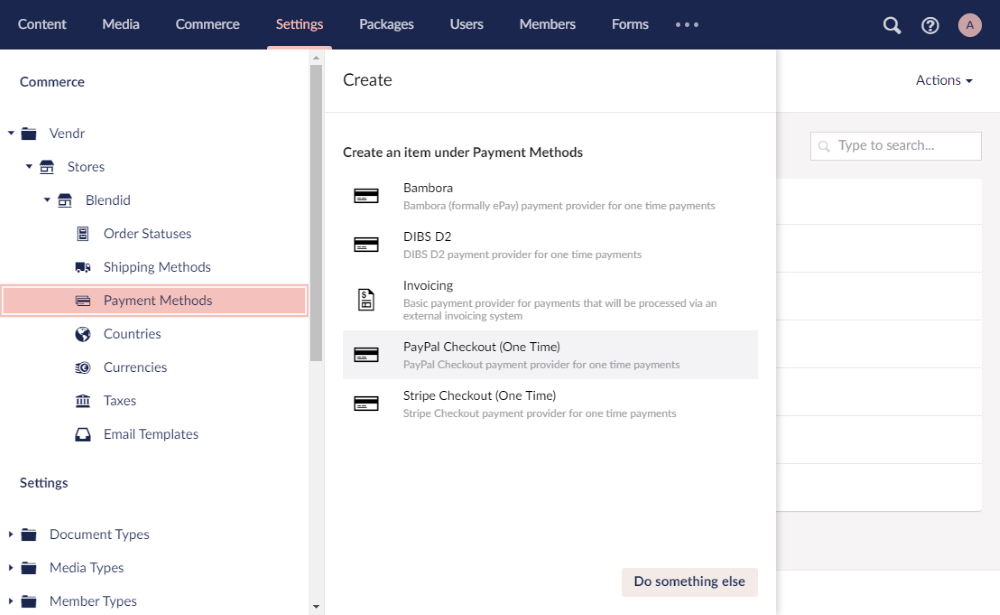
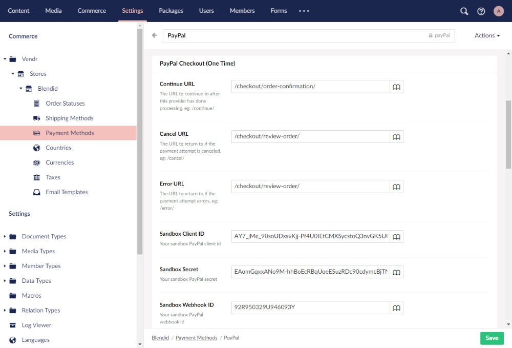

## Create Payment Method

In the Umbraco backoffice, in the **Settings > Vendr > Stores > {Store Name} > Payment Methods** section, click the **Create Payment Method** button to create a new payment method, choosing **PayPal Checkout (One Time)** from the list of available payment providers.

## Configure Payment Provider Settings

In the payment method editor, configure the standard payment method settings as required, then configure the PayPal payment provider settings as follows:

| Name | Description |
| ---- | ----------- |
| Continue URL | The URL of the page to navigate to after payment is successful - e.g. `/confirmation/` |
| Cancel URL | The URL of the page to navigate to if the customer cancels the payment - e.g. `/cart/` |
| Error URL | The URL of the page to navigate to if there is an error with the payment - e.g. `/error/` |
| Sandbox Client ID | The Sandbox PayPal App Client ID |
| Sandbox Secret | The Sandbox PayPal App Secret |
| Sandbox Webhook ID | The Sandbox PayPal App Webhook ID |
| Live Client ID | The Live PayPal App Client ID |
| Live Secret | The Live PayPal App Secret |
| Live Webhook ID | The Live PayPal App Webhook ID |
| Capture | Toggle indicating whether to immediately capture the payment, or whether to authorize the payment for later (manual) capturing |
| Sandbox Mode | Toggle indicating whether this provider should run in Sandbox mode or Live |

An addition to these core settings, there are also a number of optional advanced settings you can configure as follows:

| Name | Description |
| ---- | ----------- |
| Brand Name | A Brand Name to display in the PayPal Checkout screen. |

