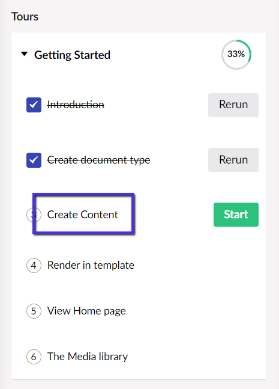
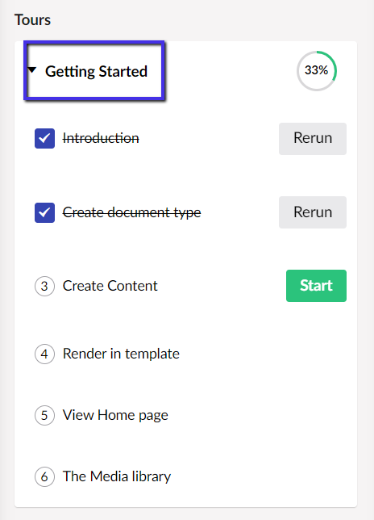
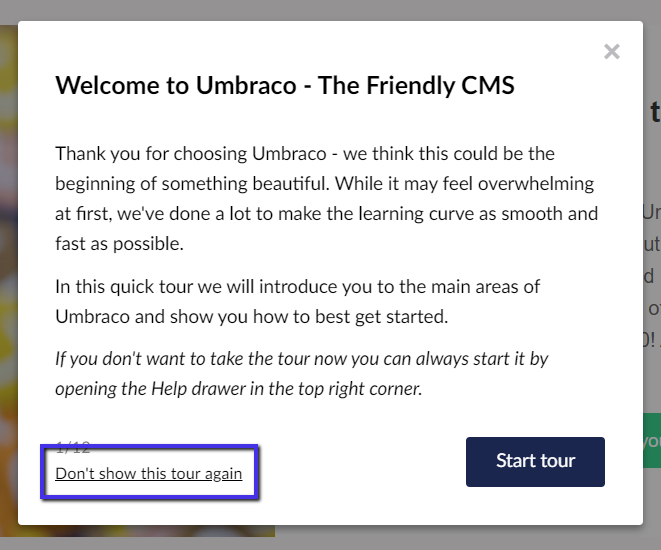
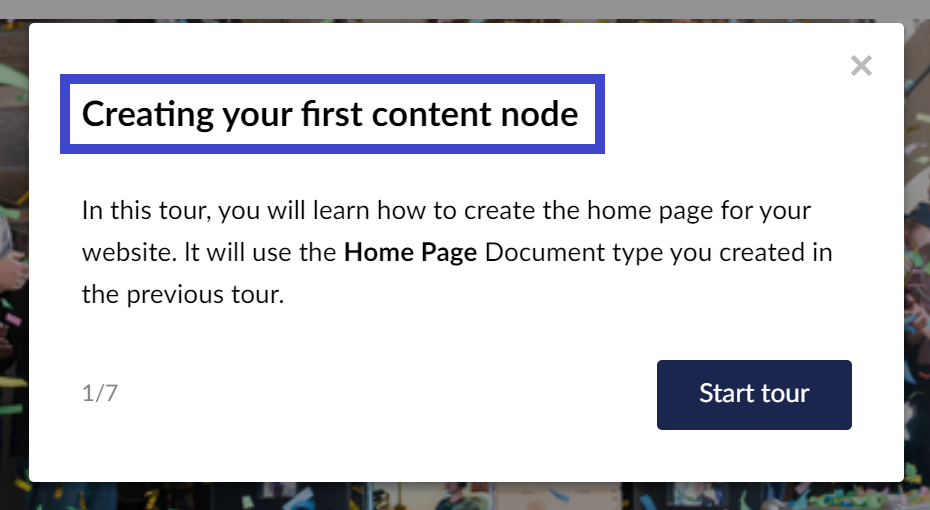
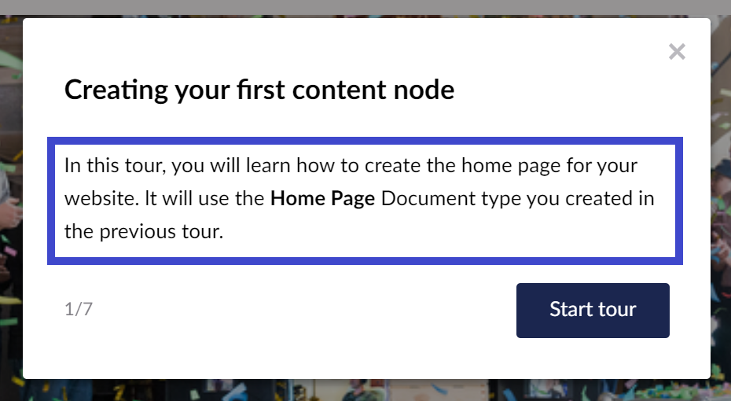
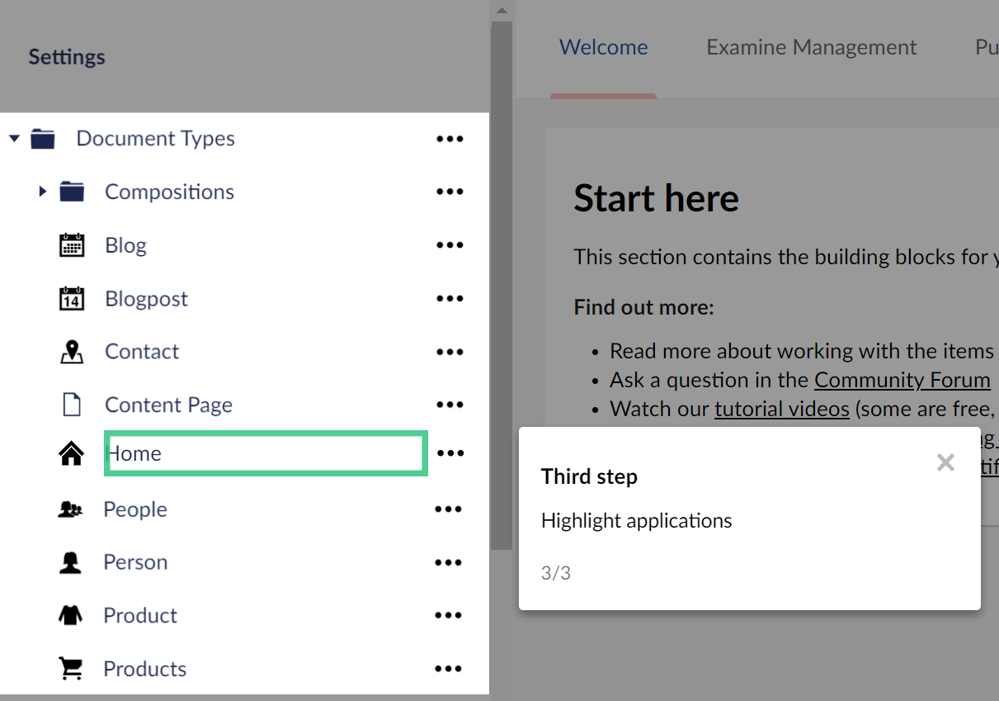

# Backoffice Tours

Backoffice Tours are a way to create helpful guides for how to work in the Umbraco backoffice.

They are managed in a JSON format and stored in files on disk. The filenames should end with the `.json` extension.

## Tour File Locations

The tour functionality will load information from multiple locations.

*   **Core tours**

    The tour that ship with Umbraco are embedded into the CMS assemblies.
*   **Custom tours**

    Custom tours need to be added as custom plugin/package. The custom json tour file needs to be added in `/App_Plugins/<YourTourPlugin>/backoffice/tours`. The custom tours can be added independently, or [as part of a plugin/package](packages/creating-a-package.md).

## The JSON Format

A tour file contains an array of tour configuration JSON objects. It's possible to have multiple, (un)related tours in one file.

```json
[
    {
        // tour configuration object
    },
    {
        // tour configuration object
    }
]
```

## The Tour Configuration Object

A tour configuration JSON object contains all the data related to a tour.

Example tour configuration object:

```json
[
  {
    "name": "My Custom Backoffice tour",
    "alias": "myCustomBackofficeTour",
    "group": "Get things done!!!",
    "groupOrder": 1,
    "allowDisable": true,
    "culture": "en-US",
    "contentType": "",
    "requiredSections": [ "content", "media" ],
    "steps": []
  }
]
```

Below is an explanation of each of the properties on the tour configuration object:

*   **name**

    This is the name that is displayed in the help drawer for the tour.

    
*   **alias**

    The unique alias of your tour. This is used to track the progress a user has made while taking a tour. The progress information is stored in the `TourData` column of the `UmbracoUsers` table in the database.
*   **group**

    The group property is used to group related tours in the help drawer under a common subject (for example Getting started).

    
*   **groupOrder**

    This is used to control the order of the groups in the help drawer. This must be an integer value.
*   **allowDisable**

    A boolean value that indicates if the "Don't show this tour again" should be shown on the tour steps. If the user clicks this link the tour will no longer be shown in the help drawer.

    
*   **culture**

    You have the option to set a culture, such as nl-NL. This tour will exclusively be displayed to users who have set this culture in their profile.
*   **contentType**

    Use this property if you want to limit the tour to a specific content type. To create a tour for content nodes using the Home Page, set the `contentType` property with the alias `homePage`.

    The `contentType` property can also be used to limit the tours to content types that are using a specific composition. This will show the tour on all nodes that are using a specific composition.

     (1) (1) (1) (1).png>)

    In the image above, two tours are available on the _Welcome_ node:

    1. "Setup the Welcome page" is available because the tour is limited to the `homePage` content type and
    2. "Setup the Search Engine Optimization (SEO)" is available because the content type uses the `SEO` composition, which is associated with a specific tour.

    When the `contentType` property is set, the tour will **not** show as part of any groups.
*   **requiredSections**

    This is an array of section aliases that a user needs to have access to in order to see the tour. If the user does not have access to all the sections the tour will not be shown in the help drawer. For example if a user lacks access to Settings but has access to Content and Media, the tour requiring all three will not be shown.
*   **steps**

    This is an array of tour step JSON objects that a user needs to take to complete the tour.

## The Tour Step Object

A tour step JSON object contains all the data related to a tour step.

Example tour step object:

```json
"steps": [
      {
        "title": "A meaningful title",
        "content": "<p>Some text explaining the step</p>",
        "type": null,
        "element": "[data-element='global-user']",
        "elementPreventClick": false,
        "backdropOpacity": 0.6,
        "event": "click",
        "view": null,
        "eventElement": "[data-element='global-user'] .umb-avatar",
        "skipStepIfVisible": ".css-element-selector",
        "customProperties": null
      }
    ]
```

Below is an explanation of each of the properties on the tour step object.

*   **title**

    This the title shown on the tour step.

    
*   **content**

    This text will be shown on the tour step, it can contain HTML markup.

    
*   **type**

    The type of step. Currently, only one type is supported : "intro". This will center the step and show a "Start tour" button.
*   **element**

    A CSS selector for the element you wish to highlight. The tour step will position itself near the element.

    A lot of elements in the Umbraco backoffice have a "data-element" attribute. It's recommended to use that, because "id" and "class" are subject to changes, e.g.:

    ```xml
    [data-element='section-content']
    ```

    
    Use the developer tools from your browser to find the id, class and data-attribute.
    

<figure><figcaption></figcaption></figure>

*   **elementPreventClick**

    Setting this to true will prevent JavaScript events from being bound to the highlighted element. A "Next" button will be added to the tour step.

    As an example, it is useful when you would like to highlight a button, but would like to prevent the user clicking it.
*   **backdropOpacity**

    A decimal value between 0 and 1 to indicate the transparency of the background overlay.
*   **event**

    The JavaScript event that is bound to the highlighted element that should trigger the next tour step for example click, hover, etc.

    If not set or omitted a "Next" button will be added to the tour.
*   **view**

    Here you can enter a path to your own custom AngularJS view that will be used to display the tour step.

    This is useful if you would like to validate input from the user during the tour step.
*   **eventElement**

    A CSS selector for the element you wish to attach the JavaScript event. Highlighting a larger section of the backoffice while encouraging users to click on a specific element can be useful.. If not set, the selector in the element property will be used.

    The image below shows the entire tree highlighted, but requires the user to click on a specific tree element.

    
*   **skipStepIfVisible**

    A CSS selector for an element that, if it is visible, will skip this tour step.

    As an example, it is useful for excluding navigational step if the user is already there, or skipping a step that would toggle an eventElement to the wrong state.
*   **customProperties**

    A JSON object that is passed to the scope of a custom step view, so you can use this data in your view with `$scope.model.currentStep.customProperties`.

## How to Filter/Disable Tours from being shown

It is possible to hide/disable tours using a C# composer by adding to the TourFilters collection.

Here is an example of disabling all the CMS core tours based on the alias. Additionally, we provide examples of filtering tours by JSON filename and disabling tours from specific packages.

```csharp
using System.Text.RegularExpressions;
using Umbraco.Cms.Core.Composing;
using Umbraco.Cms.Core.DependencyInjection;
using Umbraco.Cms.Core.Tour;

namespace Umbraco.Docs.Samples.Web.BackofficeTours;

public class BackofficeComposer : IComposer
{
    public void Compose(IUmbracoBuilder builder)
    {
        // Filter out all the CMS core tours by alias with a Regex that start with the umbIntro alias
        builder.TourFilters()
            .AddFilter(new BackOfficeTourFilter(pluginName: null, tourFileName: null, tourAlias: new Regex("^umbIntro", RegexOptions.IgnoreCase)));

        // Filter any tours in the file that is custom-tours.json
        // Found in App_Plugins/MyCustomBackofficeTour/backoffice/tours/
        builder.TourFilters()
            .AddFilterByFile("custom-tours"); //Without extension

        // Filter out one or more tour JSON files from a specific plugin/package
        // Found in App_Plugins/MyCustomBackofficeTour/backoffice/tours/custom-tours.json
        builder.TourFilters()
            .AddFilterByPlugin("MyCustomBackofficeTour");
    }
}
```
