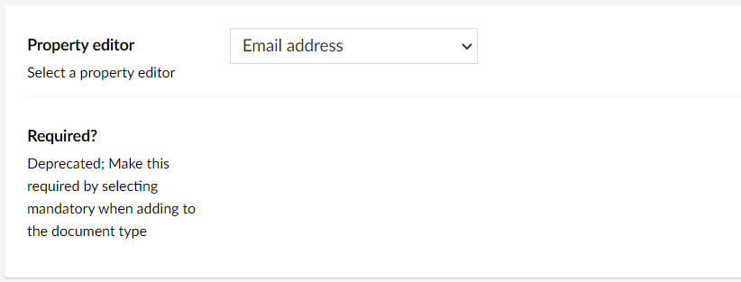

# Email Address

`Alias: Umbraco.EmailAddress`

`Returns: String`

Displays an email address.

## Settings

The Email Address Property Editor does not come with any further configuration. The property can be configured once it has been added to a Document Type.



## Content Example


## MVC View Example

### Without Modelsbuilder

```csharp
@if (Model.HasValue("email"))
{
    var emailAddress = Model.Value<string>("email");
    <p>@emailAddress</p>
}
```

### With Modelsbuilder

```csharp
@if (Model.HasValue((nameof(Model.Email))))
{
    var emailAddress = Model.Email;
    <p>@emailAddress</p>
}
```

## Add value programmatically

See the example below to learn how a value can be added or changed programmatically to an Email-address property. To update a value of a property editor you need the [Content Service](../../../../reference/management/services/contentservice/).

```csharp
@using Umbraco.Cms.Core.Services;

@inject IContentService Services;
@{
    // Get access to ContentService
    var contentService = Services;

    // Create a variable for the GUID of your page
    var guid = new Guid("796a8d5c-b7bb-46d9-bc57-ab834d0d1248");

    // Get the page using the GUID you've just defined
    var content = contentService.GetById(guid);
    // Set the value of the property with alias 'email'
    content.SetValue("email", "jpk@umbraco.dk");

    // Save the change
    contentService.Save(content);
}
```


The value sent to an EmailAddress property needs to be a correct email address, For example: name@domain.com.

It is recommended that you set up validation on this property, in order to verify whether the value added is in the correct format.

