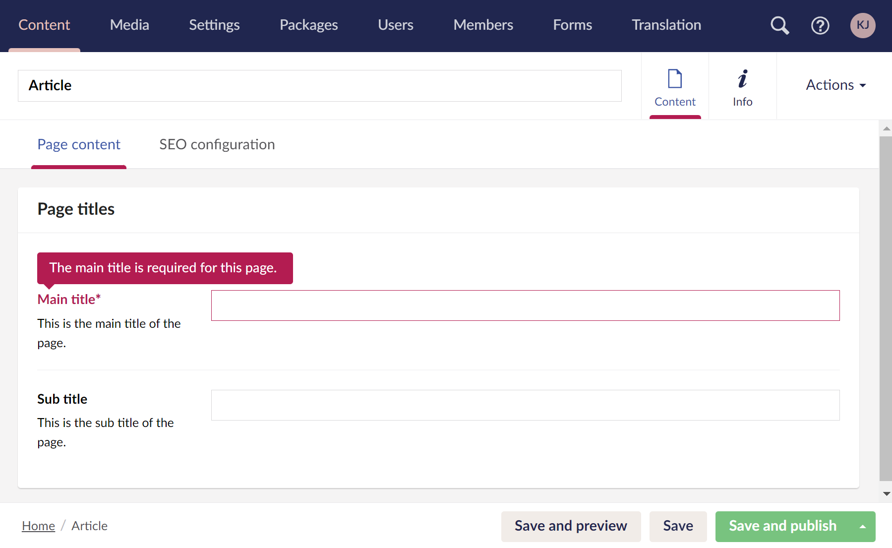

# Localizing Document Types

The Umbraco backoffice is fully localized to match the user's [configured language](../users.md). When defining document types, you can apply localization to:

- Document type names and descriptions.
- Property names and descriptions.
- Custom property validation messages.
- Tab and group names.

Setting up localization for document types is a two-step process:

- Create the localizations in [user defined language files](../../../extending/language-files.md).
- Apply the localizations to the document types.



Everything in this article also applies to defining [media types](../creating-media/README.md).



## Creating localizations

User defined language files are created in `/config/lang` and must be named `{language}.user.xml` - e.g. `en-us.user.xml`.

There are no specific requirements as to how localizations should be structured for use in document types. The following localizations have been used for the samples in this article:

```xml
<?xml version="1.0" encoding="utf-8" standalone="yes"?>
<language>
    <area alias="contentTypes">
        <key alias="article">Article page</key>
        <key alias="article-desc">A textual, article-like page on the site. Use this as the main type of content.</key>
        <key alias="landing">Landing page</key>
        <key alias="landing-desc">An inviting, very graphical page. Use this as an entry point for a campaign, and supplement with Articles.</key>
    </area>
    <area alias="tabs">
        <key alias="content">Page content</key>
        <key alias="seo">SEO configuration</key>
    </area>
    <area alias="groups">
        <key alias="titles">Page titles</key>
    </area>
    <area alias="properties">
        <key alias="title">Main title</key>
        <key alias="title-desc">This is the main title of the page.</key>
        <key alias="title-message">The main title is required for this page.</key>
        <key alias="subTitle">Sub title</key>
        <key alias="subTitle-desc">This is the sub title of the page.</key>
    </area>
</language>
```



Umbraco must be restarted to pick up on changes to language files.



## Applying localizations

The localizations are applied by using the syntax `#{area alias}_{key alias}`:


When creating and editing documents, the backoffice now uses the configured localizations:



