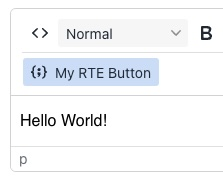

# Rich text editor settings

This settings section allows you to configure the behaviour of the rich text editor, everything from plugins to commands. Everything has a default value, so it's not required to configure any of this yourself.


**Are you using custom configuration or plugins with TinyMCE?**

In Umbraco 11 the TinyMCE version supported has been upgraded from version 4 to version 6. You need to migrate to the latest version if you are using TinyMCE plugins or custom configuration.

If your site is upgraded from an older version, follow the migration guides below to upgrade the TinyMCE version as well.

* [Migrate from version 4 to version 5](https://www.tiny.cloud/docs/migration-from-4x/)
* [Migrate from version 5 to version 6](https://www.tiny.cloud/docs/tinymce/6/migration-from-5x/)


A config with all the values can be seen underneath. Since there are a lot of defaults configured, some of these have been omitted for the sake of readability. Anywhere something has been omitted it is shown with `{...}`.

```json
"Umbraco": {
  "CMS": {
    "RichTextEditor": {
      "Plugins": ["paste", "anchor", "charmap", "table",{...}],
      "ValidElements": "+a[id|style|rel|data-id|data-udi|rev|charset|hreflang|dir|lang|tabindex|accesskey|type|name|href|target|title|class|onfocus|onblur|onclick|ondblclick|onmousedown|onmouseup|onmouseover|onmousemove|onmouseout|onkeypress|onkeydown|onkeyup],-strong/-b[class|style],-em/-i[class|style],-strike[class|style],-u[class|style],#p[id|style|dir|class|align]{...}]",
      "InvalidElements": "font",
      "Commands": [
        {
          "Alias": "ace",
          "Name": "Source code editor",
          "Mode": "Insert"
        },
        {
          "Alias": "removeformat",
          "Name": "Remove format",
          "Mode": "Selection"
        },
        {
          "Alias": "paste",
          "Name": "Paste",
          "Mode": "All"
        },
        {...}
      ],
      "CustomConfig": {
        "entity_encoding": "raw"
      },
      "CloudApiKey": "q8j4e5{...}w8c270p"
    }
  }
}
```

## Plugins

Allows you to specify what plugins should be enabled for the rich text editor as a comma seperated list of the plugin names.

## Valid elements

Allows you to specify the valid HTML elements for the rich text editor as well as the allowed properties. For instance, in the config above the `a` element is allowed, and it's allowed to have `onclick`, `href`, and many more attributes.

## Invalid elements

Specifies invalid HTML elements for the rich text editor. For instance, in the config above the `font` element is not allowed.

## Commands

Allows you to specify what commands should be available, as a list of object. These commands are the little buttons you find at the top of the editor, such as bold, italic, and so on.

When specifying these, every object should contain:

* Alias - The alias of the command
* Name - A friendly name descriping the command
* Mode - The mode the command runs on
  * Insert - The command will insert something
  * Selection - The command operate on the text, or elements, selected
  * All - The command operates on everything

## Custom config

Allows you to specify custom key value pairs for the rich text editor.

### Examples

Remove default ```<p>``` tag.

```json
  "Umbraco": {
    "CMS": {
      "RichTextEditor": {
        "CustomConfig": {
          "forced_root_block": ""
        }
      }
    }
  }
```

Add custom styles to the **Formats** dropdown list in the Richtext Editor.


Use a text editor to find and replace `\"` with `"`. This will allow you to edit the JSON file in an easier-to-read format. Don't forget to add the `\` back in when you are ready to paste the code back into your `appsettings.json` file.


```json
  "Umbraco": {
    "CMS": {
      "RichTextEditor": {
        "CustomConfig": {
          "style_formats": "[{\"title\":\"Headers\",\"items\":[ {\"title\":\"Heading 1\",\"block\":\"h1\"}, {\"title\":\"Heading 2\",\"block\":\"h2\"}, {\"title\":\"Heading 3\",\"block\":\"h3\"}, {\"title\":\"Heading 4\",\"block\":\"h4\"}, {\"title\":\"Heading 5\",\"block\":\"h5\"} ]}]"
        }
      }
    }
  }
```

Load a custom plugin that gives you the ability to interact with the global `tinymce` editor object.

Here we are loading a custom plugin called `myrteplugin` and adding a button to the editor called `myrtebutton`. When the button is clicked, it will insert the text `Hello World!` into the editor.


```json
  "Umbraco": {
    "CMS": {
      "RichTextEditor": {
        "CustomConfig": {
          "external_plugins": "{\"myrteplugin\":\"/App_Plugins/CustomPlugin/plugin.js\"}"
        },
        "Commands": [
          {
            "Alias": "myrtebutton",
            "Name": "My RTE Button",
            "Mode": "Insert"
          }
        ]
      }
    }
  }
```



```js
'use strict'
;(function () {
    /**
     * @param {import('tinymce').TinyMCE} tinymce
     */
    function plugin(tinymce) {

        // Register a new plugin on the PluginManager
        tinymce.PluginManager.add('myrteplugin', function (editor) {

            // Register a new button
            editor.ui.registry.addButton('myrtebutton', {
                text: 'My RTE Button',
                icon: 'code-sample',

                // When the button is clicked, insert 'Hello World!' into the editor
                onAction: function () {
                    editor.insertContent('Hello World!')
                }
            })
        })
    }

    // Initialize the plugin only if the global `tinymce` object exists
    if (window && 'tinymce' in window) {
        plugin(window.tinymce)
    }
})();
```


The button must be added to the toolbar in the rich text editor configuration.


Once it is added, you can click the button to insert the text `Hello World!` into the editor.



## Cloud API key

Allows you to specify a Cloud API key for the rich text editor. Set this if you want to use the [TinyMCE Cloud](https://www.tiny.cloud/) service. This is a paid service that allows you to use [premium plugins](https://www.tiny.cloud/docs/tinymce/6/plugins/#premium-plugins) and other cloud services.


Premium plugins are only available for [paid TinyMCE subscriptions](https://www.tiny.cloud/pricing/).


### Examples

Enable the [Power Paste plugin](https://www.tiny.cloud/docs/tinymce/6/introduction-to-powerpaste/).

```json
  "Umbraco": {
    "CMS": {
      "RichTextEditor": {
        "CloudApiKey": "q8j4e5{...}w8c270p",
        "Plugins": ["powerpaste"],
        "CustomConfig": {
          "powerpaste_allow_local_images": "true",
          "powerpaste_word_import": "prompt",
          "powerpaste_html_import": "clean",
        }
      },
    }
  }
```

We have enabled the `powerpaste` plugin, and configured it to allow local images. It will prompt when pasting Word documents, but for HTML documents it will clean the HTML without prompting.
