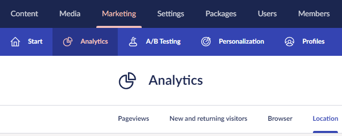

# Location

The localization information is displayed under the Location tab in the Analytics section of the uMS dashboard:

The graph contains all sessions started within the given time, similar to the "**New and returning visitors**" tab. This information is not location-bound and the graph is always displayed, even if no localization information is available.

Underneath the graph, is the table containing session and pageview information based on country.

If the pageviews contain location information, the table with countries is displayed:

There might be cases where you will see an error displayed in the table. This will occur when the [LocationExtractor](../../../../analytics/extending-analytics/implement-an-ip-to-location-provider/) service is not implemented, or if the pageviews for the given date range do not contain location information.

From the country, you can drill down to a city. This will then filter the displayed data to display session and pageview information for the selected country. Even though uMS does support the storage for county and province, currently the UI only supports displaying data by country and city.
