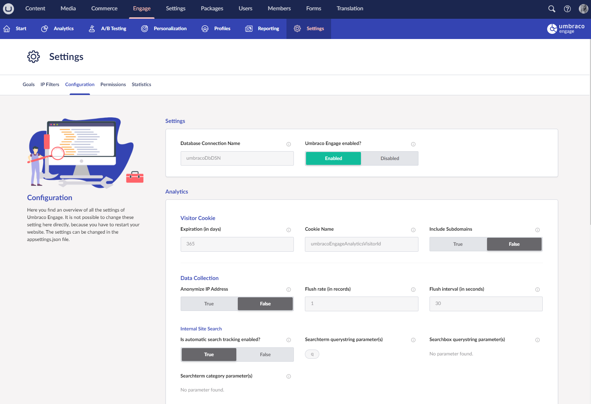

# The Configuration file

Most of the uMS configuration options are stored in the configuration file. uMS uses the standard for .NET Core applications, in which we make use of the `appsettings.json` (and environment variable support). Because of this new standard, most configuration options no longer require the application to restart to take effect. This comes with a few exceptions.

uMS 2.x ships with an `appsettings-schema.json` file, allowing Visual Studio or Jetbrains Rider to auto-complete the configuration options. It comes with information about default values and a description of what each configuration option does.

The default configuration will look like this:


```json
{
  "uMarketingSuite": {
    "Settings": {
      "DatabaseConnectionStringName": "umbracoDbDSN",
      "Enabled": true
    },
    "Analytics": {
      "VisitorCookie": {
        "ExpirationInDays": 365,
        "CookieName": "uMarketingSuiteAnalyticsVisitorId",
        "IncludeSubdomains": false
      },
      "DataCollection": {
        "AnonymizeIPAddress": false,
        "FlushRateInRecords": 100,
        "FlushIntervalInSeconds": 30,
        "InternalSiteSearch": {
          "AutomaticSearchTracking": true,
          "SearchTermParameters": "q",
          "SearchBoxParameters": "",
          "CategoryParameters": ""
        }
      },
      "DataProcessing": {
        "IntervalInSeconds": 30,
        "SessionLengthInMinutes": 30,
        "IsProcessingServer": true
      },
      "DataStorage": {
        "AnonymizeAnalyticsDataAfterDays": 730,
        "DeleteAnalyticsDataAfterDays": 1095,
        "DeleteControlGroupDataAfterDays": 180,
        "DeleteRawDataAfterDays": 5
      },
      "DataCleanup": {
        "StartAfterSeconds": 300,
        "IntervalInSeconds": 1800,
        "NumberOfRows": 1000
      }
    },
    "ABTesting": {
      "RequiredVisitorPercentageBeforeShowingAdvice": 10,
      "MinimumPercentageMacroGoalWarning": 10
    },
    "DeliveryApi": {
      "Segmentation": {
        "ContentById": true,
        "ContentByIds": true,
        "ContentByPath": true,
        "ContentByQuery": true
      }
    },
    "Profiles": {
      "Potential": {
        "ActiveThresholdInDays": 30,
        "EngagedThresholdInSeconds": 300,
        "EngagedThresholdNumberOfSessions": 3
      },
      "Identification": {
        "Name": "{{name}}",
        "Abbreviation": "{{name[0]}}",
        "ImagePropertyAlias": "avatar"
      }
    },
    "Reporting": {
      "DataGenerationEnabled": true,
      "DataGenerationTime": "04:00:00"
    }
  }
}
```


All these settings are also visualized in the uMS. This overview can be found in the section 'Marketing' -> Settings -> Configuration.




You cannot change any of the settings in the backoffice. To use the new settings the website must be restarted and that is not something that we wanted to make possible via the Umbraco backoffice.

