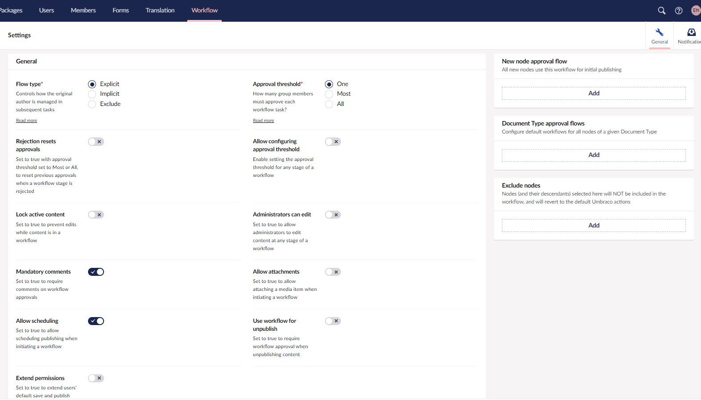
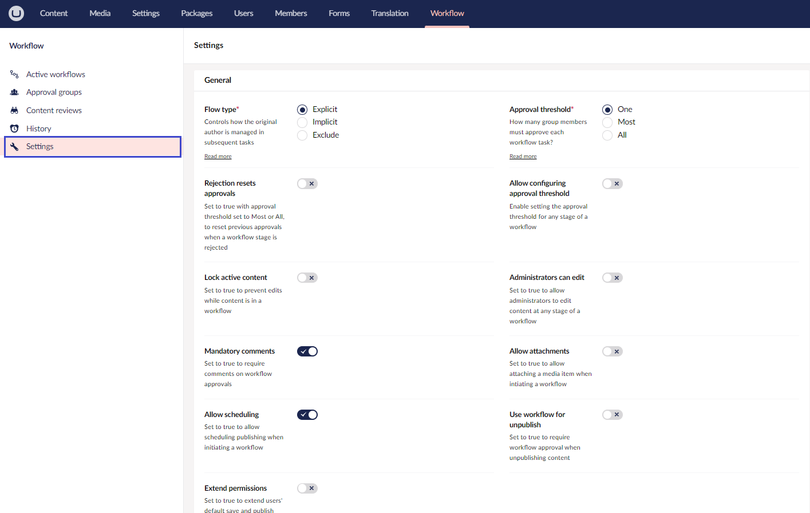
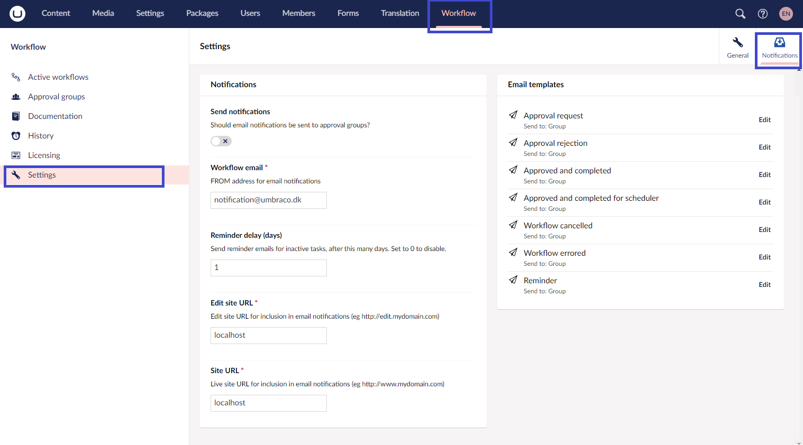

# Workflow Settings

When working with Umbraco Workflow, you can handle the workflow settings directly in the Backoffice from the **Workflow** section. You can configure the following from the Workflow Settings section:

* [General settings](workflow-settings.md#general-settings)
* [New node approval flow](workflow-settings.md#new-node-approval-flow)
* [Document Type approval flows](workflow-settings.md#document-type-approval-flows)
* [Exclude nodes](workflow-settings.md#exclude-nodes)
* [Notification Settings](workflow-settings.md#notifications-settings)
* [Email templates](workflow-settings.md#email-templates)



## General Settings

You can configure the **General** Settings from the **Workflow** section in the **Settings** menu. The following settings are available:



* **Flow type** - Determines the approval flow progress. These options manage how the Change Author is included in the workflow:
  * **Explicit** - All steps of the workflow must be completed and all users will be notified of tasks (including the Change Author).
  * **Implicit** - All steps where the original Change Author is _not_ a member of the group must be completed. Steps where the original Change Author is a member of the approving group will be completed automatically and noted in the workflow history as not required.
  * **Exclude** - Similar to Explicit. All steps must be completed but the original Change Author is not included in the notifications or shown in the dashboard tasks.
* **Approval threshold** - Sets the global approval threshold to One, Most or All:
  * **One** - Pending task requires approval from any member of the assigned approval group. This is the default behavior for all installations (trial and licensed).
  * **Most** - Pending task requires an absolute majority of group members. For example, a group with three members requires two approvals and a group with four members requires three approvals.
  * **All** - Pending task requires approval from all group members.
* **Rejection resets approvals** - When true, and the approval threshold is Most or All, rejecting a task resets the previous approvals for the workflow stage.
* **Allow configuring approval threshold** - Enables setting the approval threshold for any stage of a workflow (on a content node or Document Type).
* **Lock active content** - Determines how the content in a workflow should be managed. Set to `true` or `false` depending on whether the approval group responsible for the active workflow step should make modifications to the content. Content is locked after the first approval in the workflow - until then, the content can be edited as normal.
* **Lock scheduled content** - When not None, prevents edits to content with a scheduled release date:
  * **None** - Disables scheduled content locking
  * **Workflow** - Prevent editing scheduled content when scheduling was approved via Workflow
  * **All** - Prevents editing all scheduled content
* **Administrators can edit** - Set to true to allow administrators to edit content at any stage of the workflow, ensuring flexibility and control over the content approval process.
* **Mandatory comments** - Set to true to require comments when approving workflows. Comments are always required when submitting changes for approval, and are always optional for admin users.
* **Allow attachments** - Provide an attachment (such as a supporting document or enable referencing a media item) when initiating a workflow. This feature is useful when a workflow requires supporting documentation.
* **Allow scheduling** - Provides an option to select a scheduled date when initiating a workflow.
* **Use workflow for unpublish** - Determines if unpublish actions require workflow approval. Set to true to display the **Action** option when submitting the content for approval.
* **Extend permissions** - Determines if Umbraco Workflow should extend or replace the users' save and publish permissions. The default behavior is to replace the users' permissions.

### New node approval flow

All new nodes use this workflow for initial publishing. You can add, edit, or remove an approval group to/from the workflow.

To add an approval group to the workflow:

1. Go to the **Workflow** section.
2. Go to the **General** tab in the **Settings** menu.
3. Click **Add** in the **New node approval flow** section.

    <figure><figcaption><p>New Node Approval Flow</p></figcaption></figure>
4. Select an **approval group** to add to the workflow.

    <figure><figcaption><p>Add Workflow Approval Groups</p></figcaption></figure>
5. Click **Submit**.
6. Click **Save Settings**.

When you click on the **Edit** approval group, you are presented with different configuration options for that group. For more information on the approval group settings, see the [Settings](approval-groups.md#approval-groups-settings) section in the [Approval Groups](approval-groups.md) article.

To remove an approval group, click **Remove**.

### Document type approval flows

Configure default workflows that should be applied to all content nodes of the selected Document Type. This feature requires a license.

To add a Document type approval flow:

1. Go to the **Workflow** section.
2. Go to the **General** tab in the **Settings** menu.
3. Click **Add** in the **Document type approval flows** section.

    <figure><figcaption><p>Document Type Approval Flows</p></figcaption></figure>
4. Select a **Document type** from the drop-down list.

    <figure><figcaption><p>Add Document Type Approval Flows</p></figcaption></figure>
5. Select a **Language** from the drop-down list.
6. **Add workflow approval groups** in the **Current flow** process.
7. Click **Add condition** to add a condition to the workflow process.

    <figure><figcaption><p>Configure Document Type Approval Flow Settings</p></figcaption></figure>
8. Click **Submit**.
9. Click **Save Settings**.

To edit a Document type approval flow:

1. Go to the **Workflow** section.
2. Go to the **General** tab in the **Settings** menu.
3. Click **Edit** next to the content node in the **Document type approval flows** section.

    <figure><figcaption><p>Edit Document Type Approval Flow</p></figcaption></figure>
4. Select a **Language** from the drop-down list.
5. **Add**, **Edit**, or **Remove** approval groups from the current workflow.
6. Click **Add condition** to add a condition to the workflow process.

    <figure><figcaption><p>Configure Document Type Approval Flow</p></figcaption></figure>
7. Click **Submit**.
8. Click **Save Settings**.

### Exclude nodes

Nodes and their descendants selected here are excluded from the workflow process and will be published as per the configured Umbraco user permissions. This feature requires a license.

To exclude a node from the workflow process:

1. Go to the **Workflow** section.
2. Go to the **General** tab in the **Settings** menu.
3. Click **Add** in the **Exclude nodes** section.

    <figure><figcaption><p>Exclude Nodes</p></figcaption></figure>
4. Select the **Content node** from the Content tree.

    <figure><figcaption><p>Select Content Node</p></figcaption></figure>
5. Click **Submit**.
6. Click **Save Settings**.

## Notifications Settings

Umbraco Workflow uses Notifications to allow you to configure email notifications for all workflow activities for the backoffice.

From the **Settings** view in the **Workflow** section, the **Notifications** tab provides access to the following:

* **Send notifications:** If you wish to send email notifications to approval groups, you can enable it here. If your users are active in the backoffice, email notifications might not be required.
* **Workflow email:** Provide a sender address for email notifications. This is a mandatory field.
* **Reminder delay (days):** Set a delay in days for sending reminder emails for outstanding workflow processes. Set to 0 to disable reminder emails.
* **Edit site URL:** The URL for the editing environment (including schema - http[s]). This is a mandatory field.
* **Site URL:** The URL for the public website (including schema - http[s]). This is a mandatory field.
* [**Email templates**](workflow-settings.md#email-templates)**:** Configure which users receive emails for which workflow actions and modify the templates for those emails.

    

## Notifications Overview

Notification emails use HTML templates which render information from the `HtmlEmailModel` type which lives in the `Umbraco.Workflow.Core.Models.Email` namespace. While it is possible to modify the email templates from the backoffice, we recommend making changes via an Integrated Development Environment (IDE) of your choice.

The `HtmlEmailModel` contains the following fields:

| Fields        | Data Type                 | Description                                                                                                       |
| ------------- | ------------------------- | ----------------------------------------------------------------------------------------------------------------- |
| WorkflowType  | WorkflowType              | An `enum` value containing either 1 or 2 for Publish and Unpublish respectively.                                  |
| ScheduledDate | DateTime                  | If a scheduled date exists for the workflow, it is found here.                                                    |
| Summary       | IHtmlString               | A pre-generated representation of the current workflow state.                                                     |
| CurrentTask   | WorkflowTaskViewModel     | The view model data for the current workflow task. Contains a lot of useful data, best explored via Intellisense. |
| Instance      | WorkflowInstanceViewModel | The view model data for the current workflow. Best explored via Intellisense.                                     |

The `HtmlEmailBase` contains the following fields:

| Fields       | Data Type      | Description                                                                                          |
| ------------ | -------------- | ---------------------------------------------------------------------------------------------------- |
| SiteUrl      | string         | The public URL of your site.                                                                         |
| NodeName     | string         | The name of the node from the current workflow.                                                      |
| Type         | string         | The workflow type including the scheduled date (if exists).                                          |
| EmailType    | EmailType      | An `enum` value representing the current email type that relates directly to the workflow task type. |
| To           | EmailUserModel | The model defining the receiver of the email.                                                        |
| Email        | string         | The user's email address or a group address (if a group email is being sent).                        |
| Name         | Name           | The user's name.                                                                                     |
| Language     | string         | The user's language.                                                                                 |
| Id           | int            | The user's ID or group ID (when sending to a group email address).                                   |
| IsGroupEmail | bool           | Is the email being sent to a generic group email address?                                            |

Umbraco Workflow provides **Settings** for determining who receives emails at which stages of a workflow. While these are set to default values during installation, it is recommended to update your Notifications Settings to better suit your installation needs. Emails can be sent to:

* **All**: All the participants in all workflow stages (previous and current).
* **Admin**: The admin user.
* **Author**: The user who initiated the workflow.
* **Group**: All members of the group assigned to the current task.


Duplicate users are removed from email notifications.


By default, all emails are sent to the **Group**. This might not always be an ideal situation. For example: cancelled workflows would be best sent to the **Author** only, likewise with rejected.

It might be useful to notify **All** the participants of completed workflows but even this may be excessive. Depending on your website, you can adjust the best configuration.

## Reminders Overview

Umbraco Workflow uses a reminder email system to prompt editors to complete the pending workflows. Reminders are sent using Umbraco's internal task scheduler, every 24 hours after an initial delay. For example, setting the **Reminder delay (days)** value to 2 in the Workflow **Settings** section will allow pending workflows to sit for 2 days. After that reminder emails will be sent every 24 hours to all members of the group assigned to the pending workflow task.

The emails use a similar model to the notification emails, also inheriting from `HtmlEmailBase`. In addition to the inherited fields, `HtmlReminderEmailModel` includes:

| Fields       | Data Type | Description                                                           |
| ------------ | --------- | --------------------------------------------------------------------- |
| OverdueTasks | IList     | A list containing all the overdue tasks assigned to the current user. |
| TaskCount    | int       | The count of overdue tasks assigned to the current user.              |

## Email Templates

All email templates are fully localized where translations exist. You can edit the email templates in the Backoffice or in your IDE. By default, Umbraco Workflow's email templates are available in the default language.

## Creating an Email Template

If you wish to have one or more email templates for different languages, you will need to place all the email templates into the `~/Views/Partials/WorkflowEmails/` folder.

To add templates for other languages:

1. Go to the `~/Views/Partials/WorkflowEmails/` folder.
2. Copy the required template and paste it into the same folder.
3. Append the culture code to the file name prefixed with an underscore.

For example:

* **Default approval request template:** `~/Views/Partials/WorkflowEmails/ApprovalRequest.cshtml`
* **Danish approval request template:** `~/Views/Partials/WorkflowEmails/ApprovalRequest_da-DK.cshtml`

## Sample Email Template

Below is an example of the `ApprovalRequest.cshtml` email template from the `~/Views/Partials/WorkflowEmails/` folder:

```csharp
@model Umbraco.Workflow.Core.Models.Email.HtmlEmailModel

// Refer to the documentation for Email templates for a full rundown on the available fields
// or (better option), edit the template in Visual Studio where Intellisense will save you

<!DOCTYPE html>

<html>
<head>
    <!-- will be used as the email subject line -->
    <title>Workflow: Approval request</title>
    <meta http-equiv="Content-Type" content="text/html; charset=utf-8" />
    <meta name="viewport" content="width=device-width, initial-scale=1">
    <meta http-equiv="X-UA-Compatible" content="IE=edge" />
</head>
<body>
    <div>
        <h1>Hello @Model.To.Name,</h1>
        <p>Please review the following page for @Model.Type.ToLower() approval:</p>
        <ul>
            <li>
                <a href="@Model.CurrentTask.BackofficeUrl">@Model.CurrentTask.Node.Name</a>
                @if (!string.IsNullOrEmpty(Model.CurrentTask.OfflineApprovalUrl))
                {
                    <span><a href="@Model.CurrentTask.OfflineApprovalUrl">Offline approval</a> is permitted for this change (no login required).</span>
                }
            </li>
        </ul>
    </div>
</body>
</html>
```
