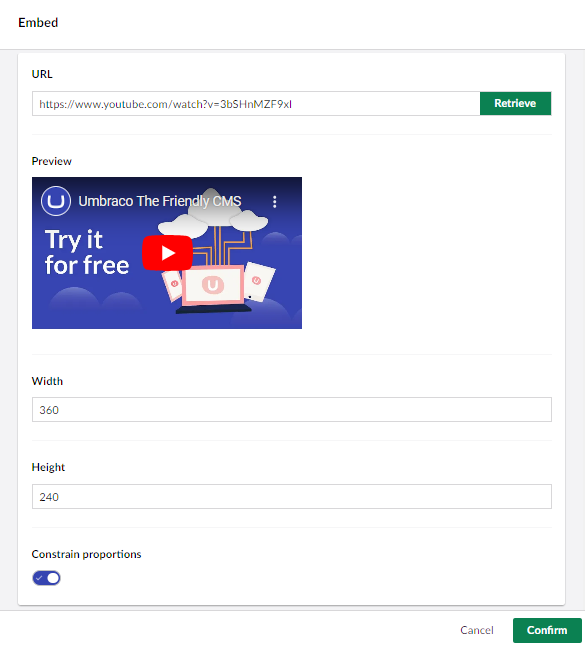
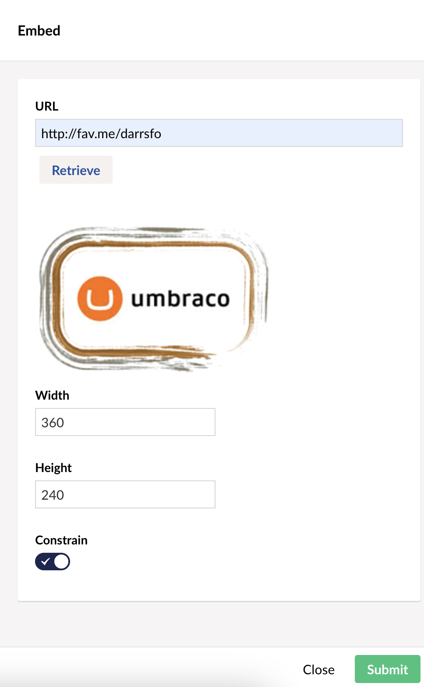

# Embedded Media Providers

The Rich Text Editor in Umbraco has an 'Embed' button, that when pressed, slides open a panel. This panel enables editors to paste the URL of a third-party media resource to embed in content.


For example, a YouTube Video:



The task of an `EmbedProvider` is to accept the pasted URL and write out the appropriate markup for the third-party provider associated with the URL.

## Embed Provider Configuration

Embed Providers are registered with the `EmbedProvidersCollection` during Composition when Umbraco boots.

The list of available default Embed Providers in an Umbraco install are as follows:

* YouTube
* YouTube Shorts
* Twitter
* Vimeo
* Dailymotion
* Flickr
* SlideShare
* Kickstarter
* Getty Images
* Ted
* SoundCloud
* Issuu
* Hulu
* Giphy

You can see the details of these, and any recent editions in the C# developer reference for [Umbraco.Core.Media.EmbedProviders](https://apidocs.umbraco.com/v14/csharp/api/Umbraco.Cms.Core.Media.EmbedProviders.html).

## Configuring a new provider

Umbraco provides a convenient `OEmbedProviderBase` class as a starting point for creating a new provider. You can read more about this class in the [Api documentation](https://apidocs.umbraco.com/v14/csharp/api/Umbraco.Cms.Core.Media.EmbedProviders.OEmbedProviderBase.html?q=OEmbedProviderBase)

### Adding a new OEmbed Provider Example

Let's allow our editors to embed artwork from the popular DeviantArt website - the world's largest online social community for artists and art enthusiasts. We can see they have information on using OEmbed: [https://www.deviantart.com/developers/oembed](https://www.deviantart.com/developers/oembed). The format of their OEmbed implementation returns a JSON format, from a URL `https://backend.deviantart.com/oembed?url=[urltoembed]`. We'll need to use the `OEmbedProviderBase` and the `base.GetJsonResponse` method. We can see 'links' to media shared on DeviantArt are in the format: `https://fav.me/[uniquemediaidentifier]`. We'll need a regex to match any URLs pasted into the embed panel that start with _fav.me_, achieved by setting the `UrlSchemeRegex` property.

The Provider would look like this:



```csharp
using Umbraco.Cms.Core.Media.EmbedProviders;
using Umbraco.Cms.Core.Serialization;

namespace MyNamespace;

public class DeviantArtEmbedProvider : OEmbedProviderBase
{
    public DeviantArtEmbedProvider(IJsonSerializer jsonSerializer)
        : base(jsonSerializer)
    {
    }

    public override string ApiEndpoint => "https://backend.deviantart.com/oembed?url=";

    public override string[] UrlSchemeRegex => new[]
    {
        @"fav\.me/*",
        @"\w+\.deviantart.com\/\w+\/art\/*",
        @"\w+\.deviantart.com\/art\/*",
        @"sta\.sh/*",
        @"\w+\.deviantart.com\/\w+#\/d*"
    };

    public override Dictionary<string, string> RequestParams => new();

    public override string? GetMarkup(string url, int maxWidth = 0, int maxHeight = 0)
    {
        return GeOEmbedDataAsync(url, maxWidth, maxHeight, CancellationToken.None).GetAwaiter().GetResult();
    }

    public override async Task<string?> GeOEmbedDataAsync(string url, int? maxWidth, int? maxHeight, CancellationToken cancellationToken)
    {
        var requestUrl = base.GetEmbedProviderUrl(url, maxWidth, maxHeight);
        OEmbedResponseWithStringDimensions? oembed = await base.GetJsonResponseAsync<OEmbedResponseWithStringDimensions>(requestUrl, cancellationToken);

        return oembed?.GetHtml();
    }
}
```



#### Register the provider with the `EmbedProvidersCollection`

Create a new C# class that implements `IComposer` and append your new provider to the `EmbedProvidersCollection`:

```csharp
using Umbraco.Cms.Core.Composing;

namespace MyNamespace;

public class RegisterEmbedProvidersComposer : IComposer
{
    public void Compose(IUmbracoBuilder builder)
        => builder.EmbedProviders().Append<DeviantArtEmbedProvider>();
}
```

The new provider should be available for editors to use:



Notice there isn't any implementation written here. The regex maps the incoming URL to the provider. The base methods handle the complication of requesting from the third-party API and turning the response into HTML.

## Custom Embed Providers

If your third-party media provider lacks OEmbed support or requires custom HTML due to content quirks, implement `GetMarkup()` without using base helper methods.

### Custom Embed Provider Example

Azure Media Services [(https://azure.microsoft.com/en-gb/services/media-services/)](https://azure.microsoft.com/en-gb/services/media-services/) provides 'broadcast-quality' video streaming services. You can embed the Azure Media Player into your site to play a video [using an IFrame](https://ampdemo.azureedge.net/azuremediaplayer.html).

You can create a custom `EmbedProvider` to embed an IFrame video player in your content. This can be done by taking the Media asset URL and writing out the required markup.



```csharp
using System.Net;
using Umbraco.Cms.Core.Media.EmbedProviders;
using Umbraco.Cms.Core.Serialization;

namespace MyNamespace;

public class AzureVideoEmbedProvider : OEmbedProviderBase
{
    public AzureVideoEmbedProvider(IJsonSerializer jsonSerializer)
        : base(jsonSerializer)
    {
    }

    // no ApiEndpoint!
    public override string ApiEndpoint => string.Empty;

    public override string[] UrlSchemeRegex => new[]
    {
        @"windows\.net/*"
    };

    public override Dictionary<string, string> RequestParams => new();

    public override string? GetMarkup(string url, int maxWidth = 0, int maxHeight = 0)
    {
        // format of markup
        string videoFormat = "<div class=\"iplayer-container\"><iframe src=\"//aka.ms/ampembed?url={0}\" name=\"azuremediaplayer\" scrolling=\"no\" frameborder=\"no\" align=\"center\" autoplay=\"false\" width=\"{1}\" height=\"{2}\" allowfullscreen></iframe></div>";

        // pass in encoded Url, with and height, and turn off autoplay...
        var videoPlayerMarkup = string.Format(videoFormat, WebUtility.UrlEncode(url) + "&amp;autoplay=false", maxWidth, maxHeight);

        return videoPlayerMarkup;
    }
}
```



Here the markup to embed has been manually constructed based upon the iframe video player, no request to an Api endpoint is made...

#### Register the Azure Embed Provider with the `EmbedProvidersCollection`

Create a new C# class that implements `IComposer` and add append your new provider to the `EmbedProvidersCollection`:



```csharp
using Umbraco.Cms.Core.Composing;

namespace MyNamespace;

public class RegisterEmbedProvidersComposer : IComposer
{
    public void Compose(IUmbracoBuilder builder)
        => builder.EmbedProviders().Append<AzureVideoEmbedProvider>();
}
```



Now editors can embed Azure Media video Urls in the format: `//amssamples.streaming.mediaservices.windows.net/3b970ae0-39d5-44bd-b3a3-3136143d6435/AzureMediaServicesPromo.ism/manifest`.
