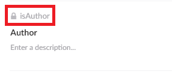
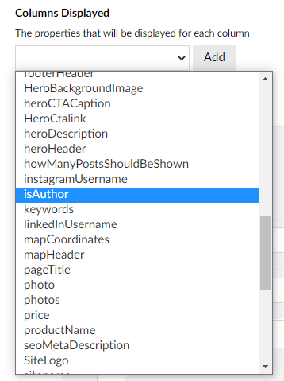
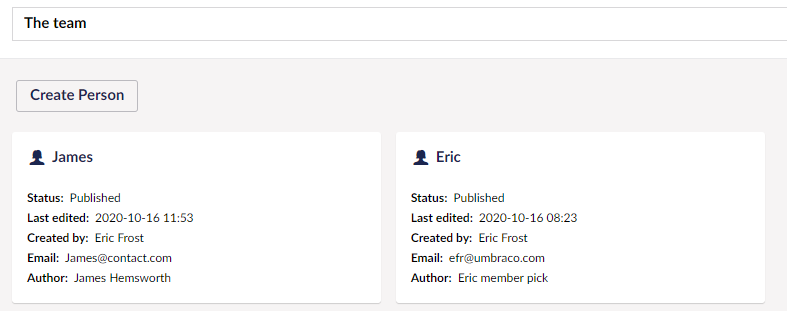

# Collection

`Alias: Umbraco.ListView`

`Returns: IEnumerable<IPublishedContent>`

**Collection** displays a collection of categories when it is enabled on a Document Type that has children.

## Enable collection

If enabled, editors will be able to see multiple children from a collection on a content node that has children. When not enabled, no collection will be shown and all children will be shown in the Content Tree.

## Settings

### Page Size

Defines how many child content nodes you want to see per page. This will limit how many content items you will see in your collection. If you set it to 5, then only 5 content items will be shown in the collection.

### Order By

Will sort your collection by the selection you choose in the dropdown. By default it selects "Last edited" and you get the following three columns:

* **Last edited** - When the content node was last edited and saved.
* **Name** - Name of the content node(s).
* **Created by** - This is the user who the content node was created by.

You can add more sorting to this collection by adding more datatypes to the columns in the "Columns Displayed" section.

### Order Direction

You can select order of the content nodes displayed, "Acsending" or "Descending". The order is affected by the "Order By" selection.

### Columns Displayed

It is possible to add more columns to the collection, via adding the properties through the dropdown. These properties are based on the Data Types which are used by the Document Type. It will show up in the dropdown by its alias and not the name on the property.

 

Once you have selected a column that you want to display, the next thing you want to do is define what its name should be and what kind of value it should display. You can also move the headers around, re-ordering how the headers should look. This is done by the move icon on the left side of the alias.

The template section is where you define what kind of value you want to display. The value of the column is in the `value` variable.

### Layouts

Collection comes with two layouts by default. A list and a grid view. These views can be disabled if you are not interested in any of them.


A minimum of one layout needs to be enabled for Collection to work.


You can also make your own layout and add it to the settings. For example, if you wanted to change the width or length of the grid, you will be able to do so.

### Bulk Action Permissions

Select what kind of action is available on the collection.

* **Allow bulk publish** - content only
* **Allow bulk unpublish** - content only
* **Allow bulk copy** - content only
* **Allow bulk move**
* **Allow bulk delete**

### Workspace View icon

Changes the icon in the backoffice of the collection. By default it will look like the image below.

### Workspace View name

You can change the name of the collection itself. Default if empty: 'Child Items'.

### Show Content Workspace View First

Enable this to show the Content Workspace View by default instead of the collection's.

## Content Example

### Generic field value

This example uses a generic field on a child item and displays it in the collection. 

The `{{ value }}` will take the value of the Email property and display it in the collection, as shown on the image below.

### Member name

First, a Member Picker property needs to be present on the content item. In this example, the `child item` has gotten a Member Picker Data Type with the alias of `isAuthor`.

Now that the child item has a member and the value that should be displayed is the name of the picked value, the next step is to reconfigure the template value in the collection setting.

This will take the value picked up by the member picker. 

And display it in the collection. Shown in the example below: 

### Other examples

 
