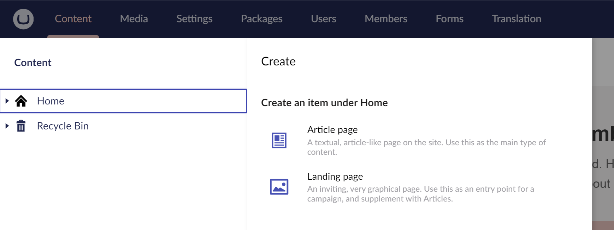

# Document Type Localization

The Umbraco backoffice is fully localized to match the user's [configured language](../users.md). When defining Document Types, you can apply localization to:

* Document Type names and descriptions.
* Property names and descriptions.
* Custom property validation messages.
* Tab and group names.

Setting up localization for Document Types is a two-step process:

* Create the localizations in [user defined language files](../../../extending/language-files/README.md).
* Apply the localizations to the Document Types.


Everything in this article also applies to defining [Media Types](../creating-media/).


## Creating localizations

User defined language files are created in `/config/lang` and must be named `{language}.user.xml`. For example:  `en-us.user.xml`.

There are no specific requirements as to how localizations should be structured for use in Document Types. The following localizations have been used for the samples in this article:



```xml
<?xml version="1.0" encoding="utf-8" standalone="yes"?>
<language>
    <area alias="contentTypes">
        <key alias="article">Article page</key>
        <key alias="article-desc">A textual, article-like page on the site. Use this as the main type of content.</key>
        <key alias="landing">Landing page</key>
        <key alias="landing-desc">An inviting, very graphical page. Use this as an entry point for a campaign, and supplement with Articles.</key>
    </area>
    <area alias="tabs">
        <key alias="content">Page content</key>
        <key alias="seo">SEO configuration</key>
    </area>
    <area alias="groups">
        <key alias="titles">Page titles</key>
    </area>
    <area alias="properties">
        <key alias="title">Main title</key>
        <key alias="title-desc">This is the main title of the page.</key>
        <key alias="title-message">The main title is required for this page.</key>
        <key alias="subTitle">Sub title</key>
        <key alias="subTitle-desc">This is the sub title of the page.</key>
    </area>
</language>
```




Umbraco must be restarted to pick up on changes to language files.


## Applying localizations

The localizations are applied by using the syntax `#{area alias}_{key alias}`.

1. Create a **Document Type with template** called `#contentTypes_article` with **alias**: `articlePage`.
2. Under the newly created document type follow these steps:

* Name the **description** to `#contentTypes_article-desc`.
* Create a new **tab** called `#tabs_content`.
* Add a new **group** called `#groups_titles`.
* Add a **property** called `#properties_title` with **alias** `title`.
  * Set description to `#properties_title-desc`.
  * Use a `TextString` editor.
  * Enable to `Set this field as mandatory`.
  * Under validation add `#properties_title-message`.


* Add a **property** called `#properties_subTitle` with **alias** `subTitle`.
  * Set description to `#properties_subTitle-desc`.
  * Use a `TextString` editor.
* Enable to `Allow as root` in the **Permissions** tab.


3. When creating and editing the content, you will see that the backoffice now uses the configured localizations.&#x20;



4. Create a new "Article" content:


4. When trying to save the content without adding the mandatory content, you will see a warning as expected:


