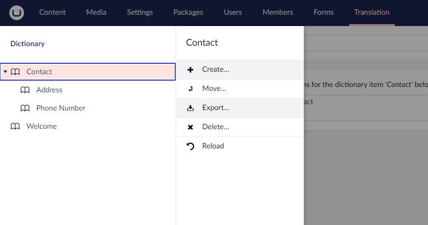
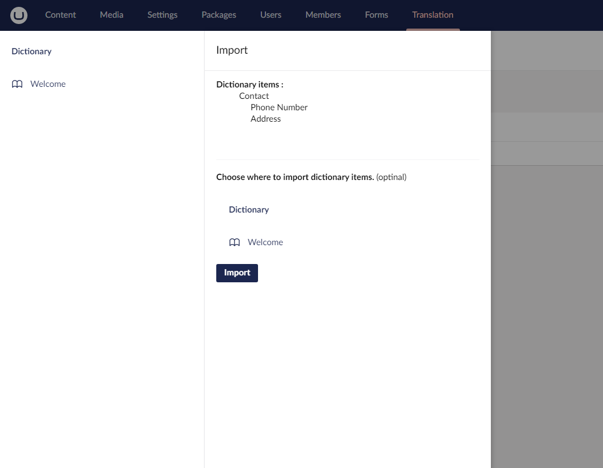

# Dictionary Items

Depending on how your site is set up, not all content is edited through the **Content** section. There might be some text in your templates that needs translation. Using Dictionary Items, you can store a value for each language. Dictionary Items have a unique key that is used to fetch the value of the Dictionary Item.

Dictionary Items can be managed from the **Translation** section. Let's take a look at an example. In this example, we will translate "Welcome to Umbraco" from within the template and add it to the dictionary:&#x20;

<figure><figcaption></figcaption></figure>

## Adding a Dictionary Item

To add a Dictionary Item:

1. Go to the **Translation** section.
2. Click on **Dictionary** in the **Translation** tree and select **Create**.
3. Enter the **Name** for the dictionary item. Let's say _Welcome_.
4. Enter the values for the different language versions.

    <figure><figcaption></figcaption></figure>
5. Click **Save**.

### Grouping Dictionary Items

To group dictionary items:

1. Go to the **Translation** section.
2. Click on **Dictionary** in the **Translation** tree and select **Create**.
3. Enter the **Name** for the dictionary item. Let's say _Contact_.
4. Click **Create**.
5. Click on **Contact** and select **Create**.
6. Enter the **Name** of the item to be created under the **Contact** group.
7. Click **Create**.
8. Enter the values for the different language versions.

    <figure><figcaption></figcaption></figure>
9. Click **Save**.

## Editing Dictionary Items

To edit a dictionary item, follow these steps:

1. Go to the **Translation** section.
2. Use the **Dictionary** tree to locate the item you need to update/edit.
   * Alternatively, you can use the _search field_ in the top-right corner.
3. Make the edits you need to make.
4. Click **Save** to save the changes.


It will only be possible to edit the language(s) that the given user has access to. The value of the remaining languages will be _read-only_.

Which language a user has access to is determined by the "Language permissions" set on the User Group. Learn more about this feature in the [Users](users.md#creating-a-user-group) article.


## Using Dictionary Values in Document Types

In some cases, you might want to render the dictionary values in the Document Type. This is to display the labels depending on the language configured for the logged-in user.

To use dictionary values in the Document Type, follow these steps:

1. Go to the **Settings** section.
2. Open the Document Type where you want to use the Dictionary value.
3. Locate the label and type `#MyDictionaryKey`. For example: `#Welcome` or `#WelcomeDescription`.

<figure><figcaption><p>Using Dictionary Value in Document Type</p></figcaption></figure>

4. Click **Save**.
5. Go to the **Content** section.
6. View the content node using the Welcome property. The property will display the dictionary value per the user's configured backoffice language.


You can translate tabs and property groups in the backoffice as well. For more information, see [How to Translate Umbraco Backoffice Document Types](https://www.youtube.com/embed/OayHhOf47LA?si=iRZ7NE-ckv9LjrSv) video.


## Fetching Dictionary Values in the Template

To fetch dictionary values in the template, replace the text with the following snippet:

```csharp
@Umbraco.GetDictionaryValue("Welcome")
```


Alternatively, you can specify an `altText` which will be returned if the dictionary value is empty.

```csharp
@Umbraco.GetDictionaryValue("Welcome", "Another amazing day in Umbraco")
```


## Importing and exporting Dictionary Items

In some cases, you might want to use the same Dictionary Items on multiple Umbraco websites. For this, you can use the export and import functionality to quickly copy the items from one website to another.

### Exporting Dictionary Items

1. Go to the **Translation** section in the Umbraco backoffice.
2. Locate the Dictionary Item (or group) you want to copy in the section tree.
3. Right-click the item.
4. Select **Export...**.
5. Decide whether you want to also include descendants.
6. Click **Export**.

This will download a `.udt` file which you can use to import the Dictionary items on another Umbraco website.



### Importing Dictionary Items

1. Go to the \*\*Translation section in the Umbraco backoffice.
2. Right-click on the top of the **Dictionary** tree.
3. Select **Import...**.
4. Click on **Import**.
5. Find and select the `.udt` file containing the Dictionary Items.
6. Click **Open** in the file browser.
7. Review the Dictionary Items for import.
8. Choose where to import the items.
9. Click on **Import**.

The Dictionary Items have now been added to your website.



## Using Dictionary Item in a Multilingual website

To use Dictionary Items in a multilingual website, see the [Creating a Multilingual Site](../../tutorials/multilanguage-setup.md) article.

## Related Links

* [API reference for the DictionaryItem](../../reference/management/models/dictionaryitem.md)
* [Localization Service](../../reference/management/services/README.md#localizationservice)
* [Creating a Multilingual Site](../../tutorials/multilanguage-setup.md)
