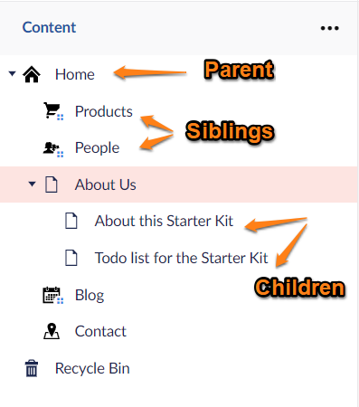
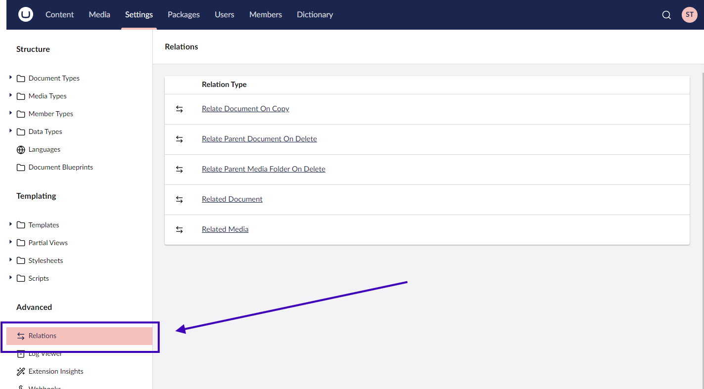

# Relations

Umbraco sections are built around the concept of 'trees' and there is an implicit relationship between items in a section tree.

We refer to these relationships in the manner of a 'Family Tree'. One content item might be the 'Parent' of some content items, and those items would be referred to as the 'Children' of that parent. Items within the same branch of the tree can also be described as 'Ancestors' or 'Descendants' of an item.

There are methods available to support querying content items by their relative position to the current page. This is possible using the following concepts: `Model.Ancestors()`, `Model.Children()`, or `Model.Descendants()`.

In some cases there are no direct relationships between two items in a tree, but they are still somehow 'related'. This could be the alternate language translation pages of a content page.

In other cases there is a 'relation' between different types of entities. This could be a relation between Content and Member, or Member and MediaFolder. You might need to be able to retrieve and display the uploaded images from a specific logged-in Member.

These are the scenarios where the concept of **Umbraco Relations** provides a solution.

## The Concept of Umbraco Relations

Umbraco Relations allow you to relate almost any object in Umbraco to almost any other Umbraco object. This is done by defining a new _Relation Type_.

### How is this different to pickers?

With a Content, Member, or Media picker the relationship only works as a 1-way street. The content item knows it has 'picked' another content item but that other content item does not know where it has been picked.

Umbraco Relations works as a 2-way street. When creating a relation between two different types of entities, it will be possible to find one entity from the other and vice versa. As an example this provides the option to list out all the pages that a content banner had been picked on.

## Relation Types

To create and use Relations in your Umbraco Website, you need to define a 'Relation Type'. The Relation Type will specify what two types of entities will be relatable. Two items might be related under multiple different Relation Types, and you might be only interested in your 'Related Language Page' Relation Type.

## Viewing Relations

It is possible to view the existing Relation Types from the Umbraco backoffice.

1. Access the Umbraco Backoffice.
2. Navigate to the **Settings** section.
3. Locate the **Advanced** group in the sidebar.
4. Select **Relations**.

On the dashboard all defined relations will be listed. Select a Relation to view a list of all the objects that have been related for that specific Relation Type.

## Creating Relations

You can create Relations using the RelationService API via code.

[Some examples are provided here in the RelationService Documentation Page](../../reference/management/using-services/relationservice.md)

### Use cases

You might want to create a 'Relation' between two objects either as:

* A response to a backoffice event. For example, a content item being published that has picked other content items. Storing a relationship between these items would make querying between them easier. Perhaps show all the pages on which a particular 'banner' has been picked.
* A logged-in member on the front end of an Umbraco website might have the facility to upload images. In response, the implementation could store the photos programmatically in the Media Section and at the same time, create a Relation to record the relationship between the member and their uploaded pictures. On an image gallery page, it would be possible to display all the gallery images for the current logged-in Member using the relations.

### Community Packages

Some of the community packages that use Relations are listed below:

* ['Relations Picker'](https://our.umbraco.com/packages/backoffice-extensions/relations-picker/) - a content picker that automatically creates Relations.
* ['ContentRelations'](https://our.umbraco.com/packages/backoffice-extensions/contentrelations/) - allows you to relate two items via the Backoffice.
* ['LinkedPages'](https://our.umbraco.com/packages/backoffice-extensions/linked-pages/) - Provides a LinkedPages context item to show, edit, and add relations between content pages.
