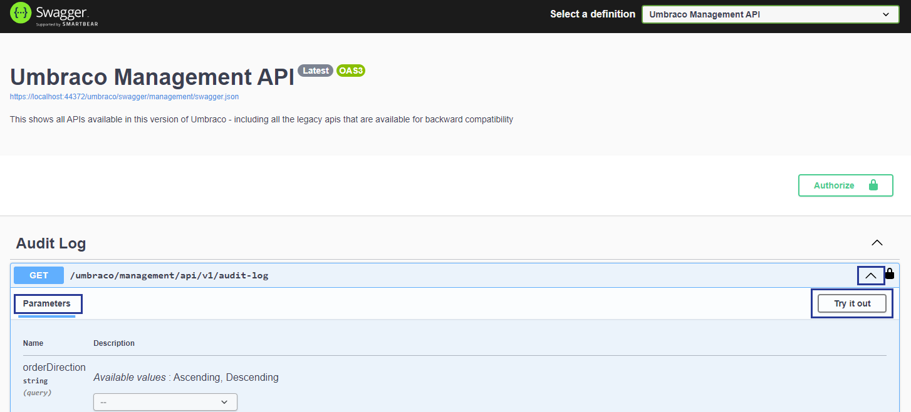
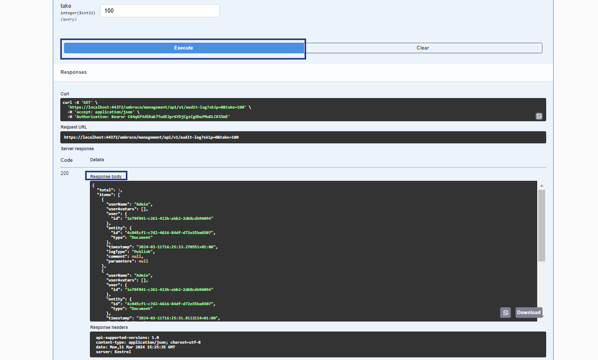

# Management API

The Management API delivers headless management capabilities built directly into Umbraco. The Management API is used by the backoffice to communicate with the backend.

The Management API can also be used for Custom apps or Workflows with OpenID Connect.


The Management API is a replacement for the backoffice controllers that lacked RESTful capabilities.


## Swagger Documentation

Umbraco ships with Swagger to document the Management API. Swagger and the Swagger UI are based on [Swashbuckle.AspNetCore](https://github.com/domaindrivendev/Swashbuckle.AspNetCore/) and is available at `{yourdomain}/umbraco/swagger`. For security reasons, both are disabled in non-production environments.

The Swagger documentation allows you to select a definition and go to either Umbraco Management API or Content Delivery API. If you are extending the Management API with your own controllers, you can also create custom documentation for these in Swagger. See [Custom Swagger API](../custom-swagger-api.md) article for details.


In the Swagger Umbraco Management API, you can find a collection of available endpoints in this version of Umbraco.

## Authorization

The Management API endpoints are protected by the backoffice authorization policies and need an authentication token to interact with them.

To set the authorization, click on the **Authorize** button:


Then a popup will appear with some setup information and login form for authorization:


The available integration for the authorization is done via a backoffice user with the integration of `OAuth2, authorizationCode with PKCE`. Swagger is only enabled in non-production environments, so if you need to access the Management API in production, you need a different client.



In production environment, only `umbraco-back-office` **client** is allowed to connect to the Management API. In non-production environments, the `umbraco-swagger` and `umbraco-postman` **clients** can be used.

You can see an example of how to connect a backoffice user via OAuth2 in Postman in the [Swagger Setup in Postman](./postman-setup-swagger) article.



When in non-production environment, you will need to connect via OAuth2 with the following Umbraco Authentication specifications:

**Authorization URL**

```http
{yourdomain}/umbraco/management/api/v1/security/back-office/authorize
```

**Token URL**

```http
{yourdomain}/umbraco/management/api/v1/security/back-office/token
```

**Flow**

```http
authorizationCode with PKCE
```

**client_id**

```http
umbraco-swagger
```

# Test an Endpoint

To test a Management API endpoint, follow these steps:

1. Authenticate via the **Authorize** button. Make sure you use `umbraco-swagger` as the `client_id`:



In non-production environments, you will always need only the `client_id` to authenticate. The `client_secret` should always be left blank because of the chosen authentication flow.


2. Expand the first endpoint of **Audit Log** and click **Try it out**



3. You now have the option to change the values of the **parameters**. In this case, let´s leave the default values as they are. 
4. Click on **Execute** so that we can get some data for our **Audit Log** endpoint.



In the **Response Body** we get the details of the **Audit Log** that we have requested.

5. You can continue changing the default **parameters**, **clear** the query, or **cancel** the trial of the endpoint.
