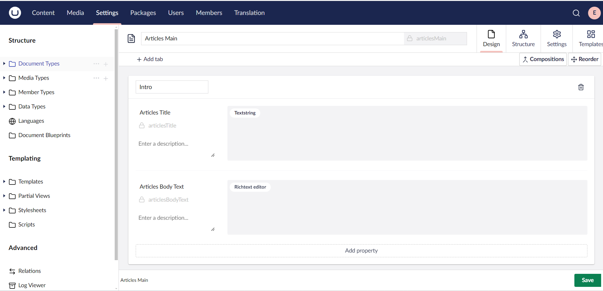
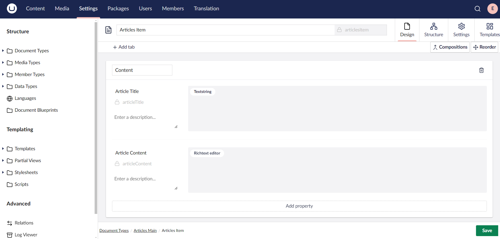
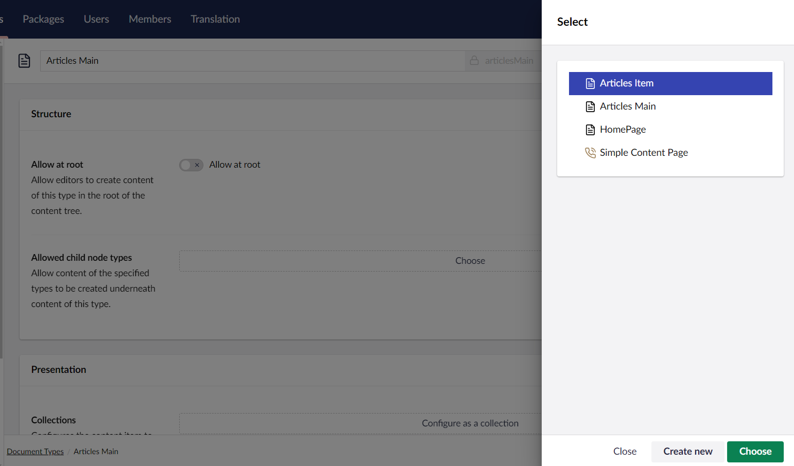
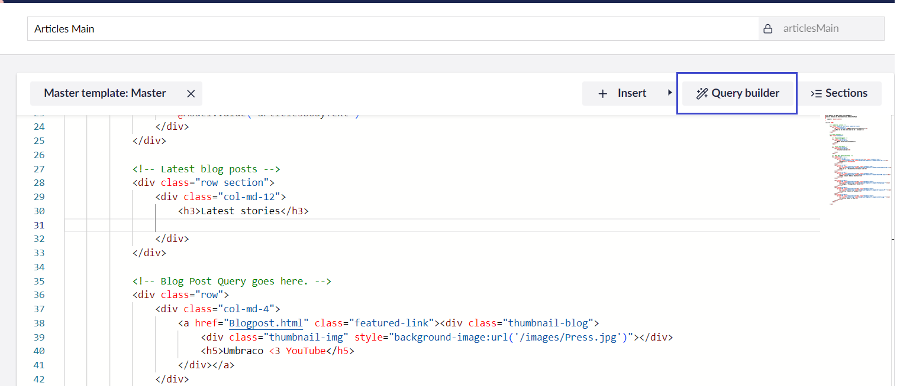
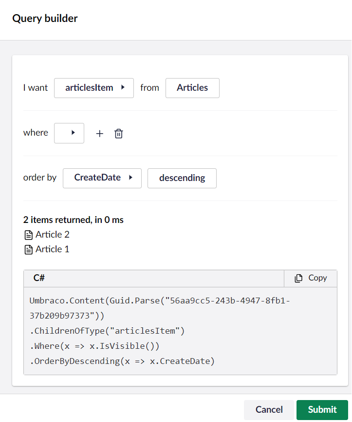

# Articles and Article Items

Having a parent page with child pages provides a good example of Umbraco's features. For example, our fictional company, Widgets Ltd, publishes about ten articles per month and therefore wants the parent page to function as a blog. This setup works for articles, posts, and other collections that require multiple content items based on the same content type.

## Creating Articles and Article Items

Create two new Document Types with template: **Articles Main** and **Articles Item**.

To create **Articles Main** Document Type, follow these steps:

1. Go to **Settings**.
2. Click **...** next to the **Document Types** in the **Settings** tree.
3. Select **Create...**.
4. Select **Document Type with Template**.
5. Enter a **Name** for the **Document Type**. Let's call it _Articles Main_.
6.  Let's add two fields with the following specifications:

    | Group | Field Name         | Alias            | Data Type        |
    | ----- | ------------------ | ---------------- | ---------------- |
    | Intro | Articles Title     | articlesTitle    | Textstring       |
    | Intro | Articles Body Text | articlesBodyText | Rich Text Editor |

    
7. Click **Save**

To create **Articles Item** Document Type, follow these steps:

1. Go to **Settings**.
2. Click **...** next to the **Document Types** in the **Settings** tree.
3. Select **Create...**.
4. Select **Document Type with Template**.
5. Enter a **Name** for the **Document Type**. Let's call it _Articles Item_.
6.  Let's add two fields with the following specifications:

    | Group   | Field Name      | Alias          | Data Type        |
    | ------- | --------------- | -------------- | ---------------- |
    | Content | Article Title   | articleTitle   | Textstring       |
    | Content | Article Content | articleContent | Rich Text Editor |

    
7. Click **Save**

### Updating the Document Type Permissions

To add **Articles Main** as a child node:

1. Navigate to the **Home Page** Document Type.
2. Go to the **Structure** tab.
3. Select **Choose** in the **Allowed child node types**.
4. Select **Articles Main**.
5. Click **Choose**.
6. Click **Save**.

To update **Articles Main** Document Type permissions:

1. Navigate to the **Articles Main** Document Type.
2. Go to the **Structure** tab.
3. Select **Choose** in the **Allowed child node types**.
4. Select **Articles Item**.
5. Click **Choose**.

    
6. Click **Configure as a collection**.
7. Select **List View - Content**.
8. Click **Save**.

    

## Creating the Content Node

To add a content node:

1. Go to **Content**.
2. Select **...** next to the **HomePage** node.
3. Click **Create**.
4. Select **Articles Main**.
5. Enter the name for the article. We are going to call it _Articles_.
6. Enter the content in the **Article Title** and **Article Body Text** fields.
7. Click **Save and Publish**. When you click on Save and Publish, you will notice an empty Collection is created.

    We still need to add the child nodes which will be displayed in the Collection making it easier to view them. You can create new nodes from this section.

    
    If you do not see the Collection, try refreshing the page.
    

8. Click **Create Articles Item**.
9. Enter the name for the article. We are going to call it _Article 1_.
10. Enter the content in the **Article Title** and **Article Content** fields.
11. Repeat steps 8 to 10 to create _Article 2_.
12. Click **Save and Publish**.

    

## Updating the Template

To update the **Articles Main** template, follow these steps:

1. Go to **Settings**.
2. Expand the **Templates** folder in the **Templating** section.
3. Open the **Articles Main** template.
4. Select **Master** in the **Master template:No Master** field.
5. Click **Choose**.
6. Click **Save**.
7. Open the **Custom Umbraco Template** folder.
8. Copy the contents of **Blog.html**.
9. Paste the content into **Articles Main** below the closing curly brace "}".
10. Remove everything from the `<html>` (around line 8) to the end of the `</div>` tag (around line 43) which is the `header` and `navigation` of the site since it is already mentioned in the Master template.
11. Remove everything from the `<!-- Footer -->` tag (around line 83) to the end of the `</html>` tag (around line 130)
12. Replace the static text within the `<h1>` tags (around line 12) with the Model.Value reference to _**articlesTitle**_.
13. Replace the static text within the `<div>` tags (from line 23 to 29) with the Model.Value reference to _**articlesBodyText**_.

    
14. Define a query for all articles below the `<h3>` tag (around line 30) of the `<!-- Latest blog posts -->` section.

    
15. You can set conditions to get specific articles or decide the order of the articles. For the purpose of this guide, we are using the following parameters:

    
16. If you've set the correct parameters, you will get a preview of the items being selected with the query.
17. Click **Submit**.
18. You will see a similar code snippet added to your template:

    ```html
    @{ var selection =
    Umbraco.Content(Guid.Parse("56aa9cc5-243b-4947-8fb1-37b209b97373"))
    .ChildrenOfType("articlesItem") .Where(x => x.IsVisible())
    .OrderByDescending(x => x.CreateDate); }
    <ul>
        @foreach (var item in selection) {
        <li>
            <a href="@item.Url()">@item.Name()</a>
        </li>
        }
    </ul>
    ```
    
19. The above code will output a list of all the _**Article Items**_ as links using the name.
20. We will modify the template a little, to add more information about the articles.
21. Replace the `HTML` in the _foreach_ loop with this snippet:

    ```csharp
    <article class="special">
        <div class="articledate" > @item.CreateDate </div>
        <div class="articletitle"><a href="@item.Url()">@item.Name()</a></div>
        <div class="articlepreview">@Html.Truncate(item.Value("articleContent").ToString(), 20, true)<a href="@item.Url()">Read @item.Name()..</a></div>
    </article>
    ```
22. Remove the `<ul>` tags surrounding the _foreach_ loop.
22. Click **Save**.

<details>

<summary>See the entire file: Articles Main</summary>


```cs
@using Umbraco.Cms.Web.Common.PublishedModels;
@inherits Umbraco.Cms.Web.Common.Views.UmbracoViewPage
@{
	Layout = "master.cshtml";
}

<!DOCTYPE HTML>
		
		<!-- Jumbotron, w title -->
		<div class="jumbotron text-center jumbotron-fluid">
			<div class="container">
				<h1 class="display-1">@Model.Value("articlesTitle")</h1>
				<p>What we do when we do what we do - and why!</p>
			</div>
		</div>

		<!-- Main container -->
		<div class="container">

			<!-- Featured blogpost -->
			<div class="row section">
				<div class="col-md-12">
					@Model.Value("articlesBodyText")
				</div>
			</div>

			<!-- Latest blog posts -->
			<div class="row section">
				<div class="col-md-12">
					<h3>Latest stories</h3>
					@{
						var selection = Umbraco.Content(Guid.Parse("66da3501-23df-4129-aa79-d511064d6ab8"))
						.ChildrenOfType("articlesItem")
						.Where(x => x.IsVisible())
						.OrderByDescending(x => x.CreateDate);
					}
					
						@foreach (var item in selection)
						{
							<article class="special">
							<div class="articledate" > @item.CreateDate </div>
							<div class="articletitle"><a href="@item.Url()">@item.Name()</a></div>
							<div class="articlepreview">@Html.Truncate(item.Value("articleContent").ToString(), 20, true)<a href="@item.Url()">Read @item.Name()..</a></div>
						</article>
						}
			
				</div>
			</div>

			<!-- Blog Post Query goes here. -->
			<div class="row">
				<div class="col-md-4">
					<a href="Blogpost.html" class="featured-link"><div class="thumbnail-blog">
						<div class="thumbnail-img" style="background-image:url('/images/Press.jpg')"></div>
						<h5>Umbraco <3 YouTube</h5>
					</div></a>
				</div>
				<div class="col-md-4">
					<a href="#" class="featured-link"><div class="thumbnail-blog">
						<div class="thumbnail-img" style="background-image:url('/images/sofie-hammock.jpg')"></div>
						<h5>A day in a Documentation Curators life</h5>
					</div></a>
				</div>
				<div class="col-md-4">
					<a href="#" class="featured-link"><div class="thumbnail-blog">
						<div class="thumbnail-img" style="background-image:url('/images/heart-DNS.png')"></div>
						<h5>New product: Umbraco Heartcore</h5>
					</div></a>
				</div>

				<div class="col-md-4">
					<a href="#" class="featured-link"><div class="thumbnail-blog">
						<div class="thumbnail-img" style="background-image:url('/images/uPackage.png')"></div>
						<h5>Packages.. Packages every where!</h5>
					</div></a>
				</div>
				<div class="col-md-4">
					<a href="#" class="featured-link"><div class="thumbnail-blog">
						<div class="thumbnail-img" style="background-image:url('/images/CG-virgins.JPG')"></div>
						<h5>Just how flexible is Umbraco?</h5>
					</div></a>
				</div>
				<div class="col-md-4">
					<a href="#" class="featured-link"><div class="thumbnail-blog">
						<div class="thumbnail-img" style="background-image:url('/images/confetti.jpg')"></div>
						<h5>Festival season of 2020</h5>
					</div></a>
				</div>
			</div>

		</div>	
```


</details>

To update the **Articles Item** template, follow these steps:

1. Go to **Settings**.
2. Expand the **Templates** folder in the **Templating** section.
3. Open the **Articles Item** template.
4. Select **Master** in the **Master template:No master** field.
5. Click **Choose**.
6. Click **Save**.
7. Open the **Custom Umbraco Template** folder.
8. Copy the contents of **Blogpost.html**.
9. Paste the content into **Articles Item** below the closing curly brace "}".
10. Remove everything from the `<html>` (around line 8) to the end of the `</div>` tag (around line 43) which is the `header` and `navigation` of the site since it is already mentioned in the Master template.
11. Remove everything from the `<!-- Footer -->` tag (around line 113) to the end of the `</html>` tag (around line 160)
12. Replace the static text within the `<h1>` tags (around line 13) with the Model.Value reference to _**articleTitle**_.
13. Replace the static text within the `<div>` tags (from line 25 to 39) with the Model.Value reference to _**articleContent**_.

    
14. Click **Submit**.
15. Click **Save**.

<details>

<summary>See the entire file: Articles Item</summary>


```cs
@using Umbraco.Cms.Web.Common.PublishedModels;
@inherits Umbraco.Cms.Web.Common.Views.UmbracoViewPage
@{
	Layout = "master.cshtml";
}

<!DOCTYPE HTML>
		
		<!-- Jumbotron, w title -->
		<div class="jumbotron text-center jumbotron-fluid">
			<div class="container">
				<h1 class="display-1">@Model.Value("articleTitle")</h1>
				<p>And this is <span class="font-weight-bold">only</span> the beginning.</p>
			</div>
		</div>

		<!-- Main container -->

		<!-- Blogpost meta data -->
		<div class="container-fluid grey-bg">
			<div class="container">
				<div class="row section">
					<div class="col-md-6">
						@Model.Value("articleContent")
					</div>
				</div>
			</div>
		</div>		

		<!-- Blogpost content -->
        <div class="container">

			<div class="row section">
				<div class="col-md-12">
					<p class="intro">The end of 2019 is approaching and with this, also the last Product Update of the year. 
						And what a year it has been - especially when we’re talking “product”! Two major product launches with Umbraco 8 and Umbraco Heartcore. 
						2019 also saw a record-breaking amount of PRs submitted, mainly due to a record-shattering Hacktoberfest 🙌 
						It’s absolutely amazing to see how much Umbraco 8 has evolved in the past 10 months, not least thanks to the friendly and very productive Umbraco community. 
						I cannot wait to see what happens in 2020! 
						But, before we get to that, let’s have a look at what we’ve been working on and what you can expect in the near future.</p>
					<br />
					<h3>New Release: Forms API & Content Filtering for Umbraco Heartcore</h3>
					<p>December 17th, we released two new features for our headless saas offering, Umbraco Heartcore; Form API and Content Filtering.
						<br /><br />
						<span class="font-weight-bold">Forms API</span><br />
						You’ll find that the REST API has been expanded to include forms created with Umbraco Forms. 
						This means you can create forms (contact forms, questionnaires etc.) directly in the backoffice, 
						complete with conditionals and validation, and get all you need to render these forms in your presentation layer. 
						All you need to do is include a form on a content node using the Form Picker and you’ll see the form data necessary 
						to render the form as part of the JSON response - you can also retrieve forms independent of content. 
						This also includes endpoints for posting form entries, so they will be stored in your Heartcore project and can utilise multi-step workflows.
						<br /><br />
						<span class="font-weight-bold">Content filtering</span><br />
						The REST API also includes a new endpoint for content delivery that lets you do more advanced filtering. 
						Previously, if you wanted to filter content based on a search term, you could utilise the search endpoint. 
						This is still possible, and useful, but if you want to be more precise and filter the content server side before it’s returned, 
						the new filter endpoint might be what you’re looking for. Let’s say you only want to retrieve content of a specific 
						Document Type that contains a specific phrase in a specific property.</p>
					<br />
					<h3>What's new on Umbraco Cloud</h3>
					<p>If you have an organisation set up on Umbraco Cloud, you’ll find that the overview of projects and members of an organisation has been 
						given an overhaul to provide you with a better overview. This is done in line with the overall brand “make-over”of the 
						Umbraco Cloud portal which we released in November. You’ll now see easy access to the different views for your organisation in a menu on the left.</p>
					<br />
					<br />
					<h3>Upcoming Release: Umbraco Deploy 3.3</h3>
					<p>As mentioned in previous Product Updates we have been working on an improved Partial Restore feature for 
						Umbraco Cloud making it a breeze to get existing projects up and running with real content. 
						This feature is now complete and undergoing the last round of testing. <br />

						We aim to release this on January 7th with a new minor version of Umbraco Deploy. <br />
						
						From this date, all existing projects on Umbraco Cloud can get this by upgrading Umbraco Deploy on the project page and 
						all new projects will be running the latest version of Deploy when it is released. 
						This release will be for version 8 and we’ll release this functionality for version 7 projects as soon as it’s backported and tested.</p>
				</div>
			</div>
		</div>

		<!-- Related story -->
		<div class="container-fluid orange-bg">
			<div class="container">
				<div class="row section">
					<div class="col-md-12 blog-related">
						<h4>Related story:</h4>
						<a href="#">
							<h5>Product Update: Highlights of 2019</h5>
							<p>‘Tis the season to be jolly, launch new products, release new features and plan for next year. 
								Don’t worry, I’m not going to sing it for you, but I’ll take you through recent product news and give you some insight as to what you can expect in December - 
								and the beginning of 2020.<br />
								<span class="font-italic">Written by Sofie Toft</span></p>
						</a>
					</div>
				</div>
			</div>
		</div>		
```


</details>

Check your browser, you should now see something similar to the screen below.


