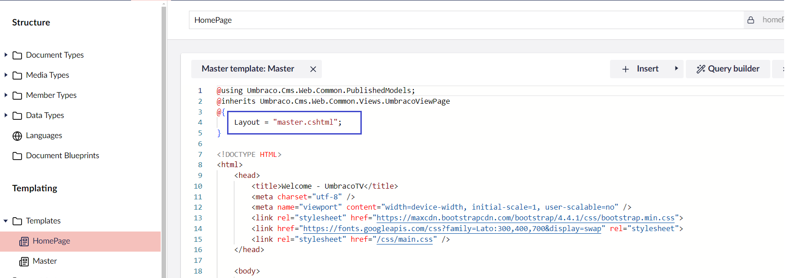
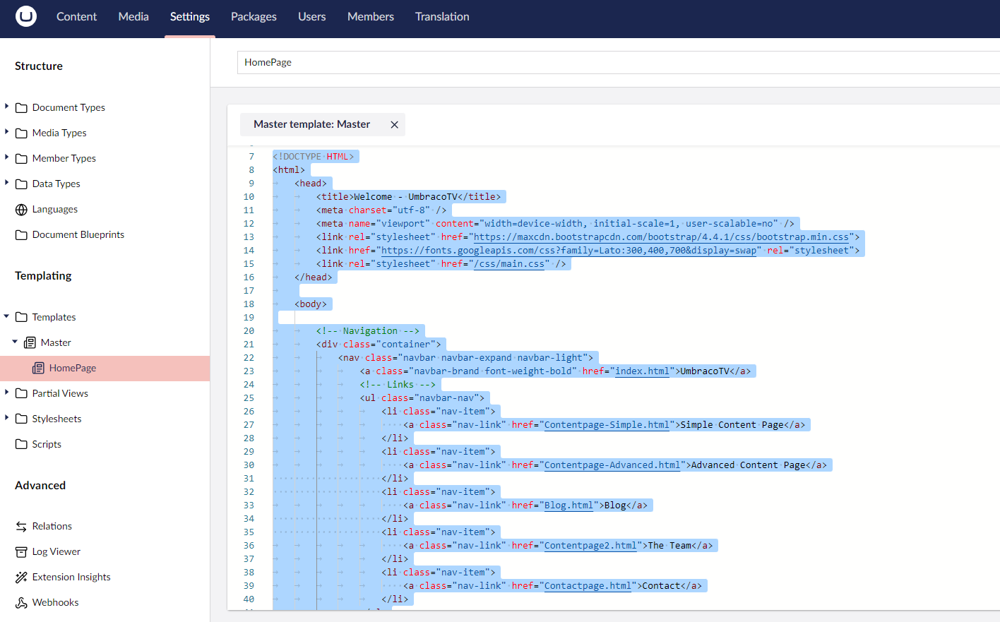

# Creating a Master Template

We've seen how to create a **Document Type** and its corresponding **Template**. If you want to create a website containing Home, News, and Contact Us pages, you will need to create a _**Document Type**_ with a corresponding **Template**.

You may end up copying the same HTML code into each of these templates, which can be time-consuming and repetitive. In such scenario, you might want to consider creating a new master template.

To create a new master template:

1. Go to **Settings**.
2. Select the **...** next to the **Templates** folder. Alternatively, click **+** to open a blank template.
3. Click **Create**.
   A template opens up in the content editor.
4. Enter a **Name** for the master template. Let's call it _Master_.

     
5. Click **Save**.

## Using the Master Template

To use the master template:

1. Go to **Settings**.
2. Expand the **Templates** folder from the **Templating** section.
3. Open the **Homepage** template.
4. Select `Master Template: No Master`.
   The Master template dialog opens on the right-side of the browser.
5. Select the template called **Master**.
6. Click **Choose**.
   The Razor code section is updated from `Layout = null;` to `Layout = "Master.cshtml";`

    
7. Click **Save**.

## Updating Templates With the New Master Template

We now need to move the parts of our HTML template that are common across all templates into the _**Master**_. It might be slightly different for different websites. You'll need to consider if all pages contain a `<div id="main">` section so that you can update it in the master.

To update templates with the new master template, follow these steps:

1. Go to **Settings**.
2. Expand the **Templates** folder from the **Templating** section.
3. Navigate to the **Homepage** template.
4. For this tutorial, we will cut everything from the `<!DOCTYPE HTML>` (around line 7) to the end of the `</div>` tag (around line 43) which is the `header` and `navigation` of the site to the master template.

    
5. Click **Save**.
6. Go to the **Master** template and paste this HTML markup after the closing curly brace (around line 7).

     
7. At the end of this markup, we need to tell Umbraco to insert the child template's content. To do so, add the code `@RenderBody()` at the end.

    
8. Click **Save**.
9. Repeat the same process for the footer content:
   * Go to the **Homepage** template and cut everything from the `<!-- Footer -->` tag (around line 108) to the end of the `</html>` tag (around line 122) and click **Save**.
   * Go to the **Master** template and paste this HTML markup after the `@RenderBody()` field we've added.

       

   * Click **Save**.

Now we've done a lot of work. When we refresh our localhost page, nothing has changed. If you have a compilation error you have perhaps mistyped **@RenderBody()**.

If you are missing any content such as header or footer, ensure that the templates matches the following:

<details>

<summary>See the entire file: Master Template</summary>


```cs
@using Umbraco.Cms.Web.Common.PublishedModels;
@inherits Umbraco.Cms.Web.Common.Views.UmbracoViewPage
@{
	Layout = null;
}
<!DOCTYPE HTML>
<html>
	<head>
		<title>Welcome - UmbracoTV</title>
		<meta charset="utf-8" />
		<meta name="viewport" content="width=device-width, initial-scale=1, user-scalable=no" />
		<link rel="stylesheet" href="https://maxcdn.bootstrapcdn.com/bootstrap/4.4.1/css/bootstrap.min.css">
		<link href="https://fonts.googleapis.com/css?family=Lato:300,400,700&display=swap" rel="stylesheet">
		<link rel="stylesheet" href="/css/main.css" />
	</head>
	
	<body>

		<!-- Navigation -->
		<div class="container">
			<nav class="navbar navbar-expand navbar-light">
				<a class="navbar-brand font-weight-bold" href="index.html">UmbracoTV</a>
				<!-- Links -->
				<ul class="navbar-nav">
					<li class="nav-item">
					    <a class="nav-link" href="Contentpage-Simple.html">Simple Content Page</a>
					</li>
					<li class="nav-item">
					    <a class="nav-link" href="Contentpage-Advanced.html">Advanced Content Page</a>
                    </li>
                    <li class="nav-item">
					    <a class="nav-link" href="Blog.html">Blog</a>
                    </li>
                    <li class="nav-item">
					    <a class="nav-link" href="Contentpage2.html">The Team</a>
					</li>
					<li class="nav-item">
					    <a class="nav-link" href="Contactpage.html">Contact</a>
					</li>
				</ul>
			</nav>
		</div>

        @RenderBody()

        <!-- Footer -->
		<div class="container-fluid footer">
			<div class="container">

				@Model.Value("footerText")

			</div>
		</div>
	
	<!-- Scripts -->
	<script src="https://ajax.googleapis.com/ajax/libs/jquery/3.4.1/jquery.min.js"></script>
	<script src="https://stackpath.bootstrapcdn.com/bootstrap/4.4.1/js/bootstrap.min.js"></script>
	
	</body>
</html>	
```


</details>

<details>

<summary>See the entire file: HomePage Template</summary>


```cs
@using Umbraco.Cms.Web.Common.PublishedModels;
@inherits Umbraco.Cms.Web.Common.Views.UmbracoViewPage
@{
	Layout = "master.cshtml";
}


		
		<!-- Jumbotron, w title -->
		<div class="jumbotron text-center jumbotron-fluid">
			<div class="container">
				<h1 class="display-1">@Model.Value("pageTitle")</h1>
				<p>And this is <span class="font-weight-bold">only</span> the beginning.</p>
			</div>
		</div>

		<!-- This is where we're going to render our content -->
		
		<div class="container">

			<div class="row section">
				<div class="col-md-12">

					@Model.Value("bodyText")

				</div>				
			</div>

		</div>

		<!-- Grey Banner -->
		<div class="container-fluid grey-bg">
			<div class="container">
				<div class="row section">
					<div class="col-md-8">
						<h2>A flexible CMS - do things your way</h2>
						<p>The Umbraco source code is free and available for download either as a ZIP file or via NuGet under the MIT license, so you can <a href="#">start crafting websites in Umbraco today</a>. 
						Need to build a site with multiple 3rd party extensions and customized add-ons? No problem. Need to build a simple site with a straightforward contact form? No problem.</p>
						<p>Whatever type or scale of your project, Umbraco will be able to handle it - and the cherry on top; with Umbraco’s well-known editor friendly UI, 
							no matter how complex a site you’re building, you know that your editors will still find it a breeze to edit. Oh, and the cherry on top of the cherry - 
							there's <span class="font-weight-bold">no need for you to spend time learning a new coding or templating language as Umbraco is based on C#, javaScript and Razor</span>. </p>
					</div>
					<div class="col-md-4">
						
					</div>
				</div>
			</div>
		</div>

		<!-- Blog section -->
		<div class="container">

			<div class="row section">
				<div class="col-md-12">
					<h1>Latest from the blog</h1>
				</div>

				<!-- Blog Post query goes here. -->
				<div class="col-md-4">
					<div class="box-blog">
						<a href="Blogpost.html"><div class="blog-promoImage" style="background-image:url('/images/u_product_roadmap_white-1.png')"></div></a>
						<h5>Product Update - Deploying Deploy 3.3</h5>
						<p class="blog-meta">January 20th 2020 - by Sofie Toft</p>
						<p>The end of 2019 is approaching and with this, also the last Product Update of the year. 
							Let’s have a look at what we’ve been working on and what you can expect in the near future.</p>
					</div>
					<a href="Blogpost.html" class="btn btn-inverted">Read more >></a>
				</div>
				<div class="col-md-4">
					<div class="box-blog">
						<a href="#"><div class="blog-promoImage" style="background-image:url('/images/Press.jpg')"></div></a>
						<h5>Umbraco <3 YouTube</h5>
						<p class="blog-meta">January 20th 2020 - by Sofie Toft</p>
						<p>The end of 2019 is approaching and with this, also the last Product Update of the year. 
							Let’s have a look at what we’ve been working on and what you can expect in the near future.</p>
					</div>
					<a href="#" class="btn btn-inverted">Read more >></a>
				</div>
				<div class="col-md-4">
					<div class="box-blog">
						<a href="#"><div class="blog-promoImage" style="background-image:url('/images/sofie-hammock.jpg')"></div></a>
						<h5>A day in a Documentation Curators life</h5>
						<p class="blog-meta">January 20th 2020 - by Sofie Toft</p>
						<p>The end of 2019 is approaching and with this, also the last Product Update of the year. 
							Let’s have a look at what we’ve been working on and what you can expect in the near future.</p>
					</div>
					<a href="#" class="btn btn-inverted blog-box-btn">Read more >></a>
				</div>
			</div>

		</div>

		<!-- Call to Action -->
		<div class="container-fluid orange-bg">
			<div class="container">

				<div class="row section">
					<div class="col-md-12 text-center">
						<h1>How to continue your Umbraco journey</h1>
						<p>What’s next? We have gathered the 3 best ways for you to go on from here ensuring you get the best start to your Umbraco journey: <br/><br/></p>
						<a href="#" class="btn btn-inverted-orange" role="button">3 ways to start your Umbraco Journey >></a>
					</div>
				</div>
	
			</div>
		</div>
```

</details>
