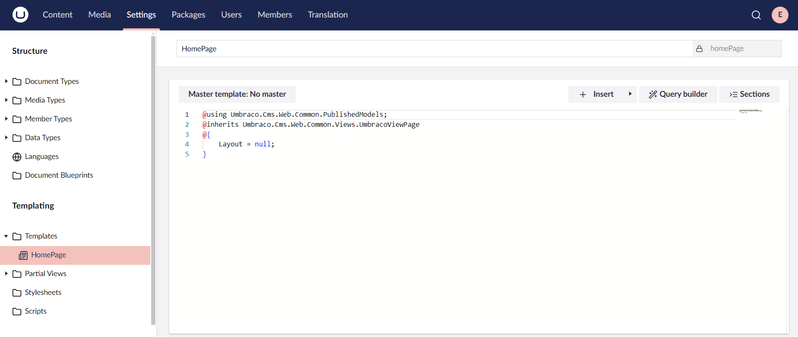
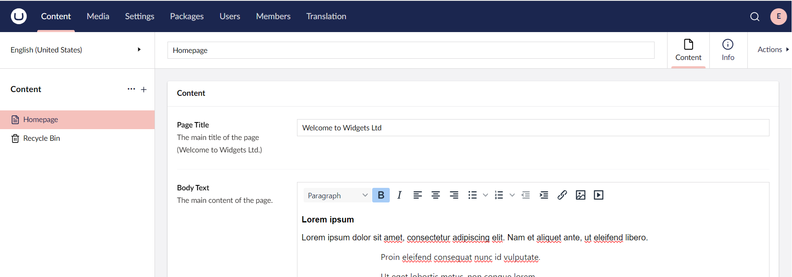
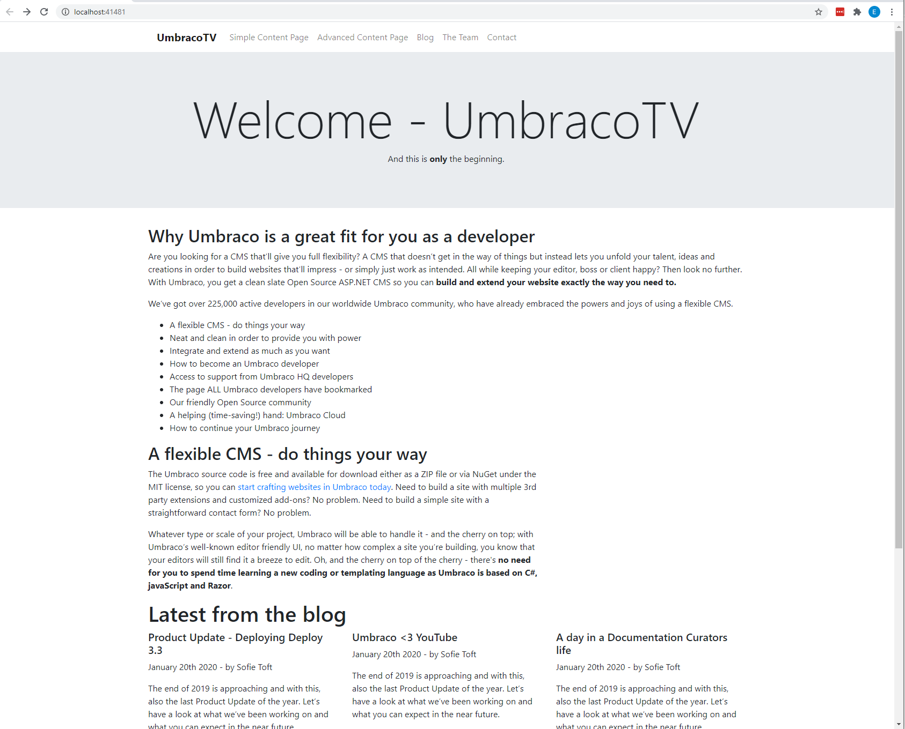

# Creating Your First Template

Umbraco creates a corresponding template when you select the **Document Type with Template** option when creating a Document Type.

To edit the template:

1. Go to **Settings**.
2. Expand the **Templates** folder in the **Templating** section of the tree. You should see a template titled **HomePage**.

    
    If you do not see the template, try refreshing the page.
    

3. Open the template. It will contain a little bit of Razor code.

    
4. Leaving the code that's there (if you don't understand it, don't worry!) let's copy our template code in.
   * We are using the files from the [Custom Umbraco Template](https://umbra.co/Umbracotemplate) folder. Clicking the link will automatically download the files.
5. Open the **Custom Umbraco Template** folder and copy the contents of **index.html**.
6. Paste the content into the _HomePage_ template below the closing curly brace "}".
   * Umbraco _**Templates**_ uses _**Razor**_ that allows you to add code in your _**Template**_ files. _**Razor**_ reacts to `@` signs.
7. Click **Save**.

We now have a _Template_. That's two out of the three stages complete for our first page.

## Creating Your First content node

Our third and final stage to creating our first page in Umbraco, is to create a _**content node**_. The content node uses our _**Document Type**_ and _**Template**_ to serve up an HTML page to web visitors.

To add a content node:

1. Go to **Content**.
2. Select **...** next to **Content** in the tree.
3. Click **Create**.
4. Select **HomePage**. The Home Page opens in the content editor.

    * If you cannot see the content node, check that **Settings** > **Document Types** > **HomePage** > **Structure** > **Allow at root** is enabled.

    
5. Enter the **Name** for the content node. We are going to call this _Homepage_.
   * The name will show up in the node list and will be used to create a URL for the page. Try to keep it short but descriptive.
6. Enter the following details:

    | Name        | Description                                                                                                                                                                                                                                                                                                                                                                                                                                                                                                                                                        |
    | ----------- | ------------------------------------------------------------------------------------------------------------------------------------------------------------------------------------------------------------------------------------------------------------------------------------------------------------------------------------------------------------------------------------------------------------------------------------------------------------------------------------------------------------------------------------------------------------------ |
    | Page Title  | Welcome to Widgets Ltd                                                                                                                                                                                                                                                                                                                                                                                                                                                                                                                                             |
    | Body Text   | 
<strong>Lorem ipsum</strong>

Lorem ipsum dolor sit amet, consectetur adipiscing elit. Nam et aliquet ante, ut eleifend libero.
<ul><li>Proin eleifend consequat nunc id vulputate.</li><li>Ut eget lobortis metus, non congue lorem.</li><li>Orci varius natoque penatibus et magnis dis parturient montes, nascetur ridiculus mus.</li><li>Maecenas tempus non lectus rhoncus efficitur.</li></ul>
Sed est ligula, maximus in dolor sed, lacinia egestas ligula. Donec eu nisi lectus.

<em>Morbi pharetra pulvinar arcu non gravida.</em>
 |
    | Footer Text | Copyright Widgets Ltd 2024                                                                                                                                                                                                                                                                                                                                                                                                                                                                                                                                         |
7. Click **Save and Publish**. The content tree will reload with the homepage node.

    

## Accessing the Frontend

To view your content on the frontend:

1. Go to the **Info** tab in the **Homepage** content node.
2. Click on the link under the **Links** section.

The default Umbraco page is gone and we can see a basic unstyled page. We are getting there.


If you see a blank page, check if the template is entered and remember to save it.


