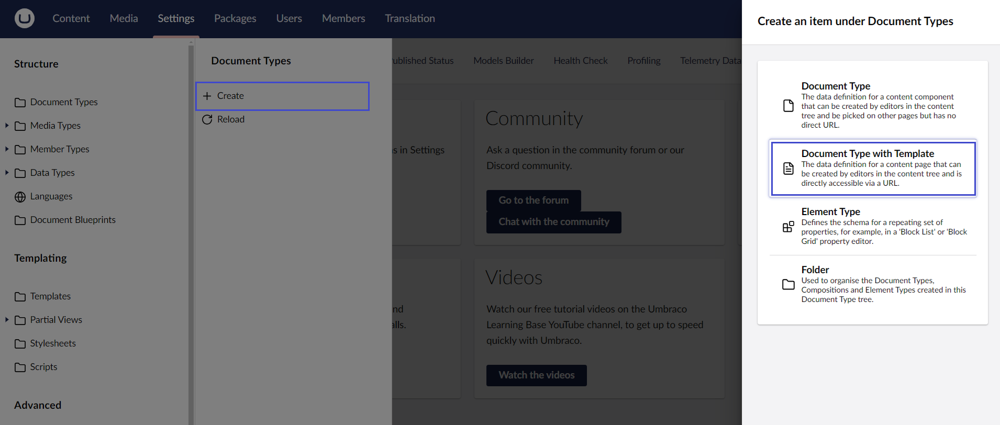
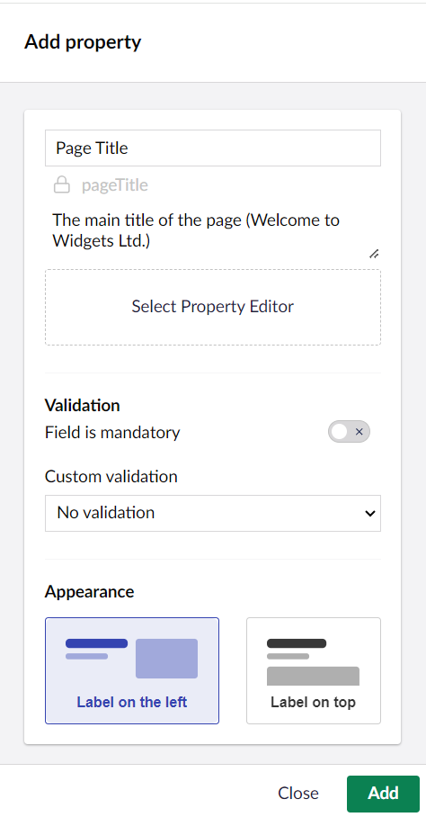
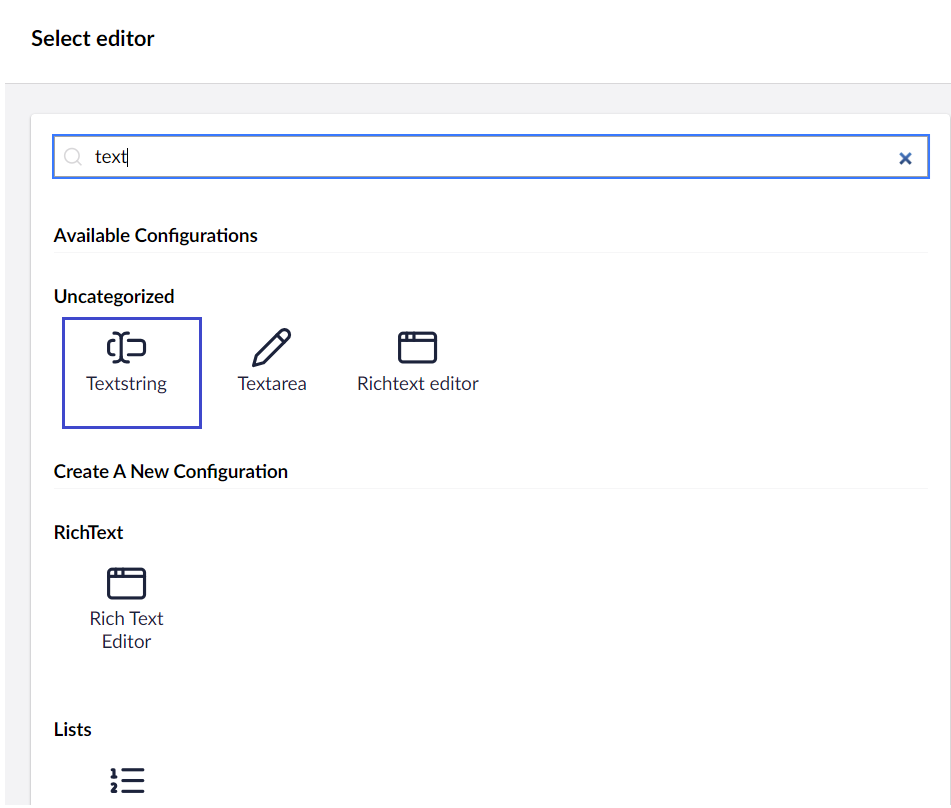
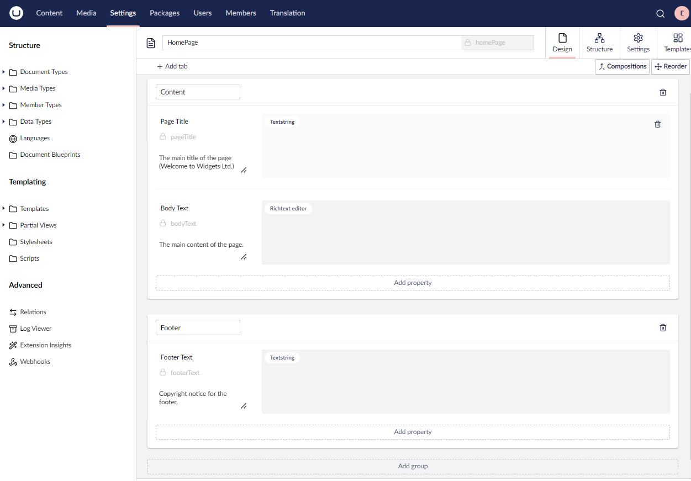

# Document Types

The first step in creating an Umbraco site is to set up a **Document Type**. A **Document Type** acts as a data container in Umbraco, where you can add **Properties** (data fields or attributes) to store content. Each **Property** is assigned a **Data Type**, such as a text string, number, or rich text editor. Umbraco uses **Templates** to render this input data on the front end.

Here are some of the most common properties you might add in a **Document Type**:

* Page Title
* Sub Heading
* Body Text
* Meta Title
* Meta Description

## Creating a Document Type

To create a Document Type:

1. Go to **Settings**.
2. Click **...** next to the **Document Types**.
3. Select **Create...**
4. Select **Document Type with Template**.

   
   **Folders** can help you organize your **Document Types**.
   

   

5. Enter a **Name** for the **Document Type**. Let's call it _HomePage_. You'll notice that an **Alias** is automatically created.
   * The alias of the Document Type is automatically generated based on the property name. If you want to change the auto-generated alias, click the "lock" icon. The alias must be in camelcase. For example _homePage_.
6. Click **Save**. Our new Document Type is now visible as a new item under **Document Types**.

## Customizing the Document Type

### Adding icons

With the help of icons, you can identify different Document Types in the **Content Tree**. To add an icon:

1. Click the icon placeholder next to the document name. The **Select Icon** dialog opens.

   

2. Browse through the icon list and select the icon of your choice.
3. Click **Submit**.
4. Click **Save**.

### Setting Permissions

To create a Document Type at the root of the **Content Tree**:

1. Go to the **Structure** tab.
2. Toggle the **Allow at root** button.

   

   
   If **Allow at root** is not enabled on the **Document Type**, you cannot create any content on your site.
   

3. Click **Save**.

### Adding Properties

To add properties to your Document Type, follow these steps:

1. Go to the **Design** tab.
2. Click **Add Group**.
3. Enter a Name for the group. For this tutorial, we will call it _Content_.

   

4. Click **Add property**. The **Add property** dialog opens.
5. Enter a **Name**. For example: _Page Title_.
6. Enter a **Description**. For example: _The main title of the page (Welcome to Widgets Ltd.)_.

   

7. Click **Select Property Editor**.
8. Select the Data Type of your choice. We'll add _text_ in the search box and select the **Textstring** Data Type.

   

9. Click **Submit**.
   * Remember to come back and explore the list of _**Data Types**_ later.
10. Repeat Steps 4 to 9 to add a _Body Text_ using the specification below:

   | Name        | Body Text                     |
   | ----------- | ----------------------------- |
   | Description | The main content of the page. |
   | Data Type   | Richtext Editor               |

11. Click **Add Group** to create a new group called _Footer_. Repeat Steps 4 to 9 to add a _Footer Text_ using the specification below:

   | Name        | Footer Text                      |
   | ----------- | -------------------------------- |
   | Description | Copyright notice for the footer. |
   | Data Type   | Textstring                       |

12. Your Document Type should now look like this:
13. Click **Save**.
   

We’ve now created our first **Document Type**. Umbraco takes the data from an instance of the _**Document Type**_ (also called _**Content Node**_). This data is then merged with a _**Template**_ – let's create our template next.
