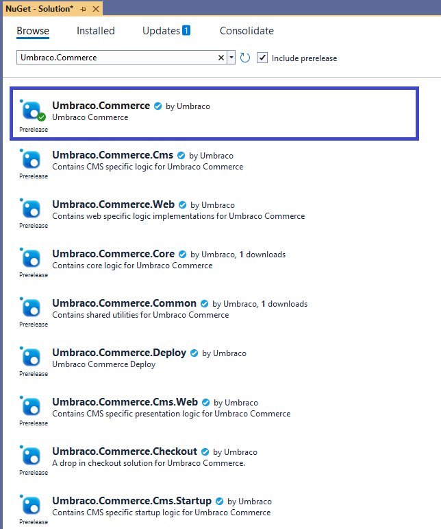

# Installation

In this article, you will learn how to install Umbraco Commerce into your Umbraco CMS implementation.

## Prerequisites

For system requirements, see the [Requirements](../getting-started/requirements.md) article.

## Umbraco Commerce Installation

There are different ways to install Umbraco Commerce:

- [NuGet Package Installation](#nuget-package-installation)
- [Visual Studio Installation](#visual-studio-installation)

### NuGet Package Installation

Umbraco Commerce is available via [NuGet.Org](https://www.nuget.org/packages/Umbraco.Commerce/).

To install Umbraco Commerce via NuGet:

1. Run the following command in the NuGet Manager Console window:

   ```bash
   dotnet add package Umbraco.Commerce
   ```

2. Restart the application using the following command:

   ```bash
   dotnet run
   ```

### Visual Studio Installation

To install via Visual Studio, follow these steps:

1. Open your project in Visual Studio.
2. Go to **Tools** -> **NuGet Package Manager** -> **Manage NuGet Packages for Solution...**
3. Browse for **Umbraco.Commerce**.

   

4. Select the appropriate version from the **Version** drop-down depending on the Umbraco version you are using.
5. Click **Install**.
6. Ensure that the package reference is added to the **.csproj** file once the installation is complete:

   ```cs
   <ItemGroup>
   <PackageReference Include="Umbraco.Commerce" Version="14.x.x" />
   </ItemGroup>
   ```

For most projects, you only need a single package to install Umbraco Commerce. But if your solution is more complex with multiple projects, Umbraco Commerce provides sub-packages to match different dependencies.

<table>
   <thead>
      <tr>
         <th width="282">Sub-package</th>
         <th>Description</th>
      </tr>
   </thead>
   <tbody>
      <tr>
         <td><strong>Umbraco.Commerce.Common</strong></td>
         <td>A shared project of common, non-Commerce-specific patterns and helpers.</td>
      </tr>
      <tr>
         <td><strong>Umbraco.Commerce.Core</strong></td>
         <td>Core Commerce functionality that doesn't require any infrastructure-specific dependencies.</td>
      </tr>
      <tr>
         <td><strong>Umbraco.Commerce.Infrastructure</strong></td>
         <td>Infrastructure-specific project containing implementations of core Commerce functionality.</td>
      </tr>
      <tr>
         <td><strong>Umbraco.Commerce.Persistence.SqlServer</strong></td>
         <td>Persistence-specific project containing implementations of core Commerce persistence functionality for SQL Server.</td>
      </tr>
      <tr>
         <td><strong>Umbraco.Commerce.Persistence.Sqllite</strong></td>
         <td>Persistence-specific project containing implementations of core Commerce persistence functionality for SQLite.</td>
      </tr>
      <tr>
         <td><strong>Umbraco.Commerce.Web</strong></td>
         <td>Core Commerce functionality that requires a web context.</td>
      </tr>
      <tr>
         <td><strong>Umbraco.Commerce.Cms</strong></td>
         <td>Core Commerce functionality that requires an Umbraco dependency.</td>
      </tr>
      <tr>
         <td><strong>Umbraco.Commerce.Cms.Web</strong></td>
         <td>The Commerce functionality for the Umbraco presentation layer.</td>
      </tr>
      <tr>
         <td><strong>Umbraco.Commerce.Cms.Web.Api</strong></td>
         <td>A shared project of common API specific functionality.</td>
      </tr>
      <tr>
         <td><strong>Umbraco.Commerce.Cms.Web.Api.Management</strong></td>
         <td>The backoffice Management API layer.</td>
      </tr>
      <tr>
         <td><strong>Umbraco.Commerce.Cms.Web.Api.Payment</strong></td>
         <td>The Payment handling API layer.</td>
      </tr>
      <tr>
         <td><strong>Umbraco.Commerce.Cms.Web.Api.Storefront</strong></td>
         <td>The frontend Storefront API layer.</td>
      </tr>
      <tr>
         <td><strong>Umbraco.Commerce.Cms.Web.UI</strong></td>
         <td>The static Commerce assets for the Umbraco presentation layer.</td>
      </tr>
      <tr>
         <td><strong>Umbraco.Commerce.Cms.Startup</strong></td>
         <td>The Commerce functionality for registering Commerce with Umbraco.</td>
      </tr>
      <tr>
         <td><strong>Umbraco.Commerce</strong></td>
         <td>The main Commerce package entry point package.</td>
      </tr>
   </tbody>
</table>


If you encounter an SQLite error after installing Umbraco Commerce, you may need to enable SQLite support. For more information, see the [Configure SQLite support](../how-to-guides/configure-sqlite-support.md) article.


## Installing a License

For details on how to install a license, see the [Licensing](../getting-started/the-licensing-model.md) article.

## Using Umbraco Commerce

Once Umbraco Commerce is installed, you can find it in the Umbraco backoffice under the **Settings** and **Content** sections. To access the **Commerce** section, additional configuration is required. For more details, see the [Umbraco Configuration](../getting-started/umbraco-configuration.md) article.
