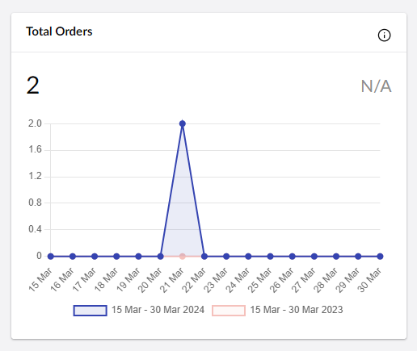

# Analytics Widgets

Analytics Widgets allow you to display custom charts and reports in the analytics section to more easily track your important KPIs.



## Registering an Analytics Widget

```typescript
import { UcManifestEntityQuickAction } from "../../core/entity-quick-action/types.js";

export const manifests : UcManifestEntityQuickAction[] = [
   {
        type: 'ucAnalyticsWidget',
        alias: 'Uc.AnalyticsWidget.TotalOrders',
        name: 'Total Orders',
        element: () => import('./total-orders-widget.element.js'),
        meta: {
            label: '#ucAnalytics_totalOrdersHeadline',
            description: '#ucAnalytics_totalOrdersDescription'
        }
    }
];

extensionRegistry.register(manifests);
```

Each entry must have a type of `ucAnalyticsWidget` along with a unique `alias` and `name`. A `element` key should be defined that imports the implementation of the `UcAnalyticsWidget` component interface.

A `meta` entry provides configuration options for the widget

| Name | Description |  
| -- | -- |
| `label` | A label for this widget (supports the `#` prefix localizaton string syntax) |
| `description` |  A description for this widget (supports the `#` prefix localizaton string syntax) |

## The Analytics Widget element

In order to define the UI for a widget, you'll need to define a component that implements the `UcAnalyticsWidget` interface. This interface is defined as

```typescript
export interface UcAnalyticsWidget extends UmbControllerHostElement {
    storeId:string;
    manifest: UcManifestAnalyticsWidget;
    timeframe: UcAnalyticsTimeframe;
}
```

This provides widget implementations with access to the current `storeId`, the defined `manifest` and the current selected `timeframe` for which the widget should show relevant data.

An example implementation would be

```typescript
// total-orders-widget.element.js

import { customElement, html, property, state } from "@umbraco-cms/backoffice/external/lit";
import { UmbLitElement } from "@umbraco-cms/backoffice/lit-element";
import { UcAnalyticsTimeframe, UcAnalyticsWidget, UcManifestAnalyticsWidget } from "@umbraco-commerce/backoffice";

@customElement('uc-total-orders-widget')
export class UcTotalOrdersWidgetElement extends UmbLitElement implements UcAnalyticsWidget {

    @property({ type:String })
    storeId!:string;

    @property({ type: Object, attribute: false })
    manifest?: UcManifestAnalyticsWidget;

    @property({ type: Object, attribute: false })
    set timeframe(timeframe: UcAnalyticsTimeframe) {
        this._timeframe = timeframe;
        this.#fetchData();
    }
    private _timeframe?: UcAnalyticsTimeframe;

    @state()
    private _data?:any[];

    #fetchData = async () => {
        // Fetch data using this._timeframe properties as a filter
        // and store the result in this._data
    }

    render() {
        if (!this._data) return;
        return html`-- WIDGET MARKUP GOES HERE --`;
    }

}

export default UcTotalOrdersWidgetElement;

declare global {
    interface HTMLElementTagNameMap {
        'uc-total-orders-widget': UcTotalOrdersWidgetElement;
    }
}
```

When the an alternative timeframe is selected from the widget dashboard, all widgets `timeframe` properties will be updated to re-fetch and render the widget.