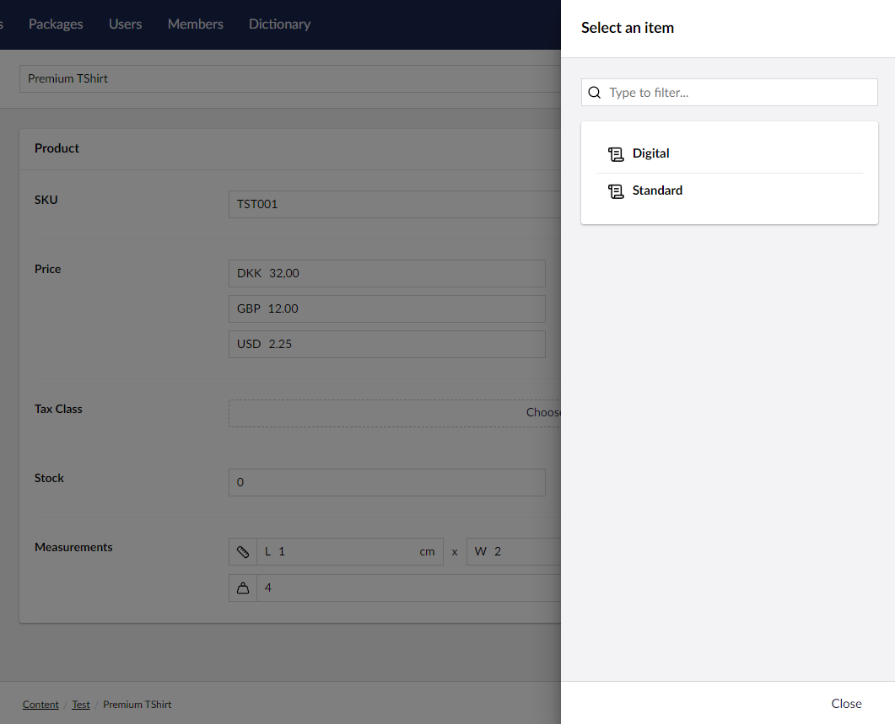

---
description: Fixed Rate Taxes in Umbraco Commerce.
---

# Fixed Tax Rates

Fixed-rate taxes allow you to dynamically calculate the tax obligations of an order by using third-party calculation platforms. This complex option is useful for countries with different tax rates for different product types or regions within the country (the norm in the US).

When using fixed-rate taxes, taxes will be calculated for each price object in the order.

Fixed-rate taxes are defined using **Tax Classes**. A tax class is a classification for a specific type of product and can be configured to have different tax rates for different countries.

## Tax Class Configuration

1. Go to **Settings > Stores > {Your Store} > Taxes > Tax Classes**.

3. Click on the **Create Tax Class** button.
4. Enter the **Tax Class Name**, **Alias**, **Default Tax Rate** and optional **Default Tax Code**.

5. Optionally, define any country-specific tax rates by toggling the checkbox in the **Country Tax Classes** for the country.

6. Click the **Edit Tax Class** button to define the country-specific tax rate/tax code.

7. Click **Save**.

## Assigning a Tax Class

There are two ways to assign a tax class to a product:

### Store Default Tax Class

In the store settings editor, set the **Default Tax Class** for the store. This will be the default tax class for all products in the store.

### Product Tax Class

In the product document type, define a **Store Entity Picker** property configured for the **Tax Class** entity type, with the property alias **taxClass**.
In the products content editor, set the **Tax Class** for the product. This will override the store default tax class for the product.

