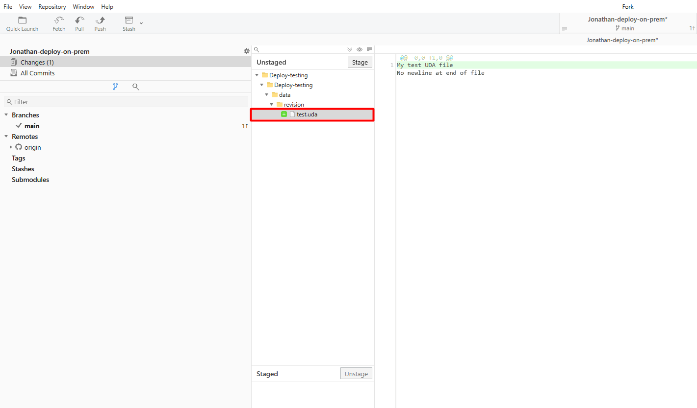
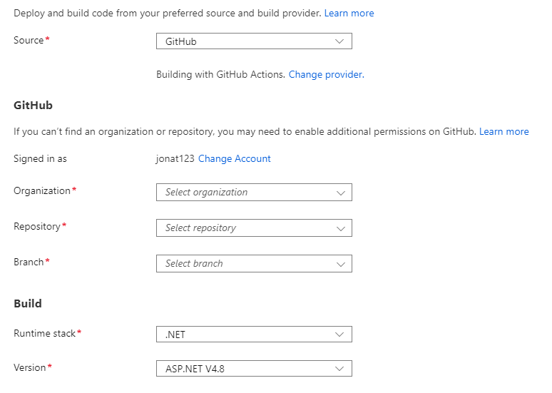

# Installing Umbraco Deploy

In this article, we will cover the steps in order for you to install Umbraco deploy on a brand new website.

We will cover how to install Umbraco deploy and set up Umbraco deploy on your website as well as show an example as to how it can be set up as a CI/CD build server using Github actions to run the deployment on a website set up with Azure web Apps.

## Prerequisites

* Umbraco 8

* Visual studio 2017 v15.9.6 or later

* Git and a repository

* CI/CD or Build Server that supports executing Powershell

* SQL Server Database

## How to install Umbraco Deploy

In this guide we will show how you can install Umbraco Deploy and set up a build server using Github actions to deploy our content.

:::note
In this example we are hosting the site on Azure Web Apps, using Github actions to set up the CI/CD build server, however you are free to choose the hosting provider and CI/CD pipeline that you prefer,
as long as it supports executing Powershell scripts it will work with Umbraco Deploy
:::

## Installation steps

1. [Set up Git repository and new Umbraco project](#Set-up-Git-repository-and-Umbraco-project)
2. [Install Umbraco Deploy via NuGet](#Installing-and-setting-up-Umbraco-Deploy)
3. [Configure CI/CD build server](#Setting-up-CI/CD-build-server-with-Github-actions)

### Set up Git repository and Umbraco project

The first step to get Umbraco Deploy up and running is to set up a  Github repository which will act as our environment where we will set up a CI/CD pipeline that will run the build server to Azure Web and new Umbraco project through Visual [studio](https://our.umbraco.com/documentation/Getting-Started/Setup/Install/install-umbraco-with-nuget).

When setting up a repository add a Gitignore file using the Visual Studio template once the Umbraco project is installed we will add some Umbraco and Umbraco deploy specific files that we want to ignore when we deploy.

Clone down  the repository to your local machine.

When it have been cloned down install the Umbraco project in the repository folder so it will be tracked by Git.

Now the project have been created in the repository, run the project and install Umbraco 8 run through the installer with a Custom SQL connection string to a local database.

Once the installation is done, navigate to the data folder using the command line and run an echo > deploy which will trigger the UDA schema to be installed.

Umbraco have now been installed in the repository, make sure to commit the files to so they are ready to be pushed up once we have set up the build server.

After the Umbraco files have been commited add the following files to the Gitignor so that they will not be picked up by Git when we are deploying and commit it as well.

```none
**/App_Data/*
!**/App_Data/packages
**/media/*

# Umbraco deploy specific
**/data/deploy*
```

### Installing and setting up Umbraco Deploy

When Umbraco have been installed in a repository, we can go ahead and install Umbraco Deploy in the project.

To install Umbraco deploy, in Visual Studio, go to the NuGet Package Manager and search for "UmbracoDeploy" and install it in the Visual Studio solution.

Once the installation have finished You might notice a new file in your config folder called UmbracoDeploy.config. This files tells the deployment engine where to deploy to, it knows which environment you’re currently on (for example local or staging) and chooses the next environment in the list to deploy to.

When Umbraco Deploy have been installed, to be able to use it in the project we will need to add the following AppSetting to the Web.Config of the project:

```xml
<add key="Umbraco.Deploy.ApiKey" value="YourAPIKeyHere" /> 
```

In the AppSetting we need to populate the value with with your own Deploy API Key.

The following code snippet can be used to generate a random key, using a tool like LinqPad

```C#

public string GetRandomKey(int bytelength)
{
   byte[] buff = new byte[bytelength];
   RNGCryptoServiceProvider rng = new RNGCryptoServiceProvider();
   rng.GetBytes(buff);
   StringBuilder sb = new StringBuilder(bytelength * 2);
   for (int i = 0; i < buff.Length; i++)
       sb.Append(string.Format("{0:X2}", buff[i]));
   return sb.ToString();
}

```

This same setting/key must be used on each environment for the same website.

::note
We strongly advise to generate different keys for different websites
:::

Once the AppSetting and API key have been added, it is now time to configure the environments in the UmbracoDeploy.config which is used to define the environments that we have for an Umbraco Deploy installation.

The Config file will look something like this:

```xml

<?xml version="1.0" encoding="utf-8"?>
<environments xmlns="urn:umbracodeploy-environments">
  <environment type="development" 
    name="Development" 
    id="00000000-0000-0000-0000-000000000000">http://development/
  </environment>
  <environment type="staging"
    name="Staging" 
    id="00000000-0000-0000-0000-000000000000">http://staging/
   </environment>
  <environment type="live" 
    name="Live" 
    id="00000000-0000-0000-0000-000000000000">http://live/
  </environment>
</environments>


```

You will need to generate a unique GUID Id for each environment, this can be done in Visual studio or how you prefer to do it.

The “Type” is for informational purposes in the backoffice but in most cases will be the same (lowercased) value of the Name.

The URLs for each environment needs to be accessible by the other environments over **HTTPS**.

:::note you’re free to update the “name” attribute to make it clearer in the interface where you’re deploying to. So if you want to name “Development” something like “The everything-goes area” then you can do that and it will be shown when deploying to that environment.
:::

Once the config has been set up with the correct information we can now go ahead and make sure that the source control is including our files in the ~/data folder of your web application.

This can be done by going to the Data folder of the project and create a test UDA file, and then check in either your Git GUI or in the command line and verify whether the test file is being tracked:



We can see that the file has been created and it is being tracked by Git and we can go ahead and delete the test file.

Now Umbraco Deploy has been installed on the project, we can now go ahead and commit the files to the repository.

Make sure to not push the files up yet as a CI/CD build server will first need to be set up and connected to our a repository.

Then when pushing the commit up the build server will run and build our solution into where you are hosting your website.

### Setting up CI/CD build server with Github actions

:::note
In this example we will show how you can set up a CI/CD build server using Github actions in Azure Web Apps.

We will not cover how you can set up the site itself as this is beyond this documentation.
:::

To set up the build server in Azure Web Apps, we need to go to the Azure portal go to the website that have been set up.

From there we need to go and set up the build server.

In the Azure portal we go to the overwiev of the website that have been set up.

From here we go to the Deployment section and the Deployment section:


In the deployment center we can set up the CI/CD build server, in this example we are going to set up our build server by using Github actions, however you are able to set up the build server however you want as long as it supports executing powershell scripts.

In the deployment center, go to the settings section, choose which source and build provider we will use.

In this case we choose Github and we get some different options for how to set it up:



We need to choose the Organization which we created our Github repository under, once we choose that we can see the repositories that we have under that Organization.

We can go ahead and choose the repository and which branch that we want the build server to build into.

Below we can as well see which runtime stack and version we are running, in this example we are running .NET and ASP.NET Version 4.8.

Once the information have been added we can go ahead and preview the file and see that we will get a YAML file that will be used for the build server:


Once we are done setting it up, we can go ahead and save the workflow.

Once it have been saved the website and the Github repository have now been connected.

If we go back to the Github repository we can see that a new folder have been created called Workflows:


Inside the folder, we find that a new YAML file has been created with the settings that we added in the Azure portal called "main_Jonathan-Deploy-App.yml" in this case.

It will need to be configured so that it works with our Umbraco projects.

The first thing that needs to be done is to make a pull from the Github repository in Git, so that we will get the YAML file on our local machine.

we now have the file on our local machine, which means that we can go ahead and configure it so it will work with our Umbraco Deploy installation.

When it have been configured it will look something like this:

```yaml
name: Build and deploy ASP app to Azure Web App - Jonathan-deploy-live

on:
  push:
    branches:
      - main
  workflow_dispatch:

jobs:
  build-and-deploy:
    runs-on: 'windows-latest'
    
    env:
      deployBaseUrl: https://helloworld.azurewebsites.net
      umbracoDeployReason:  DeployingMySite
  
    steps:
    - uses: actions/checkout@master

    - name: Setup MSBuild path
      uses: microsoft/setup-msbuild@v1.0.2

    - name: Setup NuGet
      uses: NuGet/setup-nuget@v1.0.5

    - name: Restore NuGet packages
      run: nuget restore
      working-directory: 'Deploy-testing'

    - name: Publish to folder - two parent folders up back at root of our repo
      working-directory: 'Deploy-testing'
      run: msbuild /nologo /verbosity:m /t:Build /t:pipelinePreDeployCopyAllFilesToOneFolder /p:_PackageTempDir="..\..\published\"
      
    - name: Copy License File
      shell: powershell
      run: xcopy /S /Q /Y /F ".\Deploy-testing\Deploy-testing\bin\umbracoDeploy.lic" ".\published\bin\"
      
    - name: Deploy to Azure Web App
      uses: azure/webapps-deploy@v2
      with:
        app-name: 'Jonathan-deploy'
        slot-name: 'production'
        publish-profile: ${{ secrets.AzureAppService_PublishProfile_04d3dd3154c64469aad82d1986996781 }}
        package: published
        
    - name:  Run Deploy Powershell - triggers deployment on remote env
      working-directory: 'Deploy-testing\Deploy-testing'
      shell: powershell
      run: .\TriggerDeploy.ps1 -InformationAction:Continue -Action TriggerWithStatus -ApiKey ${{ secrets.deployApiKey }} -BaseUrl  ${{ env.deployBaseUrl }} -Reason  ${{ env.umbracoDeployReason }} -Verbose       
```

:::note
This is  an example of how you can set up the CI/CD pipeline for Umbraco Deploy, however there are many ways that this can be done and it is possible to set it up in a way that works for how you or your company workflow.
:::

Before the build can work, we will need to set up the API key that we generated earlier to work with the build server in Github actions.

This is done in Github under settings > Secrets > New repository secret it needs to be called **"DEPLOYAPIKEY"** and then add the API key from the the AppSetting for Umbraco Deploy in the web.config and save it.

We can now go ahead and commit it to our Github repository and can now push up all the files to the repository.

Once the files have been pushed up, go to Github there we can see that the CI/CD build has started running:


The Build server that has been set up will go through the steps in the YAML file and once it is done in Github we can see that the deployment have gone through succesfully:


We can now start creating content on the local machine. We can see that once we create something like a document type, the changes are getting picked up in Git and, once done with making changes, we can commit them and deploy them to Github which again, will run the build server we have set up and then extract the changes into the website that we have set up in Azure.

This will only deploy the meta data for our local site to your website, to transfer content and media you will need to do so from the backoffice on your local project using the queue for transfer [feature](../Content-Transfer).
