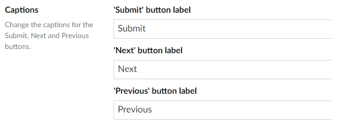

# Form Settings

In this article, you can read about customizing your form. To access the Form Settings:

1. Navigate to the **Forms** section.
2. Open a Form you wish to customize.
3. Click **Settings** in the top-right corner of the screen.
    

## Settings Options

The following options are available in Forms Settings:

- **Store Records**
    By default, all submitted records is saved in a database. This option allows you to view and export the saved records from the queries overview. If you do not want to store data (due to policies in your organisation), you can uncheck the box.

    

- **Captions**
    Customize the labels of the Submit, Next, and Previous buttons used in your form.

    

- **Styling**
    Set a **css class** to give your form custom styling. You have an option to disable the default styling. Enabling the **Disable default stylesheet** option will prevent a default stylesheet to be added to the pages where the form is placed.

    

- **Validation**
    Define a message that is displayed when a field is mandatory, when a value is not supplied or when the value is invalid.

    

    The following Validations are available:
    | **Mandatory error message** | The error message is displayed for a field that is marked as mandatory but a value has not been provided upon submission. This setting can be overwritten on a field level - `{0}` will be replaced with the field caption. |
    |-|-|
    | **Invalid error message** | The error message is displayed for a field if the value provided is not valid (a regular expression has been setup but the input does not match). This setting can be overwritten on a field level - `{0}` will be replaced with the field caption. |
    | **Show validation summary** | Enable this option if you wish to display a summary of all error messages on top of the form. |
    | **Hide field validation labels** | Enable this option if you wish to hide individual field error messages from being displayed. |
    |**Mark fields** | You can choose to not mark any fields or only mark mandatory or optional fields. |
    | **Indicator** | Choose which indicator to use when a field has been marked as mandatory. The default indicator is `*` |

- **Moderation**
    Enabling this feature allows the moderator to approve or deny a Form before its published. Most Forms contain publicly shown entries such as blog post comments or submissions for a social campaign and you can decide what's being published online.

    
