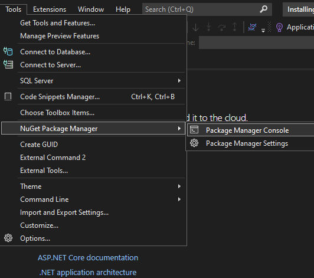
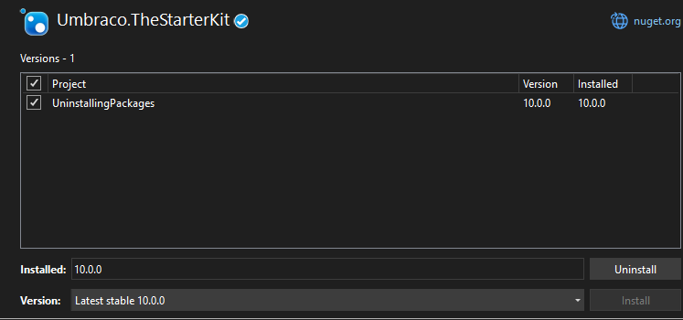
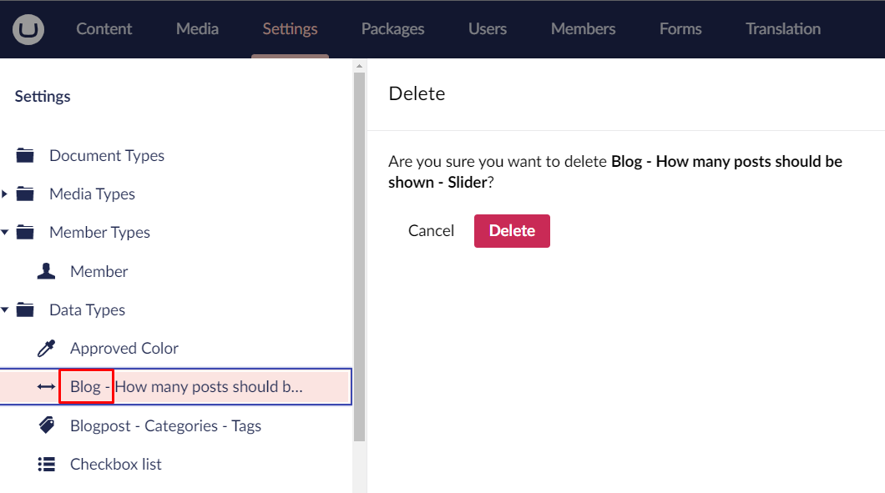

# Installing packages

In the Umbraco Backoffice, there is a **Packages** section which can be used to browse community-made packages for the CMS. From version 9 of Umbraco, it is only possible to add packages to via NuGet.

Navigating to a specific package in the section will present you with an overview of the package, as well as an install snippet for NuGet CLI.

The packages can be installed by using:
- NuGet Package Manager in Visual Studio
- Package Manager Console in Visual Studio
- .NET CLI (usually accessible from the terminal/command prompt of your system)

For example, to install TheStarterKit package for the CMS the command would be:

`dotnet add package Umbraco.TheStarterKit`

Navigating to the Package Manager in Visual Studio is more visual, and gives you an overview of already installed packages.

The Package Manager has an integrated search function that allows you to find any public NuGet package and install it on the project.

Once the package has been installed, it will show up under the **Packages** section in the backoffice, under **Installed** tab.

# Uninstalling packages

Uninstalling packages is not always as straightforward as installing them.

In this section we will provide two examples on uninstalling a package - The Starter Kit and SEO Checker.

## Uninstalling packages like The Starter Kit

The Starter Kit provides you with a boilerplate solution to build upon. The package installs Document Types, Templates, media, content, and everything else needed to set up a small website. There is little custom code/functionality involved, and that is usually the case for such (starter kit/starter websites) packages.

To uninstall a package, either run a command like

`dotnet remove package Umbraco.TheStarterKit`

in the CLI, or use the visual interface of NuGet Package Manager.

It is recommended to clean the solution after removing any package. This can be done by right-clicking the project in Visual Studio and choosing the *Clean* option, or using the `dotnet clean` command.

### Removing package leftovers from the backoffice

With packages like The Starter Kit, the process does not end there. While the package is gone, content - and everything else needed for the website - is still available in the backoffice. To fully remove this kind of package, additional steps are needed.

#### Remove Content provided by the package

There is no universal way to tell what content comes from a package, and what content is custom-made. In the content section, delete individual nodes accordingly. If the goal is to fully remove the package and clean the site, all the content can be removed (and the recycle bin emptied).

#### Remove Media provided by the package
Similarly to Content, Media also might have to be removed

#### Remove Document Types
Document types can be removed from the **Settings** section. If fully removing the package, all document types can be deleted, as there are no default Document Types in a clean-slate Umbraco installation.

#### Removing Data Types
As opposed to Document Types, there are some Data Types that are available out of the box when Umbraco is installed. It is not recommended to remove them. The safe approach is to delete any item that starts with a document type prefix and includes multiple dashes - that is the default naming convention for new configurations of datatypes (e.g. Blog - How many posts should be shown - Slider)

#### Removing Templates
No templates are available out of the box in a new installation. If cleaning up after a package, it would be okay to delete all that are present

#### Removing Partial Views
Out of the box, there are a few views available in the *blocklist* and *grid* folders. Everything else can theoretically be removed.

### Cleaning leftover files on disk

Some packages might reference other items. For example, installing The Starter Kit also adds `Bergmania.OpenStreetMap` to your project. That component will show up as installed in the backoffice even after uninstalling the NuGet package.

In many cases, custom dashboards, editors, and scripts are left in the `App_Plugins` folder after a package has been uninstalled via NuGet. These files also have to be deleted manually.

:::note
Please note this particular guide targets a specific package. There are many packages out there, and each one is different. The exact steps presented here might not work the exact same way for all the packages, though the general approach should still apply.
:::

## Uninstalling packages like SEO Checker

More advanced packages that add functionality on top of Umbraco usually rely on providing custom, compiled code. That being said, many of such packages also implement custom sections, dashboards, editors, and views.

In this example, we are using SEO Checker which is not a very invasive package out of the box. It allows the developers of the site to add custom properties to Document Types used to track good search engine optimization practices.

An example use case of SEO Checker property on a Document Type, as presented in the Content section:

To uninstall SEO Checker from a website, the first step would be removing the package via a dotnet command (or Package Manager):

`dotnet remove package SEOChecker`

After that, cleaning the solution is recommended.

### Cleaning leftover files on disk

While uninstalling the package would remove most of the custom code, `App_Plugins` folder has to be cleaned manually. 

Removing *seochecker* folder from `App_Plugins` will clean up the leftover backoffice section and dashboards.

### Consequences of removing packages

If there is any content on the website that relies on having a custom Property Editor or a data source installed, those specific properties will fall back to using a `label` Data Type with the previously saved content being converted to a string.

In the case of SEO Checker the custom property added from the package would look like this after all the package files have been removed:

Depending on the packages used and the implementation, frontend rendering of content coming from custom editors, or any frontend functionality dependent on external code, might not work correctly. It is recommended to inspect the frontend of the site after removing any packages.
