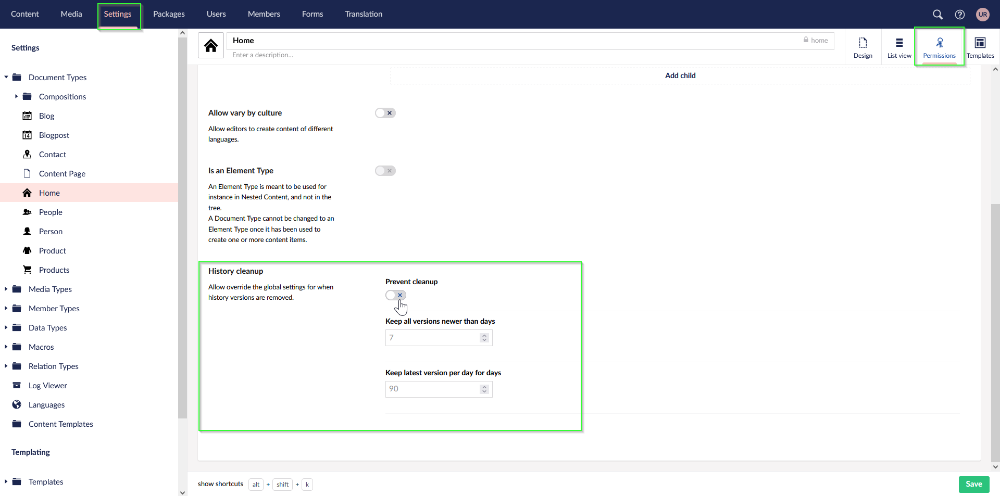
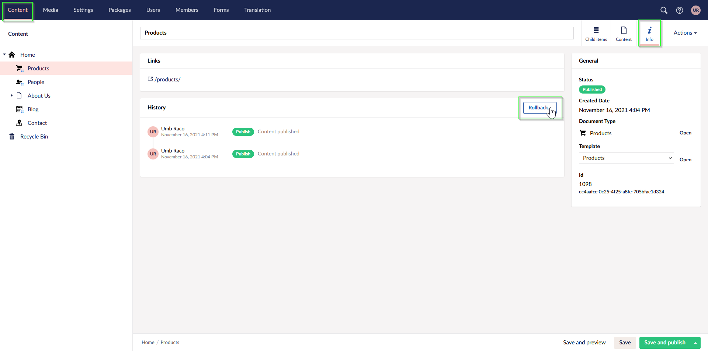

# Content Version Cleanup

When you publish a document a lot of new records are created in the database, all of the property data
for each culture variant of a document are duplicated and this can mount up fast eating up disk space on 
your database server.

Umbraco 9.1.0 introduced a feature to clean up historic content versions (inspired by [Our.Umbraco.UnVersion](https://our.umbraco.com/packages/website-utilities/unversion/) h5yr!).

The feature is enabled by default via configuration for new installs starting from 9.1.0 but will require opt in for 
those upgrading from 9.0.0.

This feature certainly isn't for everyone, some sites will have regulatory requirements to keep historic data for audit.

For those sites with stricter requirements (or those who just don't want the feature) it is possible to opt out both globally 
(see [v9-Config > ContentSettings](/documentation/Reference/v9-Config/ContentSettings/index.md#contentversioncleanuppolicy)) and per document type (keep reading).

Additionally it is possible to keep the feature enabled but mark specific versions to keep forever (perhaps last years awesome marketing campaign).

It's worth noting that whilst we delete rows, we do not shrink database files or rebuild indexes so for upgraded sites with a lot
of history you may wish to perform these tasks (if they are not part of your regular database maintenance plan already).

## Overriding global settings

It is possible to override the global settings per document type in the backoffice to prevent unwanted clean up, this can be managed in the "permissions"
content app for each document type.

## Prevent cleanup of important versions

It is possible to mark important content versions as "prevent cleanup" to ensure they are never removed via the new and improved 
rollback modal which can be found on the "info" content app for each document.

1. Open rollback modal.

1. Click "prevent cleanup" button for each important version.
