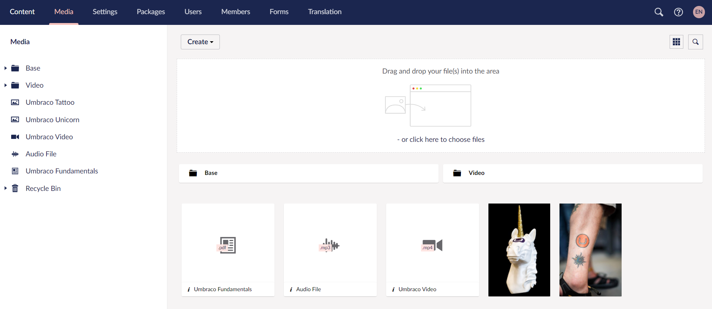
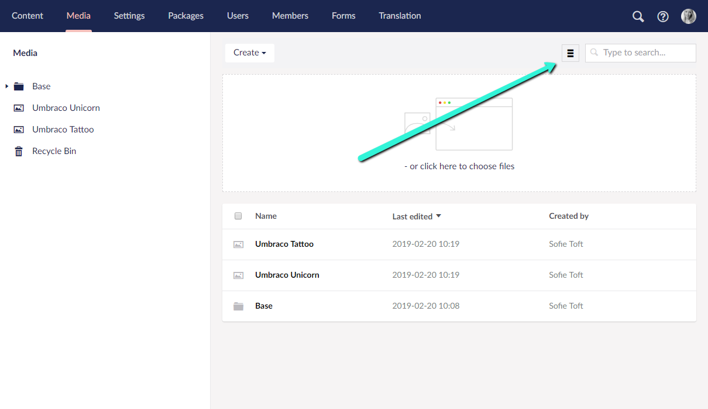
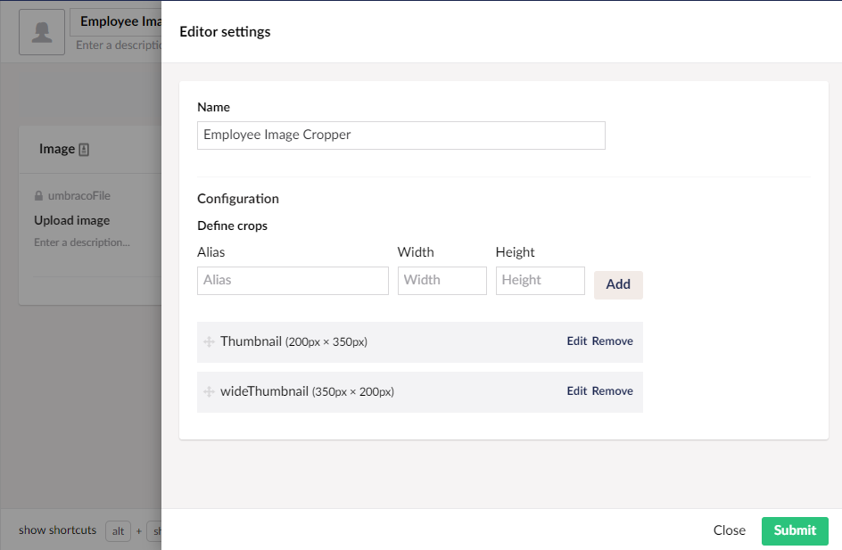
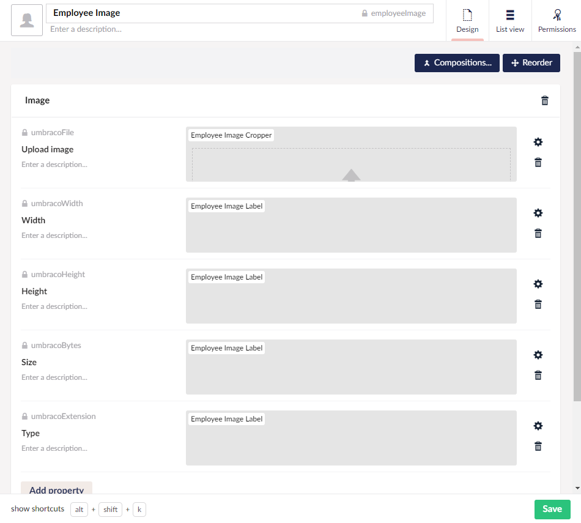
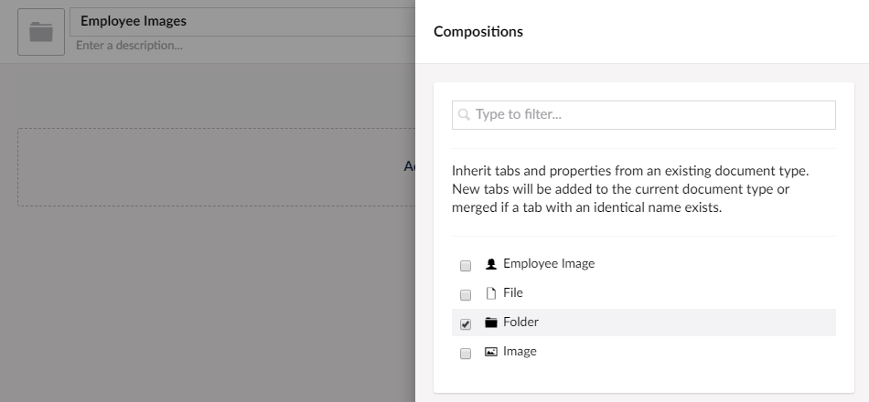
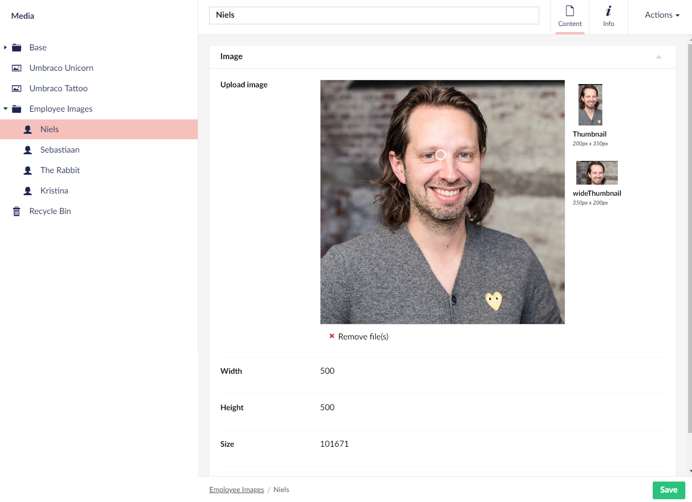

# Creating media

Media in Umbraco is handled in much the same way as content. Instead of defining Document Types you define Media Types that act as the base for media items. Unlike with normal content there are a three default Media Types:

- Folder
- Image
- File

The __Folder__ Media Type is a container for organizing media items in the media tree. The __Image__ Media Type is used for uploading and storing images and the __File__ Media Type is used to upload and store other files in the Media section. This means you don't have to define your own Media Types to start using the section. You've already got the tools for organizing and uploading media.

## Creating a folder

It is always a good idea to start by creating a folder for Media items. Make sure to name your folders in a way that makes it possible for editors to upload files and images in the right place.

To create a media folder go to the __Media section__ and click the menu icon to the right of __Media__, alternatively you can right click the __Media__ node and choose **Create**. This will bring up a dialogue. Pick __Folder__, enter a name and press __save__.

## Uploading images and files

There are a couple of different ways to do this.

You can use the context menu as when creating a folder. Click the menu icon next to the folder and choose __Image__ or __File__, enter a name for your media item and click the __Upload field__ and choose a file to upload.

An easier way to do it is to drag and drop the file to the upload field in the Media section. Umbraco will automatically detect if it is an image or a file and create a media item in the folder. You can even drop entire folders (with subfolders) and the folder and file structure will be recreated. Alternatively you can click on the upload field to get a standard OS file picker dialog.

You can also click the __Create__ dropdown, and choose what kind of item you want to create. Choose Image or File here, will again give you the option to either click an Upload field or drag the image into the upload field to upload the item.

The default __Image__ Media Type has 5 properties that will be populated once the image is uploaded. These are __Upload Image__, __Width__, __Height__, __Size__ and __Type__. They can be viewed in the __Media__ section and accessed in your templates.

## Organizing and editing media items

The default view for the media section is a card view that let's you preview the images, files and folders.

By clicking the items you can select multiple media items and do bulk operations like deleting or moving them. To edit properties on a media item click the name of the item, which you will see once hovering over the item.

You can switch to a list view by clicking the view toggle next to the search field and selecting the listview.

## Using media items in content

By adding a __Media Picker__ property to a Document Type the editor will have the ability to select media items when creating content.

:::tip
The __Upload File__ property on the images use the Image Cropper Data Type. If crops are added to this you can adjust the individual crops on the media item and access them in templates. You can add crops by editing the Upload File property on the Image Media type in the Settings section.
:::

## Creating a Media Type

You can create your own Media Types and add tabs, properties, and control the structure of the Media tree as you would with Document Types. This means you can store information that is specific to the media on the item itself.

A Media Type is created in the __Settings__ section using the Media Type editor.

Go to the __Settings__ section. On the __Media Types__ node click the menu icon (or right click the node) to bring up the context menu. Here you can choose between creating a media type or a folder.

:::tip
Having different folders for different media types makes it possible to restrict where media items can be created. Only allowing PDF uploads in a certain folder or employee images in another makes it easier for editors to keep the Media section organized.
:::

Choose __New Media Type__. This will open the Media Type editor. It is similar to the editor used for creating Document Types. The difference is that Media Types define items for the Media section and you do not have the ability to assign a template for the Media Type.

Name the Media Type "Employee Image". Choose an icon by clicking the icon to the left of the name.

### Adding tabs

Before we start adding properties to the Media Type we need to create a group to put these in.

Click on __Add group__ and call it "Image".

### Adding properties

We need to add the same properties as on the default __Image__ Media Type. These are:

- `umbracoFile`
- `umbracoWidth`
- `umbracoHeight`
- `umbracoBytes`
- `umbracoExtension`

On the Image group click __Add property__. Name it "Upload image" and change the alias to "umbracoFile".

Click __Add editor__, search for "cropper" and choose __Image cropper__ under __Create new__. This will create a new Image Cropper Data Type. The name of the new Data Type type is a bit long so rename it to "Employee Image Cropper".

Add two new crops called "Thumbnail" (200px x 350px) and "wideThumbnail" (350px x 200px).

Name the remaining four properties "Width", "Height", "Size" and "Type" and give them the aliases seen below. They should all use the __Label__ editor. As mentioned before these properties will automatically be populated once an image has been uploaded.

## Defining a Media Type folder

Next up we'll create a folder to hold the employee images. We could use the existing __Folder__ Media Type but that would mean editors can upload employee images to any folder of that type. If we create a folder specifically for employee images there is only one place to put them thus making it easier to have an organized Media section.

### Structure and inheritance

Go back to the __Settings__ and create a new Media Type and name it "Employee Images". Select the folder icon by clicking the icon to the left of the name.

We want the same basic functionality (same properties and tabs) as the __Folder__ Media type and that can be achieved by clicking __Compositions__ and selecting the __Folder__ Media Type. Now Employee images will inherit tabs and properties from the Folder Media Type.

Switch to a list view by clicking the **List view** tab and toggle the **Enable list view** option.

Finally, we need to allow the Employee Image Media Type in our new folder. Go to the __Permissions__ tab. Click __Add child__ under __Employee Images__ and select __Employee Image__.

All that is left to do is to define where the folder can be created. We want to create the folder in the root of the Media section so select the __Allow at root__ option at the top of the Permission tab.

### Creating the folder and media items

Go to the __Media__ section and click the menu icon next to Media and select the __Employee images__ folder. Name it "Employee Images" and click **Save**.

There are four options to add a new media items to the folder, as you can see here:

:::tip
Remember you can uncheck the __Allow at root__ option on the __Employee images__ Media Type to prevent editors from creating multiple folders of this type. This will not affect created folders, only disable the creation of new ones.
:::

### Cropping the images

If you select an image that has been uploaded to this folder you'll see the full image and the two crops we have defined below. Moving the pink focal point on the on the image will update the crops to focus accordingly. You can also edit the individual crops by selecting them and moving the image or adjust the slider to zoom.

## More information

- [Rendering Media](../../Design/Rendering-Media)
- [Customizing Data Types](../Data-Types)

## Related Services

- [MediaService](../../../Reference/Management/Services/MediaService/index.md)
