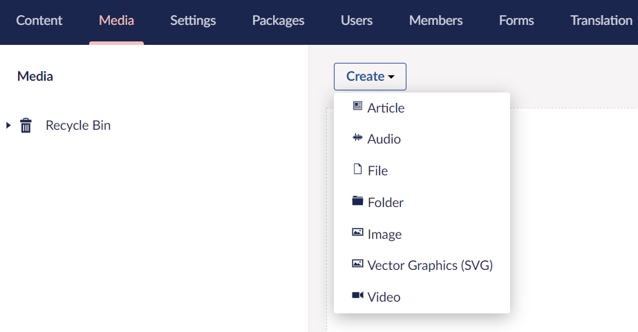
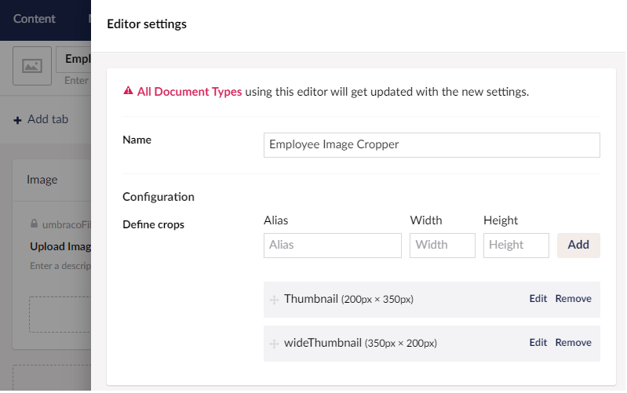
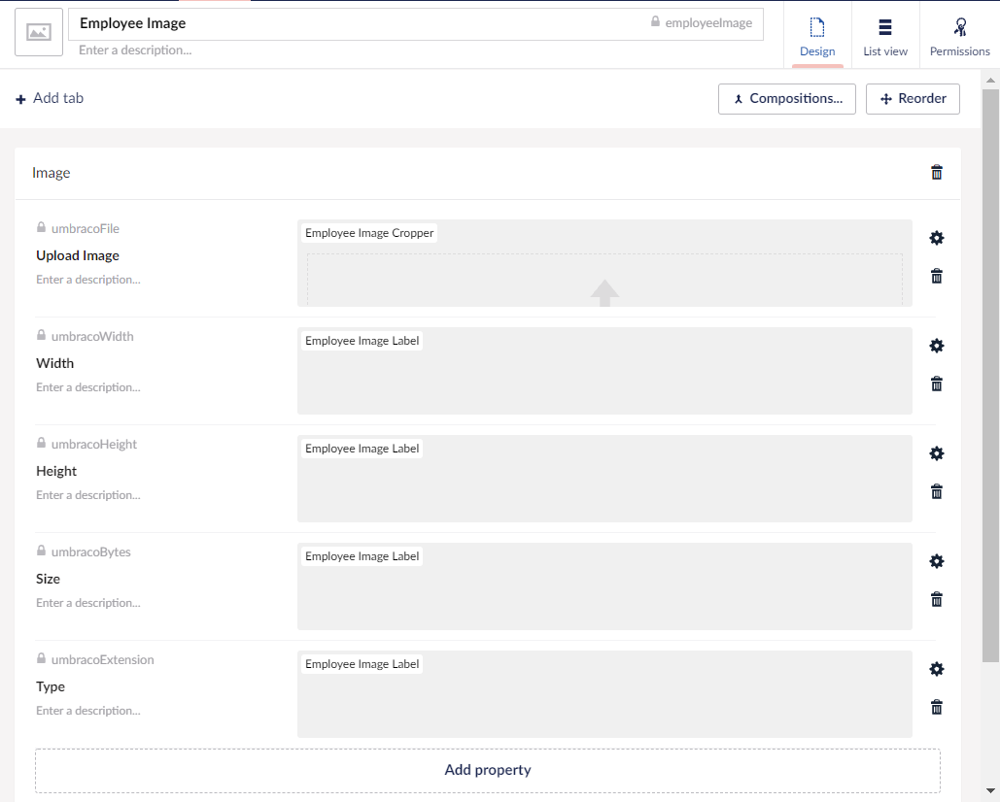
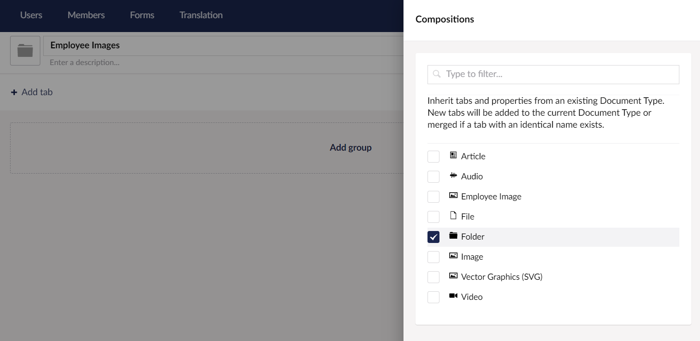
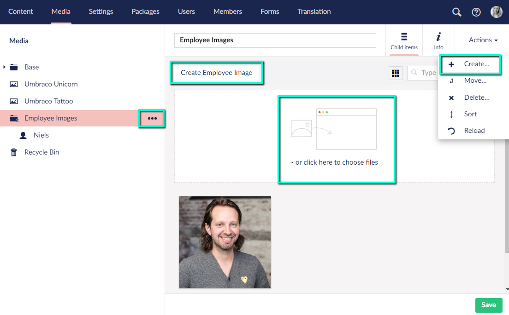

# Creating media

Media in Umbraco is handled the same way as content. Instead of defining Document Types you define Media Types that acts as a base for media items. The following default Media Types are available:

- Article - Used for uploading and storing documents.
- Audio - used for uploading and storing digital audio files.
- File - used for uploading and storing different types of files in the Media section.
- Folder - a container for organizing media items in the media tree.
- Image - used for uploading and storing images.
- Vector Graphics (SVG) - used for uploading and storing Scalable Vector Graphics files which are text files containing source code to draw the desired image.
- Video - used for uploading and storing video files.

This means you don't have to define your own Media Types to start using the Media section. You have already got the tools for organizing and uploading the media.

:::note
If you have upgraded from an older version than 8.14 then the new media types are not added automatically. You can add those types manually yourselves by follwing the steps below ['Creating a new Media Type'](#creating-a-media-type). On [this page](default-media-types.md) you will find an overview of all new media types. If you use uSync it is possible to import the new media types. In this [repo](https://github.com/erikjanwestendorp/UmbracoMediaTypes) you will find the uSync definitions.
:::

## Creating a folder

It is always a good idea to start by creating a folder for your Media items. Make sure to name your folders in a way that makes it possible for editors to upload their media items in the right place.

To create a media folder, go to the __Media section__ and click **...** next to __Media__. Alternatively, you can right-click the __Media__ node and choose **Create**. This will bring up the list of available media types. Select __Folder__, enter a name for the folder and click __save__.

## Uploading Media

You can upload media in three ways:

1. Click **...** next to __Media__ and choose the media type, enter a name for your media item and select the __Click to upload__ field to choose a file type or drag the file into the upload field to upload the item.

    

2. Drag and drop your files in the __Upload__ field in the Media section.

    

    :::note
    Umbraco will automatically detect the media type and create a media item in the folder. You can even drop entire folders (with subfolders) and the folder and file structure will be recreated.
    :::

3. Click the __Create__ dropdown, and choose the media item. Enter a name for your media item and select the __Click to upload__ field or drag the file into the upload field to upload the item.

    

The __Image__ Media Type has 5 properties (__Upload Image__, __Width__, __Height__, __Size__ and __Type__) that is populated once the image is uploaded. These properties  can be viewed in the __Media__ section and accessed in your templates.

Except the __Folder__ Media Type, the rest of the media types has 3 properties - __Upload Image__, __Type__, and __Size__.

## Organizing and editing media items

The default view for the media section is a card view that let's you preview the different media files.

Click the items to select multiple media items and perform bulk operations like moving or deleting them. To edit properties on a media item, click the name of the item, which you will see once you hover over the item.

You can switch to a list view by clicking the view toggle next to the search field and selecting the listview.

## Using media items in content

By adding a __Media Picker__ property to a Document Type the editor will have the ability to select media items when creating content.

:::tip
The __Upload File__ property on the images use the Image Cropper Data Type. If crops are added to this you can adjust the individual crops on the media item and access them in templates. You can add crops by editing the Upload File property on the Image Media type in the Settings section.
:::

## Creating a Media Type

You can create your own Media Types and add tabs, properties, and control the structure of the Media tree as you would with Document Types. This means you can store information that is specific to the media on the item itself.

A Media Type is created in the __Settings__ section using the Media Type editor.

Go to the __Settings__ section. On the __Media Types__ node click **...** next to __Media Types__ (or right click the Media Types node) to bring up the context menu. Here you can choose between creating a **New Media Type** or a **Folder**.

:::tip
Having different folders for different media types makes it possible to restrict where media items can be created. Only allowing PDF uploads in a certain folder or employee images in another makes it easier for editors to keep the Media section organized.
:::

Choose __New Media Type__. This will open the Media Type editor. It is similar to the editor used for creating Document Types. The difference is that Media Types define items for the Media section and you do not have the ability to assign a template for the Media Type.

Name the Media Type _Employee Image_. Choose an icon by clicking the icon to the left of the name.

### Adding tabs/groups

Before we start adding properties to the Media Type we need to add a tab/group to put these in. To add a tab/group, Click on __Add tab__ or __Add group__ and call it _Image_.

For more information on adding a tab, see [Using tabs](../Adding-Tabs/index.md) article.

### Adding properties

We need to add the same properties as on the default __Image__ Media Type. These are:

- `umbracoFile`
- `umbracoWidth`
- `umbracoHeight`
- `umbracoBytes`
- `umbracoExtension`

On the Image group, click __Add property__. Name it _Upload image_ and change the alias to _umbracoFile_.

Click __Add editor__, search for _cropper_ and choose __Image cropper__ under __Create new__. This will create a new Image Cropper Data Type. The name of the new Data Type type is a bit long so rename it to _Employee Image Cropper_.

Add two new crops called _Thumbnail_ (200px x 350px) and _wideThumbnail_ (350px x 200px).

Name the remaining four properties _Width_, _Height_, _Size_ and _Type_ and give them the aliases as mentioned in the image below. They should all use the __Label__ editor. As mentioned before these properties will automatically be populated once an image has been uploaded.

## Defining a Media Type folder

Next up, we'll create a folder to hold the employee images. We could use the existing __Folder__ Media Type but that would mean editors can upload employee images to any folder of that type. If we create a folder specifically for employee images there is only one place to put them thus making it easier to have an organized Media section.

### Structure and inheritance

Go back to the __Settings__ and create a new Media Type and name it _Employee Images_. Select the folder icon by clicking the icon to the left of the name.

We want the same basic functionality (same properties and tabs) as the __Folder__ Media type and that can be achieved by clicking __Compositions__ and selecting the __Folder__ Media Type. Now, Employee images will inherit tabs and properties from the Folder Media Type.

Switch to a list view by clicking the **List view** tab and toggle the **Enable list view** option.

We need to allow the Employee Image Media Type in our new folder. Go to the __Permissions__ tab. Click __Add child__ under __Employee Images__ and select __Employee Image__.

Finally, define where the folder can be created. We want to create the folder in the root of the Media section so select the __Allow at root__ option at the top of the Permission tab.

### Creating the folder and media items

Go to the __Media__ section and click the menu icon next to Media and select the __Employee images__ folder. Name it "Employee Images" and click **Save**.

There are four options to add a new media items to the folder, as you can see here:

:::tip
Remember you can uncheck the __Allow at root__ option on the __Employee images__ Media Type to prevent editors from creating multiple folders of this type. This will not affect created folders, only disable the creation of new ones.
:::

### Cropping the images

If you select an image that has been uploaded to this folder you'll see the full image and the two crops we have defined below. Moving the pink focal point on the on the image will update the crops to focus accordingly. You can also edit the individual crops by selecting them and moving the image or adjust the slider to zoom.

## More information

- [Rendering Media](../../Design/Rendering-Media)
- [Customizing Data Types](../Data-Types)

## Related Services

- [MediaService](../../../Reference/Management/Services/MediaService/index.md)
