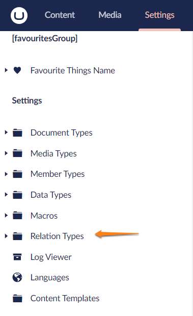
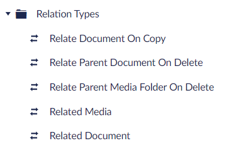
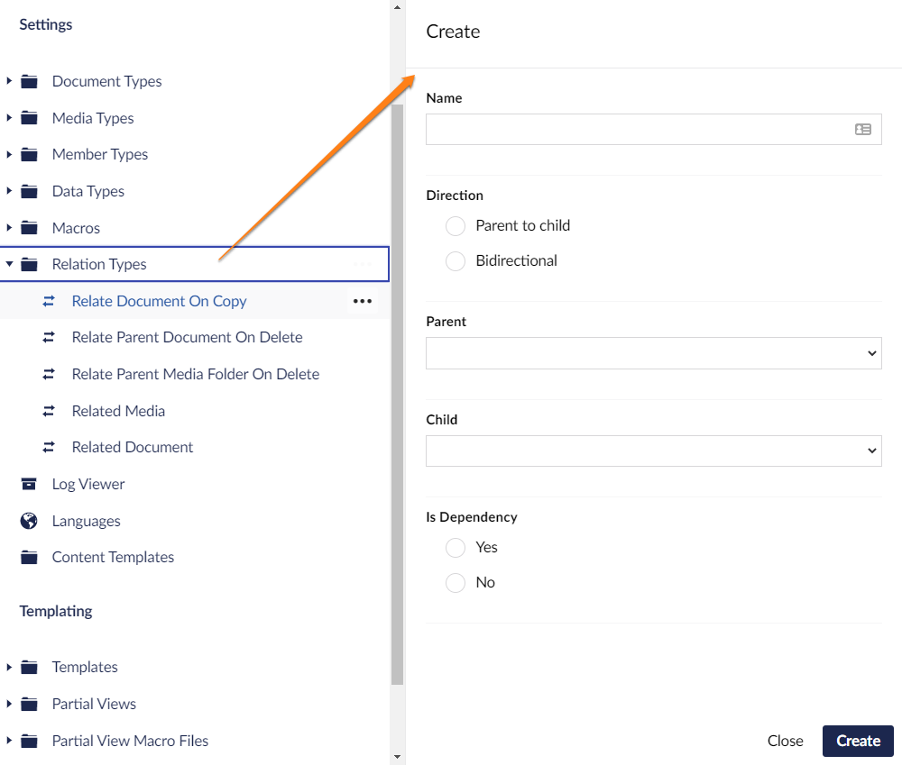
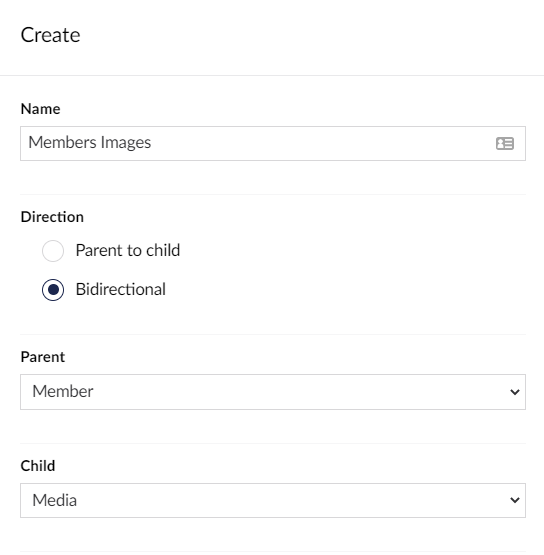

# Relations

Umbraco sections are built around the concept of 'trees' and there is an implicit relationship between items in a section tree. 

We refer to these relationships in the manner of a 'Family Tree' - eg, One content item might be the 'Parent' of several content items, and those content items would be referred to as the 'Children' of that parent. Items within the same branch of the tree can also be described as 'Ancestors' or 'Descendants' of an item, depending if they are above or below them in the depth of the tree. 

There are methods in Umbraco to support querying content items by their relative position in the tree to the current page using these concepts, eg `Model.Ancestors()` or `Model.Children()` or `Model.Descendants()` - but what about 'Cousins'? 

What, for example, if there are no direct Parent/Child/Ancestor/Descendant relationships between two items in a tree, but they are still somehow notionally 'related' in the context of your website? eg the alternate language translation pages of a content page... 

What if there is also a 'relation' between different types of Umbraco entities in your site, eg Content -> Member or Member -> MediaFolder, (perhaps you'd like to be able to retrieve and display the uploaded images from a specific logged in Member.)

These are the scenarios where the concept of **Umbraco Relations** provides a solution.

## The Concept of Umbraco Relations

Umbraco Relations allow you to relate almost any object in Umbraco to almost any other Umbraco object - under a defined *Relation Type*.

### How is this different to pickers?
With a Content/Member/Media picker that you might add to a Content Type - the relationship is ONLY 1-way. Your content item knows it has 'picked' another content item, perhaps to display a shared banner across different pages, but that 'banner' content item doesn't know where it has been picked!

Umbraco Relations are 2-way, when you create a relation between two different types of entities, you can alway find one entity from the other and vice versa. eg you could list out in the backoffice all the pages that a content banner had been picked on.

## Relation Types

In order to create and use Relations in your Umbraco Website, you need to define a 'Relation Type' to specify what the two types of entities will be relatable, and to give the Relation Type an alias, so you can test if two items are related for a particular 'relation type'. Two items might be related under multiple different Relation Types, and you might be only interested in your 'Related Language Page' Relation Type.

### Create a Relation Type

Visit the Settings section of the Umbraco backoffice and you'll find the 'Relation Type' tree

If you expand the Relation Type tree, you can see that Umbraco 'ships' with some default Relation Types, that helps the backoffice function:

for example there is a Relation Type that tracks when Media is picked in Content to be able to provide the functionality of warning an editor if they try to delete a Media Item that it is 'in use'. There is a Relation Type, to help 'restore' deleted content back to the place it was deleted from in the Recycle Bin.

Right click the 'Relation Types' folder to create your new Relation Type

Provide the Relation Type with a name (this will generate it's alias).

Choose the 'direction' of the relationship, eg usually Bidirectional to get the benefits of relations.

Define the type of one object in the relation (confusingly this is called 'Parent' but that only defines which column in the database this value is stored in, for a bidirectional relationship it doesn't matter which type of entity is defined as the parent or the child, but if there is a natural 'one thing' will be related to lots of 'other things', then choose that thing as the parent. (really they should be Uncles/Aunts and Nephews/Nieces - but there isn't a common non-gendered term for this family relationship, although Piblings and Niblings has started to become popular).

Choose the different types for each entity in the relationship.

Currently the available types are:

Document(Content), Media, Member, Document Type, Media Type, Member Type, Member Group, Data Type, Root, Recycle Bin

eg. for relating Members to their uploaded Images, we might create a 'Member Images' relation

'Is Dependency' - in the functionality to prevent an item from being deleted if it's in use, some performance gains have been found when querying if a media item is a dependency - by adding an 'Is Dependency' field to the relationship, generally for your custom relations, you'll set this to false.

Click **Create** and you'll see your new Relation Type created in the Relation Types folder. You can see the 'Alias' that you'll need to make note of when working with Relations.

## Viewing Relations

To view one of the existing Relation Types, go to the **Relations** tab. It displays a long list of all the objects that have been related for this specific Relation Type. 

## Creating Relations

You can create Relations using the RelationService API via code.

[Some examples are provided here in the RelationService Documentation Page](../../documentation/reference/management/services/relationservice/)

### Use cases
You might want to create a 'Relation' between two objects either as:

-  a response to a backoffice event. For example, a content item being published that has picked several other content items. You can add a relationship between these items to make querying between them easier. 

Or 

in the front end of your site, a logged in member might upload images to your site, and you create them programatically in the Media Section and create a Relation between the Member and the Media Item, so you can retrieve the Members images to display in a gallery.

### Community Packages
  
There are several community packages that make use of Relations, eg 

* ['Relations Picker'](https://our.umbraco.com/packages/backoffice-extensions/relations-picker/) - a content picker that automatically creates Relations
* ['ContentRelations'](https://our.umbraco.com/packages/backoffice-extensions/contentrelations/) - allows you to relate two items via the Backoffice
* ['LinkedPages'](https://our.umbraco.com/packages/backoffice-extensions/linked-pages/) - Provides a LinkedPages context item to show, edit and add relations between content pages.