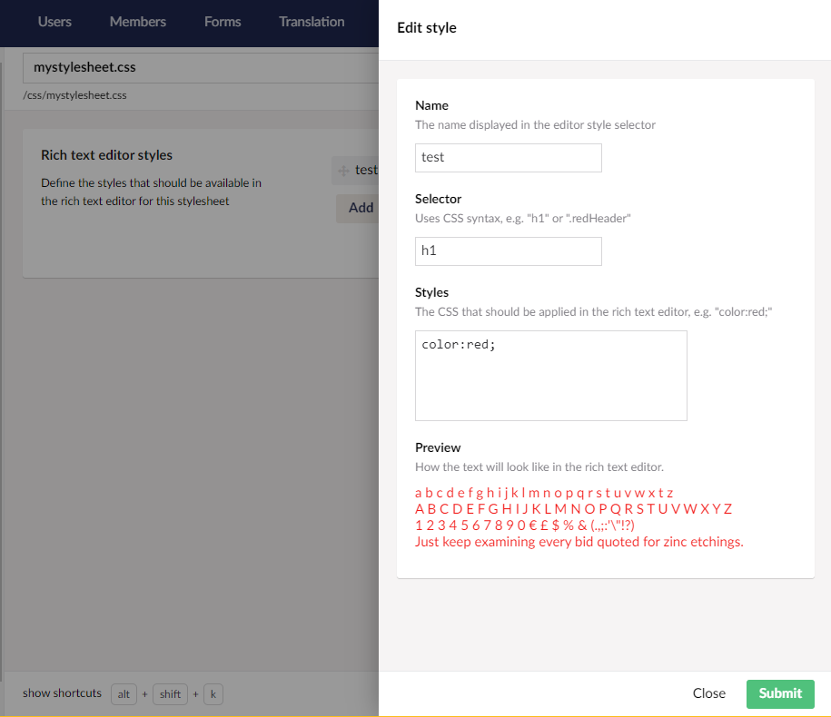
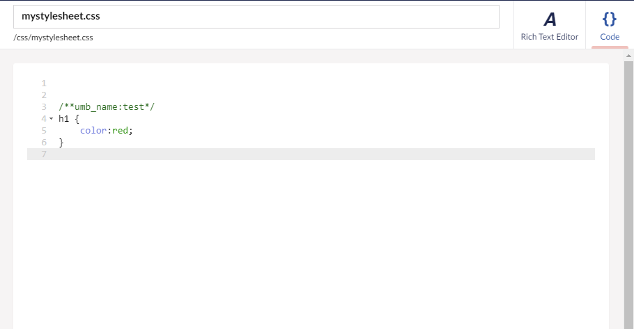
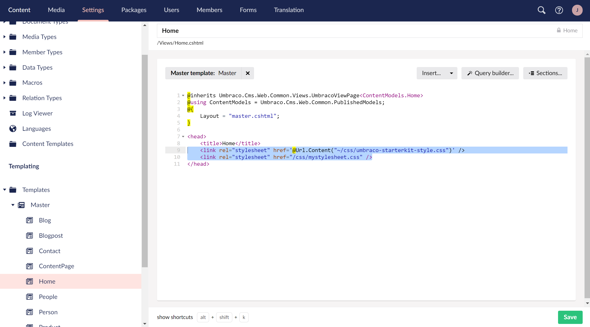
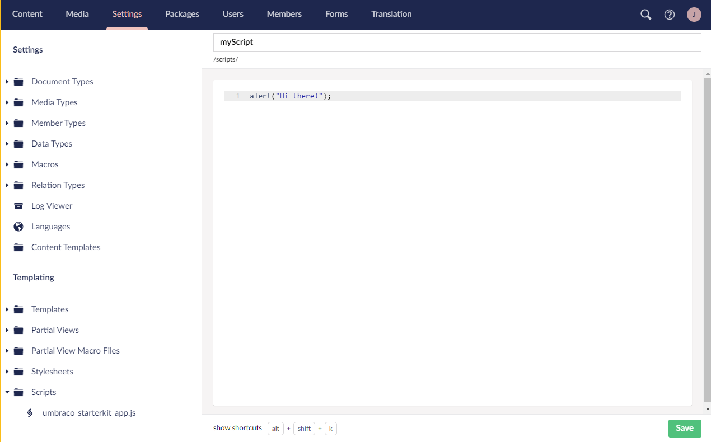
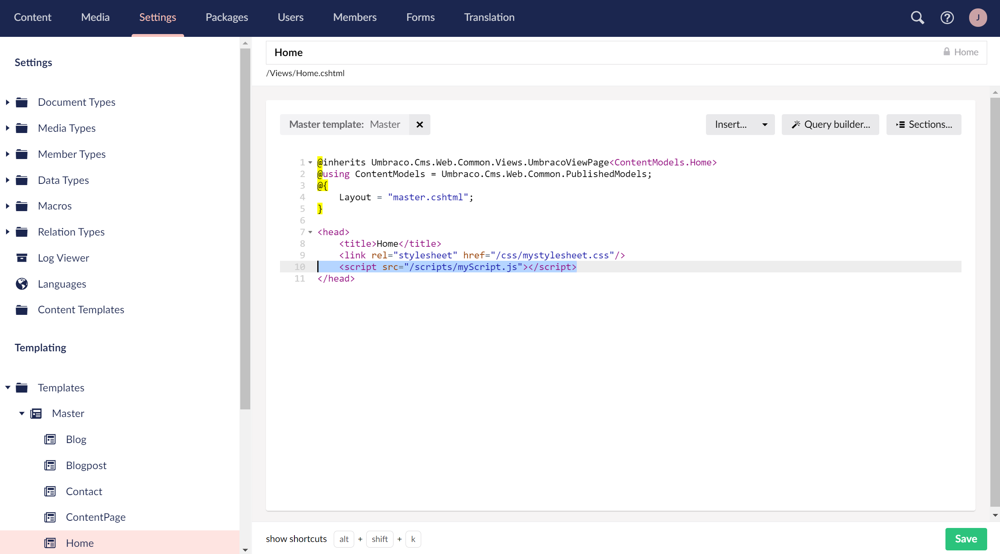

# Working with stylesheets and JavaScript

## Stylesheets in the Backoffice

You can create and edit stylesheets in the Stylesheets folder in the Settings section of the Backoffice.


In the Create menu, there are several options available:

* Stylesheet file (for use in templates/views)
* Rich Text Editor stylesheet file (for use in [Rich Text Editor](../../Backoffice/Property-Editors/Built-in-Property-Editors/Rich-Text-Editor/index.md))
* Folder (for keeping stylesheets organized)

:::note
It is currently not possible to use any CSS preprocessor (such as SASS) in the backoffice.
:::

After creating a new stylesheet, you would work with it as you would with templates or javascript files - using the built-in backoffice text editor.
When you're working with stylesheets, you also have access to the Rich Text Editor, which allows you to create CSS styles and get a real-time preview.


The rules you create in the Rich Text Editor section will carry over to the Code tab.




To reference your newly included stylesheet in a template file, navigate to Templates, pick the template you like (css files are usually referenced in the layout or home templates) and link to it with the `link` tag.



By default, the stylesheets will be saved in the `wwwroot/css` folder in the solution.
To reference them you can use either of the methods used in the above screenshot.

```html
<link rel="stylesheet" href='@Url.Content("~/css/mystylesheet.css")' />
```
or
```html
<link rel="stylesheet" href="/css/mystylesheet.css" />
```

With the stylesheet referenced, you will be able to style the template file with the rules and classes defined in the stylesheet.

Your stylesheets can be used in Rich Text Editors (datatype) as well - please see the [Rich Text Editor](../../Backoffice/Property-Editors/Built-in-Property-Editors/Rich-Text-Editor/RTE-Styles/index.md) documentation for more information.

:::note
If your RTE is styled differently on the frontend of the site, the backoffice styling might be getting overwritten by other stylesheets you have included.
:::

## JavaScript files in the Backoffice

To create and edit JavaScript files in the Backoffice, head on over to the Scripts folder in the Settings section of the Backoffice.


From here you can add a new JavaScript file, or a new folder.

Add a new JavaScript file and write your code:



Then, navigate to the template where you would like to include your JS file.

```html
<script src="/scripts/myScript.js"></script>
```



By default all JavaScript files will be stored in the `wwwroot/scripts` folder in the solution.

:::tip
If you are working locally, you can create CSS and JS files outside of the Backoffice - as long as they are placed in appropriate folders (`css` and `scripts`), they will show up in the Backoffice when you right-click on the folder and then pick reload.
:::

## Bundling & Minification for JavaScript and CSS

You can use whichever tool you are comfortable with for bundling & minification by implementing the `IRuntimeMinifier` interface in your custom minifier class, though it is worth noting that Umbraco 9+ ships with Smidge which offers lightweight runtime bundling and minification.

You can create various bundles of your site's CSS or JavaScript files in your code that can be rendered later in your views. There can be a single bundle for the entire site, or a common bundle for the files you want to be loaded on every page, as well as page-specific bundles, just by listing your resources in the order you like.

**Step 1:** Create a `INotificationHandler<UmbracoApplicationStartingNotification>`

```csharp
using Umbraco.Cms.Core;
using Umbraco.Cms.Core.Events;
using Umbraco.Cms.Core.Notifications;
using Umbraco.Cms.Core.Services;
using Umbraco.Cms.Core.WebAssets;

namespace Umbraco.Docs.Samples.Web.Stylesheets_Javascript
{
    public class CreateBundlesNotificationHandler : INotificationHandler<UmbracoApplicationStartingNotification>
    {
        private readonly IRuntimeMinifier _runtimeMinifier;
        private readonly IRuntimeState _runtimeState;

        public CreateBundlesNotificationHandler(IRuntimeMinifier runtimeMinifier, IRuntimeState runtimeState) {
            _runtimeMinifier = runtimeMinifier;
            _runtimeState = runtimeState;
        }
        public void Handle(UmbracoApplicationStartingNotification notification)
        {
            if (_runtimeState.Level == RuntimeLevel.Run)
            {
                _runtimeMinifier.CreateJsBundle("registered-js-bundle",
                BundlingOptions.NotOptimizedAndComposite,
                new[] { "~/scripts/test-script1.js", "~/scripts/test-script2.js" });

                _runtimeMinifier.CreateCssBundle("registered-css-bundle",
                    BundlingOptions.NotOptimizedAndComposite,
                    new[] { "~/css/test-style.css" });
            }
        }
    }
}
```
**Step 2:** Register the `INotificationHandler` in the `ConfigureServices` of `Startup.cs`
```csharp
public void ConfigureServices(IServiceCollection services)
{
    services.AddUmbraco(_env, _config)
        .AddBackOffice()
        .AddWebsite()
        .AddComposers()
        .AddNotificationHandler<UmbracoApplicationStartingNotification, CreateBundlesNotificationHandler>()
        .Build();
}
```

**Step 3:** Render the bundles by the bundle name in a view template file using the Smidge TagHelper:

```csharp
<html>
<head>
    <script src="registered-js-bundle"></script>
    <link rel="stylesheet" href="registered-css-bundle"/>
</head>
</html>
```

:::note
The Smidge TagHelper does not consider the value of `Umbraco:CMS:Hosting:Debug` set in your appsettings file. 

If you do need to debug bundles you can inject `hostingSettings` and add the `debug` attribute as shown below

```csharp
@using Microsoft.Extensions.Options
@using Umbraco.Cms.Core.Configuration.Models
@inject IOptions<HostingSettings> hostingSettings
@{
    var debugMode = hostingSettings.Value.Debug;
}
```
```csharp
    <script src="registered-js-bundle" debug="@debugMode"></script>
    <link rel="stylesheet" href="registered-css-bundle" debug="@debugMode" />
```
:::

Or by using `IRuntimeMinifier`:

:::note
In case you are in Debug mode, your bundles won't be minified or bundled, so you would need to set `Umbraco:CMS:Hosting:Debug: false` in your appsettings file.
:::

```csharp
@using Umbraco.Cms.Core.WebAssets
@inject IRuntimeMinifier runtimeMinifier

<html>
<head>
    @Html.Raw(await runtimeMinifier.RenderJsHereAsync("registered-js-bundle"))
    @Html.Raw(await runtimeMinifier.RenderCssHereAsync("registered-css-bundle"))
</head>
</html>
```

Another possibility is to declare bundles inline in your views:

```csharp
@using Umbraco.Cms.Core.WebAssets
@inject IRuntimeMinifier runtimeMinifier
@{
    runtimeMinifier.CreateJsBundle("inline-js-bundle",
    BundlingOptions.NotOptimizedAndComposite,
    new[] { "~/scripts/test-script1.js", "~/scripts/test-script2.js" });

    runtimeMinifier.CreateCssBundle("inline-css-bundle",
        BundlingOptions.NotOptimizedAndComposite,
        new[] { "~/css/test-style.css" });
}
<html>
<head>
    @Html.Raw(await runtimeMinifier.RenderJsHereAsync("inline-js-bundle"))
    @Html.Raw(await runtimeMinifier.RenderCssHereAsync("inline-css-bundle"))
</head>
</html>
```

Full details about Smidge can be found here: [https://github.com/Shazwazza/Smidge](https://github.com/Shazwazza/Smidge)
