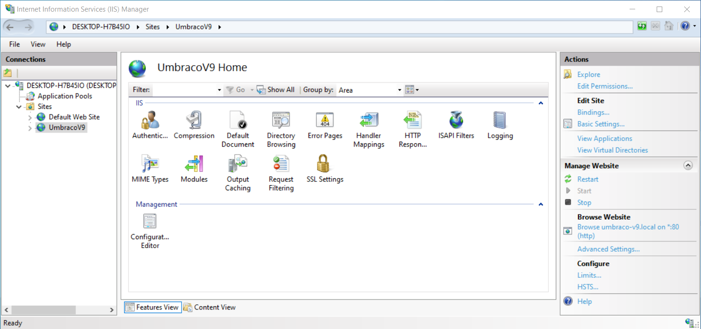

## Alternative IIS Setup with manual Deployment
If you need to manually deploy you solution to another server like staging or production, it might be helpful to know some further details about IIS configuration.

You can find all the details in Mircosoft's documentation for Asp.Net Core IIS hosting. But here are some key points:

### IIS Application pool
Compared to *.Net Framework* websites IIS works more like a reverse proxy. The application pool e.g. needs to use unmanaged code.

### EnvironmentVariables in ApplicationHost.config
You see *.Net 5 / Core* sites have less *GUI* modules for configuration:

In the *Management* section you find the *Configuration Editor*:

One section is of particular interest.
- In the first, left hand dropdown list (*Section:*) choose: system.webServer/aspNetCore section.
- In the second, right hand dropdown list (*From:*) choose: `ApplicationHost.config <location path='[YOUR-SITENAME]'>`. This ensures your settings get stored in a machine specific file and not the website's web.config. The web.config might end in a public repository and should not contain sentitive data like ConnectionStrings or SMTP configuration with username and password. And by default the web.config will be overwritten during publish processes.

For line *environmentVariables* open the dialog to add environment variables. These work similar to the *launchSettings*. E.g. you can define ASPNETCORE_ENVIRONMENT and create an `appSettings.[ASPNETCORE_ENVIRONMENT].json` file. Or even better create environment variables for sensitive settings like passwords. There are to differences to `launchSettings.json` configuration:
- Variable names need to change the object structur form json by combining the segments with double underscore `__` e.g. `ConnectionStrings__umbracoDbDSN`
- escaped backslashes `\\` e.g. `serverName\\databaseInstanceName` are preplaced by single backslash `\` e.g. `DATABASESERVER123\SQL2017`

### Publish website
You can use i.e. folder or ftp publishing to get all the files you need for your website hosting and release compiled. In Visual Studio right click on umbraco web project of the *Solution Explorer* and choose *Publish...* command.

### Hosting Bundle
On your development machine you normally get the latest .Net SDKs when you update your Visual Studio IDE. But on a hosting server you might have not the right framework installed. In general you have to install so called hostng bundles for .Net Core. Find details on:
- https://docs.microsoft.com/en-us/aspnet/core/host-and-deploy/iis/hosting-bundle
- https://dotnet.microsoft.com/download/dotnet/
