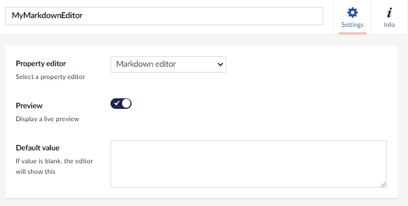
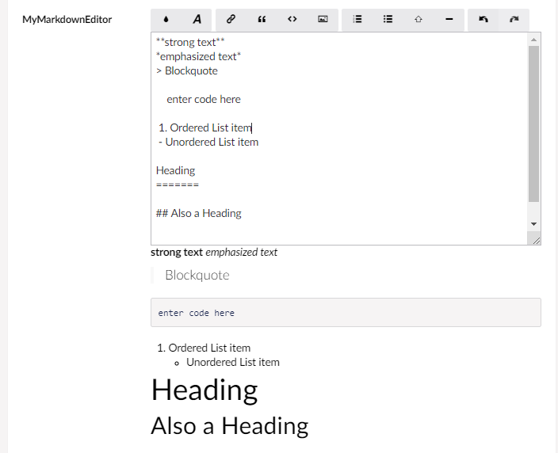

# Markdown editor

`Alias: Umbraco.MarkdownEditor`

`Returns: System.Web.HtmlString`

This built-in editor allow the user to use the markdown formatting options, from within a tinyMCE-like interface.


## Data Type Definition Example



There are two settings available for manipulating the **Markdown editor** property.

* **Preview** toggles if a preview of the markdown should be displayed beneath the editor in the content view. 
* **Default value** is inserted if no content has been saved to the document type using this property editor.

## Content Example



### Explanation of buttons from left to right
Function | Shortcut | Further explanation
---------|----------|---------------------
toggle **bold** text  | Ctrl + B |
toggle *italic* text  | Ctrl + I |
insert link           | Ctrl + L | This opens the Select Link interface. 
toggle quote          | Ctrl + Q |
toggle code block     | Ctrl + K |
insert image          | Ctrl + G | This opens the Select Media interface.
toggle ordered list   | Ctrl + O |
toggle unordered list | Ctrl + U | 
toggle heading        | Ctrl + H | This toggles between h1, h2 and off.
toggle a hr           |          |
undo                  | Ctrl + Z |
redo                  | Ctrl + Y |
### Other functionality
Function   | Shortcut 
-----------|---------
select all | Ctrl + A 
copy       | Ctrl + C 
paste      | Ctrl + V


## MVC View Example

### With Modelsbuilder

```csharp
@Model.MyMarkdownEditor
```

### Without Modelsbuilder

```csharp
@Model.Value("MyMarkdownEditor")
```

## Add values programmatically

See the example below to see how a value can be added or changed programmatically. To update a value of a property editor you need the [Content Service](../../../../../Reference/Management/Services/ContentService/index.md).

```csharp
@{
	// Get access to ContentService
	var contentService = Services.ContentService;

	// Create a variable for the GUID of the page you want to update
	var guid = Guid.Parse("32e60db4-1283-4caa-9645-f2153f9888ef");

	// Get the page using the GUID you've defined
	var content = contentService.GetById(guid); // ID of your page

	// Create markdown value
	var markdownValue = new HtmlString("#heading  \n**strong text**");
	
	// Set the value of the property with alias 'myMarkdownEditor'. 
	content.SetValue("myMarkdownEditor", markdownValue);

	// Save the change
	contentService.Save(content);
}
```

Although the use of a GUID is preferable, you can also use the numeric ID to get the page:

```csharp
@{
    // Get the page using it's id
    var content = contentService.GetById(1234); 
}
```

If Modelsbuilder is enabled you can get the alias of the desired property without using a magic string:

```csharp
@{
    // Set the value of the property with alias 'myMarkdownEditor'
    content.SetValue(Home.GetModelPropertyType(x => x.MyMarkdownEditor).Alias, markdownValue);
}
```

