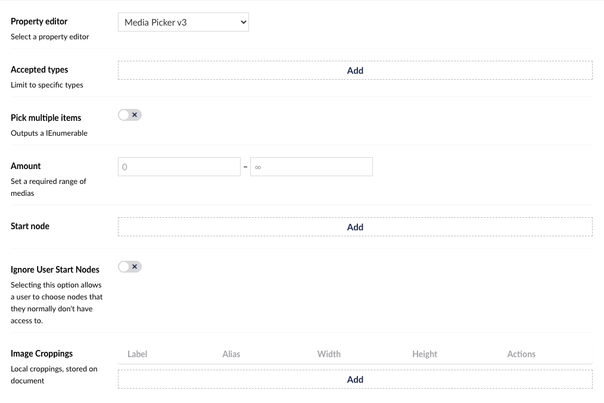
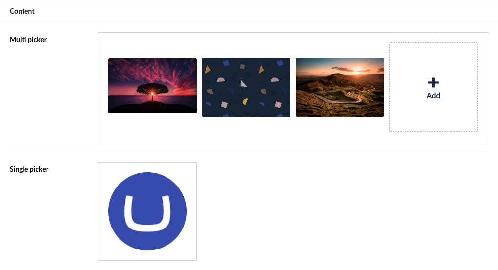

# Media Picker #

`Alias: Umbraco.MediaPicker3`

`Returns: IEnumerable<MediaWithCrops>` or `MediaWithCrops`

This property editors returns a single `MediaWithCrops` item if the "Pick multiple items" data type setting is disabled or a collection if it is enabled.

## Data Type Definition Example



### Accepted types

Use setting to limit the picker to only select Media Items of these types.

### Pick multiple items

Use this setting to enable the property to contain multiple items. When this is enabled the property editor returns an `IEnumerable<MediaWithCrops>`. 

You can still set the maximum amount to 1. Do so when you want to retrieve a collection but only allow the Content Editors to select one Media Item.

### Amount

Use this setting to enforce a minimum and/or maximum amount of selected Media Items. Note that it is not possible to set a maximum when the "Pick multiple items" feature is disabled.

### Start node

This setting is used to limit the Media Picker to certain parts of the Media Tree. 

### Ignorer user start nodes

Use this setting to overrule user permissions, to enable any user of this property to pick any Media Item of the chosen Start node.

When this setting is enabled, a user who doesn't normally have access to the media selected as "Start Node" (/Design in this case), can access the media when using this particular Media Picker. If no Start node has been defined for this property any content can be viewed and selected of this property.


### Enable Focal Point

Enable the focal point setter, do only enable this if the focal point is used or if you have Image crops defined.

### Image Crops

Define local image croppings, Crop data is stored on the document in this property. This means it can differentiate between documents.

## Content Example



## MVC View Example

### Multiple enabled without Modelsbuilder

```csharp
@{
    var typedMultiMediaPicker = Model.Value<IEnumerable<MediaWithCrops>>("medias");
    foreach (var entry in typedMultiMediaPicker)
    {
        
    }
}
```

### Multiple enabled with Modelsbuilder

```csharp
@{
    var typedMultiMediaPicker = Model.Medias;
    foreach (var entry in typedMultiMediaPicker)
    {
        
    }
}
```

### Multiple disabled without Modelsbuilder

```csharp
@{
    var typedMediaPickerSingle = Model.Value<MediaWithCrops>("media");
    if (typedMediaPickerSingle != null)
    {
        
    }
}
```

### Multiple disabled with Modelsbuilder

```csharp
@{
    var typedMediaPickerSingle = Model.Media;
    if (typedMediaPickerSingle is MediaWithCrops mediaEntry)
    {
        
    }
}
```

## Using local crops

Local image croppings are stored and retrived different than global crops, below is two examples of how to retrive local crops.

### Using GetLocalCropUrl

```csharp
@{
    foreach (var entry in Model.Medias)
    {
        
    }
}
```

### Using UrlHelper

```csharp
@{
    foreach (var entry in Model.Medias)
    {
        
    }
}
```

## Use global crops

Global image croppings are crops stored on the Media Item, by the Property Editor `Image Cropper`, making it shared between all usages of the media Item.

The global crops are configured on the DataType of the `umbracoFile` property on the Media Type `Image`

[Read about the Image Cropper here](../Image-Cropper/index.md)

### Using GetCropUrl

```csharp
@{
    foreach (var entry in Model.Medias)
    {
        
    }
}
```

### Using UrlHelper

```csharp
@{
    foreach (var entry in Model.Medias)
    {
        
    }
}

## Add values programmatically

```This is not part of the current Media Picker v3, feel free to provide such.```
