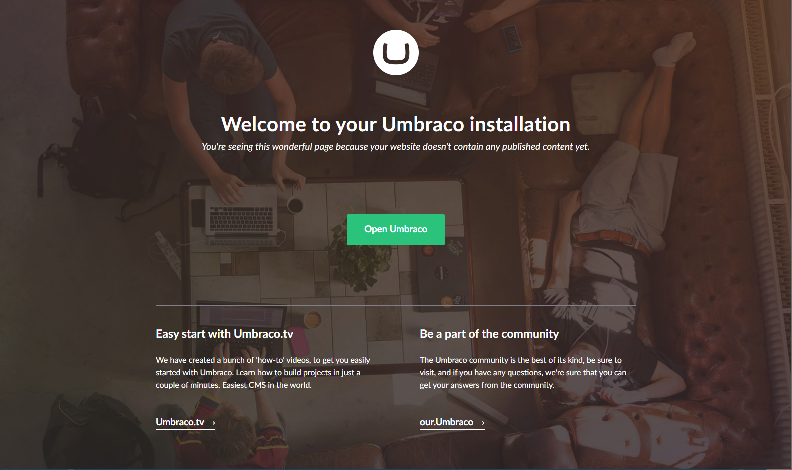

# Unattended Installs

In some cases, you might need to install one or multiple Umbraco instances automatically without having to run through the installation wizard to configure the instance.

You can use the **Unattended installs** feature to allow for quick installation and set up of Umbraco instances on something like Azure Web Apps.

This article will give you the details you need to install Umbraco unattended.

:::warning
When installing Umbraco using the unattended install feature, you will not be able to access the Umbraco backoffice once the installation has completed, as no password has been set for the default user.

Instead, you will need to configure an external login provider or set a password for the user in some other way.

Support for adding users through the unattended installation process will be added at a later point.
:::

## Get the correct version of Umbraco

In order to install Umbraco without having to run through the installation wizard, you need **Umbraco version 8.11.0+**.

Get a clean instance from either the [NuGet feed](https://www.nuget.org/packages/UmbracoCms/) or download a zip file directly from [Downloads](https://our.umbraco.com/download).

## Configure your database

As you will not be running through the installation wizard when using the unattended installs feature, you need to manually tell Umbraco which database to use.

* Set up and configure a new database - see [Requirements](../Requirements/#hosting) for details.
* Add the connectionstring to the `web.config` file.

Example:

```xml
<connectionStrings>
    <remove name="umbracoDbDSN"/>
    <add name="umbracoDbDSN" connectionString="Server=MyServerName;Database=MyDatabase;User Id=Username;Password=ASecretPassword;" providerName="System.Data.SqlClient"/>
</connectionStrings>
```

## Define the correct Umbraco version

In order for Umbraco to be installed correctly, you will need to specify the exact version number before initializing the installation.

The version needs to be specified using the `Umbraco.Core.ConfigurationStatus` key in the `<appSettings>` section of the `web.config` file.

Example:

```xml
<appSettings>
    <add key="Umbraco.Core.ConfigurationStatus" value="8.11.0"/>
```

## Enable the unattended installs feature

The unattended installs feature is disabled by default and in order to enable it, you need to add the following key to the `appSettings` section of the `web.config` file.

```xml
<appSettings>
    <add key="Umbraco.Core.RuntimeState.InstallUnattended" value="true"/>
```

Remember to set the value to `true`.

## Initialize the unattended install

After completing the 3 steps above you can now initialize the installation by booting up the Umbraco instance.

Once it has completed, you should see the following when visiting the frontend of the site.



## Configuration options

|   	|  Configured Version 	|  With Conn String |  InstallUnattended 	|  
|---	|---	|---	|---	|
|  Default	|  false 	|  false 	|  false 	|
|  Unattended (no installer, will just install without a user password)	|  true 	|  true 	|  true 	|
|  Pre configured (will run installer without DB option)	|  false 	|  true 	|  false 	|
|  Pre configured (will run installer without DB option) 	|  true 	|  true 	|  false 	|

