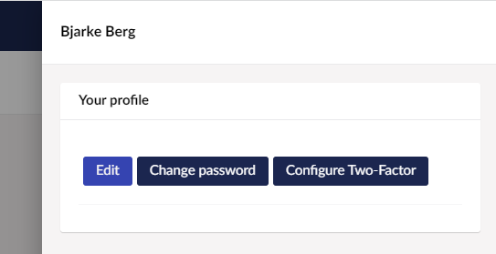
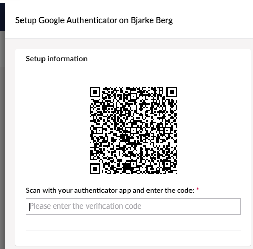
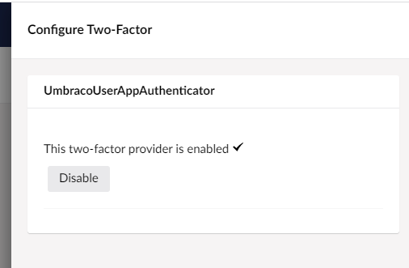
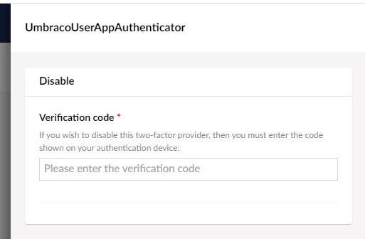

# Two-factor Authentication

Two-factor authentication (2FA) for Umbraco members is activated by implementing an `ITwoFactorProvider` interface and registering the implementation. The implementation can use third-party packages to archive for example support for authentication apps like Microsoft- or Google Authentication App.

## Two-factor authentication for Members

Since Umbraco does not control how the UI is for member login and profile edit, the UI for 2FA is shipped as part of the snippets for macros. These can be used as a starting point, before styling the page as you would like.

### Example implementation for Authenticator Apps for Members

In the following example, we will use the [GoogleAuthenticator NuGet Package](https://www.nuget.org/packages/GoogleAuthenticator/).
Despite the name, this package works for both Google and Microsoft authenticator apps and can be used to generate the QR code needed to activate the app for the website.

```Csharp
using System;
using System.Threading.Tasks;
using Google.Authenticator;
using Umbraco.Cms.Core.Security;
using Umbraco.Cms.Core.Services;

namespace Umbraco9
{
    /// <summary>
    /// Model with the required data to setup the authentication app.
    /// </summary>
    public class QrCodeSetupData
    {
        /// <summary>
        /// The secret unique code for the user and this ITwoFactorProvider.
        /// </summary>
        public string Secret { get; init; }

        /// <summary>
        /// The SetupCode from the GoogleAuthenticator code.
        /// </summary>
        public SetupCode SetupCode { get; init; }
    }

    /// <summary>
    /// App Authenticator implementation of the ITwoFactorProvider
    /// </summary>
    public class UmbracoAppAuthenticator : ITwoFactorProvider
    {
        /// <summary>
        /// The unique name of the ITwoFactorProvider. This is saved in a constant for reusability.
        /// </summary>
        public const string Name = "UmbracoAppAuthenticator";

        private readonly IMemberService _memberService;

        /// <summary>
        /// Initializes a new instance of the <see cref="UmbracoAppAuthenticator"/> class.
        /// </summary>
        public UmbracoAppAuthenticator(IMemberService memberService)
        {
            _memberService = memberService;
        }

        /// <summary>
        /// The unique provider name of ITwoFactorProvider implementation.
        /// </summary>
        /// <remarks>
        /// This value will be saved in the database to connect the member with this  ITwoFactorProvider.
        /// </remarks>
        public string ProviderName => Name;

        /// <summary>
        /// Returns the required data to setup this specific ITwoFactorProvider implementation. In this case it will contain the url to the QR-Code and the secret.
        /// </summary>
        /// <param name="userOrMemberKey">The key of the user or member</param>
        /// <param name="secret">The secret that ensures only this user can connect to the authenticator app</param>
        /// <returns>The required data to setup the authenticator app</returns>
        public Task<object> GetSetupDataAsync(Guid userOrMemberKey, string secret)
        {
            var member = _memberService.GetByKey(userOrMemberKey);

            var twoFactorAuthenticator = new TwoFactorAuthenticator();
            SetupCode setupInfo = twoFactorAuthenticator.GenerateSetupCode("My application name", member.Username, secret, false);
            return Task.FromResult<object>(new QrCodeSetupData()
            {
                SetupCode = setupInfo,
                Secret = secret
            });
        }

        /// <summary>
        /// Validated the code and the secret of the user.
        /// </summary>
        public bool ValidateTwoFactorPIN(string secret, string code)
        {
            var twoFactorAuthenticator = new TwoFactorAuthenticator();
            return twoFactorAuthenticator.ValidateTwoFactorPIN(secret, code);
        }

        /// <summary>
        /// Validated the two factor setup
        /// </summary>
        /// <remarks>Called to confirm the setup of two factor on the user. In this case we confirm in the same way as we login by validating the PIN.</remarks>
        public bool ValidateTwoFactorSetup(string secret, string token) => ValidateTwoFactorPIN(secret, token);
    }
}

```

First, we create a model with the information required to set up the 2FA provider and then we implement the `ITwoFactorProvider` with the use of the `TwoFactorAuthenticator` from the GoogleAuthenticator NuGet package.

Now we need to register the `UmbracoAppAuthenticator` implementation. This can be done on the `IUmbracoBuilder` in your startup or a composer.

```Csharp
using Umbraco.Cms.Core.Composing;
using Umbraco.Cms.Core.DependencyInjection;
using Umbraco.Cms.Core.Security;
using Umbraco.Extensions;

namespace Umbraco9
{
    public class UmbracoAppAuthenticatorComposer : IComposer
    {
        public void Compose(IUmbracoBuilder builder)
        {
            var identityBuilder = new MemberIdentityBuilder(builder.Services);
            identityBuilder.AddTwoFactorProvider<UmbracoAppAuthenticator>(UmbracoAppAuthenticator.Name);
        }
    }
}
```

At this point, the 2FA is active, but no members have set up 2FA yet. The setup of 2FA depends on the type. In the case of App Authenticator, we will add the following to our view showing the edit profile of the member.

```Csharp
@using Umbraco.Cms.Core.Services
@using Umbraco.Cms.Web.Website.Controllers
@using Umbraco.Cms.Web.Website.Models
@using Umbraco9  @* Or whatever your namespace with the QrCodeSetupData model is *@
@inject MemberModelBuilderFactory memberModelBuilderFactory
@inject ITwoFactorLoginService twoFactorLoginService
@{
    // Build a profile model to edit
    var profileModel = await memberModelBuilderFactory
        .CreateProfileModel()
        .BuildForCurrentMemberAsync();

    // Show all two factor providers
    var providerNames = twoFactorLoginService.GetAllProviderNames();
    if (providerNames.Any())
    {
        <div asp-validation-summary="All" class="text-danger"></div>
        foreach (var providerName in providerNames)
        {
            var setupData = await twoFactorLoginService.GetSetupInfoAsync(profileModel.Key, providerName);
            if (setupData is null)
            {
                @using (Html.BeginUmbracoForm<UmbTwoFactorLoginController>(nameof(UmbTwoFactorLoginController.Disable)))
                {
                    <input type="hidden" name="providerName" value="@providerName"/>
                    <button type="submit">Disable @providerName</button>
                }
            }
            else if(setupData is QrCodeSetupData qrCodeSetupData)
            {
                @using (Html.BeginUmbracoForm<UmbTwoFactorLoginController>(nameof(UmbTwoFactorLoginController.ValidateAndSaveSetup)))
                {
                    <h3>Setup @providerName</h3>
                    
                    <p>Scan the code above with your authenticator app <br /> and enter the resulting code here to validate:</p>
                    <input type="hidden" name="providerName" value="@providerName"  />
                    <input type="hidden" name="secret" value="@qrCodeSetupData.Secret"  />
                    <input type="text" name="code"  />
                    <button type="submit">Validate & save</button>
                }
            }
        }
    }
}
```

In this razor-code sample, we get the current members unique key and list all registered `ITwoFactorProvider` implementations.

If the `setupData` is `null` for the specified `providerName` it means the provider is already set up. In this case, we show a disable button. Otherwise, we check the type and show the UI for how to set up the App Authenticator, by showing the QR Code and an input field to validate the code from the App Authenticator.

The last part required is to use the `Login` Partial Macro snippet.

### Notification when 2FA is requested for a member

When a 2FA login is requested for a member, the `MemberTwoFactorRequestedNotification` is published. This notification can also be used to send the member a one-time password via e-mail or phone. Even though these 2FA types are [not considered secure](https://docs.microsoft.com/en-us/aspnet/core/security/authentication/mfa?view=aspnetcore-6.0#mfa-sms) as App Authentication, it is still a massive improvement compared to no 2FA.

## Two-factor authentication for Users

Umbraco controls how the UI is for user login and user edits, but will still need a view for configuring each 2FA provider.

### Example implementation for Authenticator Apps for Users

In the following example, we will use the [GoogleAuthenticator NuGet Package](https://www.nuget.org/packages/GoogleAuthenticator/).
Despite the name, this package works for both Google and Microsoft authenticator apps and can be used to generate the QR code needed to activate the app for the website.

```Csharp
using System;
using System.Runtime.Serialization;
using System.Threading.Tasks;
using Google.Authenticator;
using Umbraco.Cms.Core.Security;
using Umbraco.Cms.Core.Services;
using Umbraco.Extensions;

namespace Umbraco9
{
    [DataContract]
    public class TwoFactorAuthInfo
    {
        [DataMember(Name = "qrCodeSetupImageUrl")]
        public string QrCodeSetupImageUrl { get; set; }

        [DataMember(Name = "secret")]
        public string Secret { get; set; }
    }

    /// <summary>
    /// App Authenticator implementation of the ITwoFactorProvider
    /// </summary>
    public class UmbracoUserAppAuthenticator : ITwoFactorProvider
    {
        private readonly IUserService _userService;

        /// <summary>
        /// The unique name of the ITwoFactorProvider. This is saved in a constant for reusability.
        /// </summary>
        public const string Name = "UmbracoUserAppAuthenticator";

        /// <summary>
        /// Initializes a new instance of the <see cref="UmbracoAppAuthenticator"/> class.
        /// </summary>
        public UmbracoUserAppAuthenticator(IUserService userService)
        {
            _userService = userService;

        }

        /// <summary>
        /// The unique provider name of ITwoFactorProvider implementation.
        /// </summary>
        /// <remarks>
        /// This value will be saved in the database to connect the member with this  ITwoFactorProvider.
        /// </remarks>
        public string ProviderName => Name;

        /// <summary>
        /// Returns the required data to setup this specific ITwoFactorProvider implementation. In this case it will contain the url to the QR-Code and the secret.
        /// </summary>
        /// <param name="userOrMemberKey">The key of the user or member</param>
        /// <param name="secret">The secret that ensures only this user can connect to the authenticator app</param>
        /// <returns>The required data to setup the authenticator app</returns>
        public Task<object> GetSetupDataAsync(Guid userOrMemberKey, string secret)
        {
            var user = _userService.GetByKey(userOrMemberKey);

            var twoFactorAuthenticator = new TwoFactorAuthenticator();
            SetupCode setupInfo = twoFactorAuthenticator.GenerateSetupCode("My application name", user.Username, secret, false);
            return Task.FromResult<object>(new TwoFactorAuthInfo()
            {
                QrCodeSetupImageUrl = setupInfo.QrCodeSetupImageUrl,
                Secret = secret
            });
        }

        /// <summary>
        /// Validated the code and the secret of the user.
        /// </summary>
        public bool ValidateTwoFactorPIN(string secret, string code)
        {
            var twoFactorAuthenticator = new TwoFactorAuthenticator();
            return twoFactorAuthenticator.ValidateTwoFactorPIN(secret, code);
        }

        /// <summary>
        /// Validated the two factor setup
        /// </summary>
        /// <remarks>Called to confirm the setup of two factor on the user. In this case we confirm in the same way as we login by validating the PIN.</remarks>
        public bool ValidateTwoFactorSetup(string secret, string token) => ValidateTwoFactorPIN(secret, token);
    }
}
```

First, we create a model with the information required to set up the 2FA provider and then we implement the `ITwoFactorProvider` with the use of the `TwoFactorAuthenticator` from the GoogleAuthenticator NuGet package.

Now we need to register the `UmbracoUserAppAuthenticator` implementation and the view to show to set up this provider. This can be done on the `IUmbracoBuilder` in your startup or a composer.

```Csharp
using Microsoft.Extensions.DependencyInjection;
using Umbraco.Cms.Core.Composing;
using Umbraco.Cms.Core.DependencyInjection;
using Umbraco.Cms.Core.Security;
using Umbraco.Cms.Web.BackOffice.Security;
using Umbraco.Extensions;

namespace Umbraco9
{
    public class UmbracoAppAuthenticatorComposer : IComposer
    {
        public void Compose(IUmbracoBuilder builder)
        {
            var identityBuilder = new BackOfficeIdentityBuilder(builder.Services);

            identityBuilder.AddTwoFactorProvider<UmbracoUserAppAuthenticator>(UmbracoUserAppAuthenticator.Name);

            builder.Services.Configure<TwoFactorLoginViewOptions>(UmbracoUserAppAuthenticator.Name, options =>
            {
                options.SetupViewPath = "..\\App_Plugins\\TwoFactorProviders\\twoFactorProviderGoogleAuthenticator.html";
            });
        }
    }
}
```

Now we need to create the view we just configured, in the path we choose.

```html
<div ng-controller="CustomCode.TwoFactorProviderGoogleAuthenticator as vm">

  <umb-editor-view ng-cloak>

    <form name="vm.authForm" method="POST" ng-submit="vm.validateAndSave()">

      <umb-editor-header name="vm.title" name-locked="true" hide-alias="true" hide-icon="true" hide-description="true">
      </umb-editor-header>

      <umb-editor-container>

        <umb-box>

          <umb-box-header title="Setup information"></umb-box-header>

          <umb-box-content>

            <div class="control-group text-center">
              
            </div>

            <umb-control-group label-for="token" alias="2facode"
              label="Scan with your authenticator app and enter the code:" required="true">

              <input umb-auto-focus id="2facode" class="-full-width-input input-xlarge" type="text" name="token"
                inputmode="numeric" autocomplete="one-time-code" ng-model="vm.code" localize="placeholder"
                placeholder="@login_2faCodeInputHelp" aria-required="true" required />

              <div ng-messages="vm.authForm.token.$error" role="alert">
                <span class="umb-validation-label" ng-message="token">
                  <localize key="login_2faInvalidCode">Invalid code entered</localize>
                </span>
              </div>

            </umb-control-group>

          </umb-box-content>

        </umb-box>

      </umb-editor-container>

      <umb-editor-footer>

        <umb-editor-footer-content-right>

          <umb-button type="button" button-style="link" label-key="general_close" shortcut="esc" action="vm.close()">
          </umb-button>

          <umb-button state="vm.buttonState" button-style="success" label-key="buttons_save" type="submit"
            disabled="vm.code.length === 0">
          </umb-button>

        </umb-editor-footer-content-right>

      </umb-editor-footer>

    </form>

  </umb-editor-view>

</div>
```

As this view uses an angular controller, we need to create that class and configure it in the `package.manifest`.

In `package.manifest`, we point to the path of the angular controller that we are creating in the next step.

```json
{
  "javascript": [
    "~/App_Plugins/TwoFactorProviders/twoFactorProviderGoogleAuthenticator.controller.js"
  ]
}
```

And we create the controller in that location:

```javascript
!(function () {
  "use strict";

  const googleTwoFactorProviderCtrl = [
    '$scope', 'twoFactorLoginResource', 'notificationsService',
    function ($scope, twoFactorLoginResource, notificationsService) {
      const vm = this;

      vm.title = "Setup Google Authenticator on " + $scope.model?.user?.name;
      vm.providerName = $scope.model?.providerName;
      vm.qrCodeImageUrl = "";
      vm.secret = "";
      vm.code = "";
      vm.authForm = {};
      vm.buttonState = "init";

      vm.close = close;
      vm.validateAndSave = validateAndSave;

      function init() {
        vm.buttonState = "init";
        twoFactorLoginResource.setupInfo(vm.providerName)
          .then(function (response) {
            // This response is the model I defined to be returned from ITwoFactorProvider.GetSetupDataAsync
            vm.qrCodeImageUrl = response.qrCodeSetupImageUrl;
            vm.secret = response.secret;
          })
          .catch(function () {
            notificationsService.error("Could not fetch login info");
          });
      }

      function validateAndSave() {
        vm.authForm.token.$setValidity("token", true);
        vm.buttonState = "busy";

        twoFactorLoginResource.validateAndSave(vm.providerName, vm.secret, vm.code)
          .then(function (successful) {

            if (successful) {
              notificationsService.success("Two-factor authentication has successfully been enabled");
              vm.buttonState = "success";
              close();
            } else {
              vm.authForm.token.$setValidity("token", false);
              vm.buttonState = "error";
            }

          })
          .catch(function (error) {
            notificationsService.error(error);
            vm.buttonState = "error";
          });
      }

      function close() {
        if ($scope.model.close) {
          $scope.model.close();
        }
      }

      init();
    }
  ];

  angular.module("umbraco").controller("CustomCode.TwoFactorProviderGoogleAuthenticator", googleTwoFactorProviderCtrl);
})();
```

At this point, the 2FA is active, but no users have set up 2FA yet.

Each user can now enable the configured 2fa providers on their user. This can be done from the user panel by clicking the user avatar.



When clicking the `Configure Two-Factor` button, a new panel is shown, listing all enabled two-factor providers.


When clicking `Enable` on one of these, the configured view for the specific provider will be shown



When the authenticator is enabled correctly, a disable button is shown instead.



To disable the two-factor authentication on your user, it is required to enter the verification code, otherwise, admins are allowed to disable providers on other users.



While the 2FA is enabled, the user will be presented with this screen after entering the username and password.


## Notification when 2FA is requested for a user

When a 2FA login is requested for a user, the `UserTwoFactorRequestedNotification` is published.
This notification can also be used to send the user a one-time password via e-mail or phone, even though these 2FA types are [not considered secure](https://docs.microsoft.com/en-us/aspnet/core/security/authentication/mfa?view=aspnetcore-6.0#mfa-sms) as App Authentication, it is still a massive improvement compared to no 2FA.
