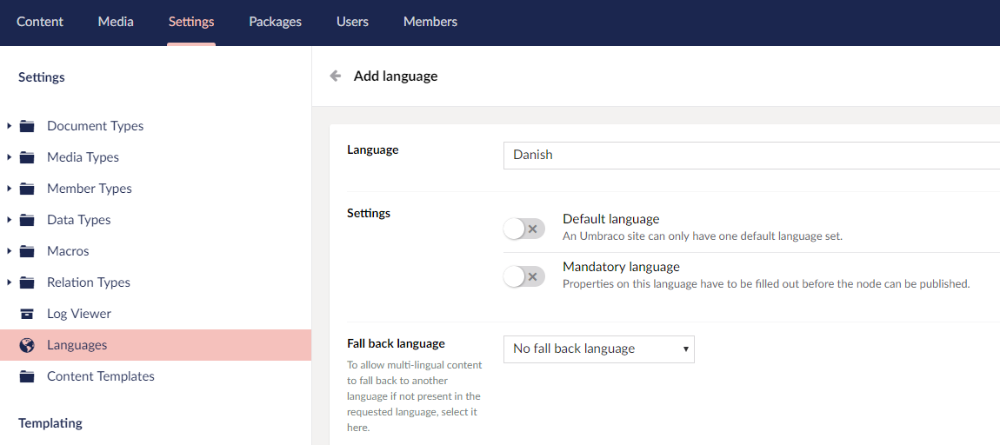
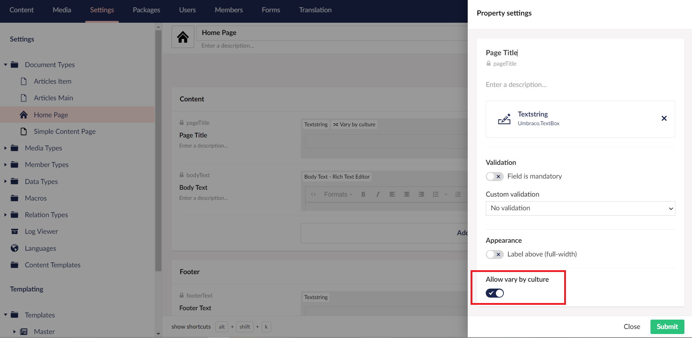
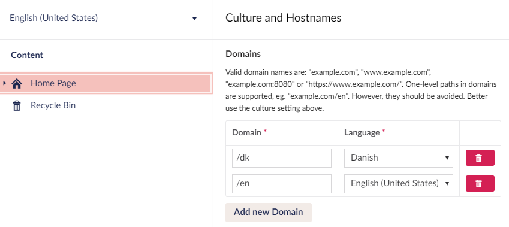
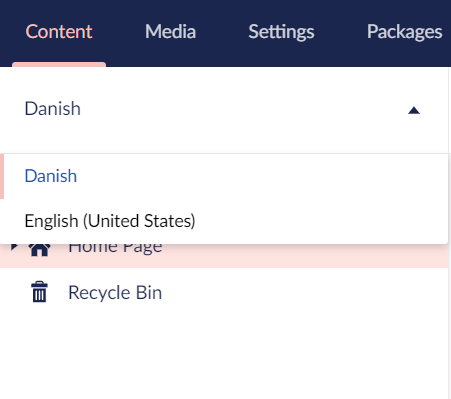
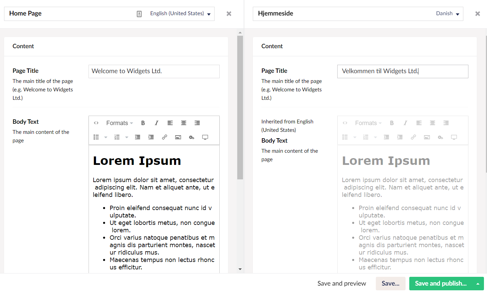
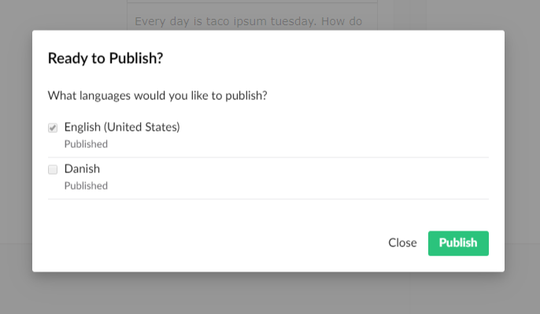

# Adding Language Variants

Now that we have a basic site set up, let's make the site multilingual by making variations of our content in one more language. For this we will make a Danish version of the `Contact Us` page.

## Adding a new language

To add a new language, follow these steps:

1. Go to the **Settings** tab.
2. In the **Settings** pane, go to **Languages**. The **Languages** window opens in the editor.
3. Click **Add Language**. The **Add Language** window opens in the editor.
4. Select a **Language** from the dropdown list. In this tutorial, we will pick Danish.
    
5. In **Settings**, to set the new language as the:
    1.  Defualt language for your site, toggle **Default Language**.
    2.  Mandatory language for your site, toggle  **Mandatory Language**.
6. Select a **Fallback Language** from the drop-down list.
7. Click **Save**.

## Enabling Language Variants on Document Types and Properties

To enable language variants on document types, follow these steps:

1. Go to the **Settings** tab.
2. From the **Document Types** folder, select **Home Page**.
3. Go to the **Permissions** tab and toggle **Allow vary by culture**
4. Click **Save**.
5. Go to the **Design** tab.
6. Click on the gear icon ⚙ of the **Page Title** and toggle **Allow vary by culture**.
7. Click **Submit**.
    
8. For this tutotial, we will not make any changes to the **Body Text**. Click **Save**.

## Adding Culture and Hostnames to the root node of the website

To add culture and hostnames, follow these steps:

1. Go to the **Content** tab.
2. Right-click on the **...** dots next to the **Home Page** content node and select **Culture and Hostnames...**.
3. In the **Culture and Hostnames** pane, let's add a domain for each hostname, like it's done here:
    
4. Click **Save**.

## Adding Language Variants to the Content

You will find a language dropdown above your content tree. If it's not there, you might need to refresh the page:

In the language dropdown, you will find all the languages that you have installed for your site. You can switch between them to update the content variations for each language.

To add language variants to the content, follow these steps:

1. Go to the **Home Page** node. You will find a language dropdown next to the title at the top:
    
2. Click the dropdown and hover over the new language. You will see an **Open in Splitview** option will appear.
    
3. Click **Open in Splitview**. In this splitview, we can see the content node with each language side by side.

    You may notice that the bodytext is greyed out - this is because we haven't checked the **Allow vary by culture** checkbox.
    
4. Enter the **Name** for your content node and the **Page Title** in the new language.
5. Click **Save and Publish**. The **Ready to Publish** window opens providing the option to publish in one or more languages.
    
6. You can select either one or multiple languages and click **Publish**.

## Viewing the Language Variant on the Browser

To view the language variant on the browser, follow these steps:

1. Go to the **Content** tab.
2. Select your new language from the language dropdown above your content tree.
3. Select the **Home Page** node and go to the **Info** tab.
4. You will notice the links with the new language domain added to it. If it's not there, you might need to refresh the page.
     
5. Click on the link to view the new language varied node in the browser.
6. Alternatively, you can add the domain name to your localhost in the browser. For example: http://localhost:xxxx/dk/

---

Prev: [Articles Parent and Article Items](../Articles-Parent-and-Article-Items) &emsp; &emsp; &emsp; &emsp; &emsp; &emsp; &emsp; &emsp; &emsp; &emsp; &emsp; &emsp; &emsp; &emsp; &emsp; &emsp; &emsp; &emsp; &emsp; &emsp; &emsp; &emsp; Next: [Conclusions and Where Next?](../Conclusions-Where-Next)