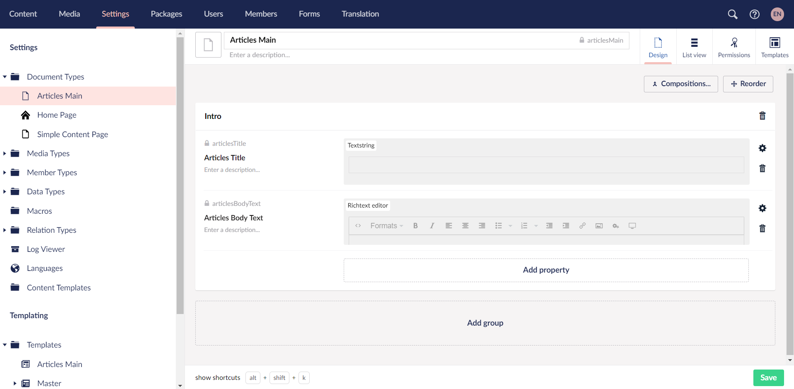
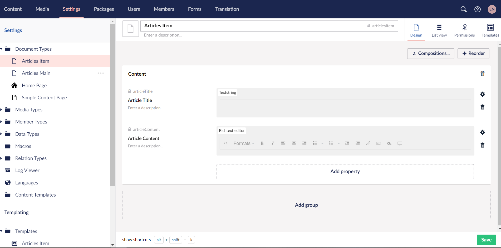
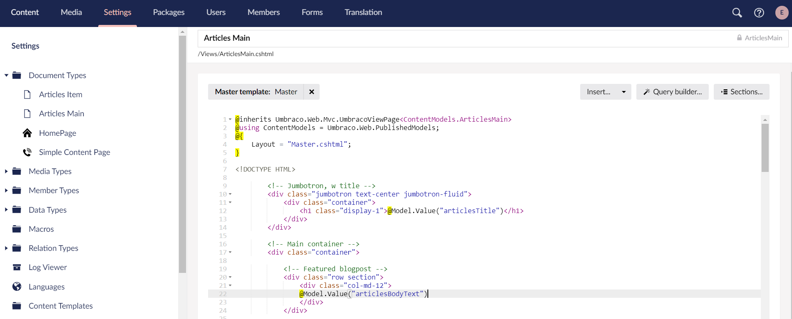
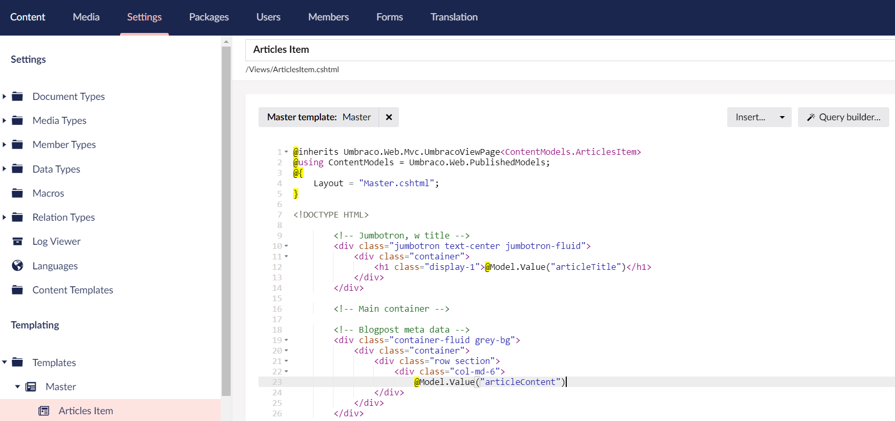

# Articles and Article Items - A Parent Page with Infinite Children

Having an Articles Parent page, and a number of associated child articles, provides a good example of Umbraco's features. We'll assume our fictional company, Widgets Ltd, writes about ten articles a month and want the articles page to act like a blog. You could use this functionality for news, event pages, or any other collection of document types.

## Creating Articles and Article Items

Create two new Document Types with template: **Articles Main** and **Articles Item**.

To create **Articles Main** document type, follow these steps:

1. Go to **Settings**.
2. In the **Settings** pane, click the **...** next to the **Document Types** in the tree.
3. Click **Document Type with Template**.
    {: data-fancybox}
4. Enter a **Name** for the **Document Type**. Let's call it _Articles Main_.
5. Let's add two fields with the following specifications:
    | Group | Field Name         | Alias            | Data Type        |
    |-------|--------------------|------------------|------------------|
    | Intro | Articles Title     | articlesTitle    | TextBox          |
    | Intro | Articles Body Text | articlesBodyText | Rich Text Editor |

    {: data-fancybox}
6. Go to the **Permissions** tab.
7. In the **Allowed child node types**, click **Add child**. The **Choose child node** window opens.
8. Select **Articles Item** and click **Save**.
9. Go to the **List View** tab.
10. Toggle **Enable List view button** and click **Save**.

To create **Articles Item** document type, follow these steps:

1. Go to **Settings**.
2. In the **Settings** pane, click the **...** next to the **Document Types** in the tree.
3. Click **Document Type with Template**.
    
4. Enter a **Name** for the **Document Type**. Let's call it _Articles Item_.
5. Let's add two fields with the following specifications:
    | Group   | Field Name      | Alias          | Data Type        |
    |---------|-----------------|----------------|------------------|
    | Content | Article Title   | articleTitle   | TextBox          |
    | Content | Article Content | articleContent | Rich Text Editor |

    {: data-fancybox}
6.  Navigate to the **Home Page** node and go to the **Permissions** tab.
7. In the **Allowed child node types**, click **Add child**. The **Choose child node** window opens.
8. Select **Articles Main** and click **Save**.

## Creating the Content Node

To add a content node:

1. Go to **Content**.
2. Click the **...** next to the **HomePage** and select **Articles Main**.
3. Enter the name for the article. We are going to call it _Articles_.
4. Enter the **Article Title**, **Article Content**, and click **Save**.
   When you click on Save, you will notice a list view is created. The child nodes are placed in a list making it easier to view them. You can create new nodes from this section.
   :::tip
    If you do not see the list view, try refreshing the page.
   :::
5. Let's add two child nodes called **Article 1**, **Article 2**, and click **Save**.
    

## Updating the Template

To update the **Articles Main** template, follow these steps:

1. Go to **Settings**.
2. In the **Templating** section, expand the **Templates** folder. You should see a template titled **_Articles Main_**.
3. In the **Master template** select **Master** and click **Save**.
4. Copy the template content from the **_Simple Content Page_**  template and paste the content into **Articles Main**.
    :::warn
    Take care when pasting the template not to overwrite the first line `@inherits Umbraco.Web.Mvc.UmbracoViewPage<ContentModels.ArticlesMain>`. If you get an error when loading the page ensure the last part in <> brackets matches your Document Type alias.
    :::
5. Replace the static text within the `<!-- Jumbotron, w title -->` tags with the Model.Value references. For example:  Add references to **_articlesTitle_** and **_articlesBodyText_**.
 
6. Define a query for all articles, just below the `<div>` tag of the`<!-- Jumbotron, w title -->`.
    
7. You can set conditions to get specific articles or decide the order of the articles. For the purpose of this guide, we'll use the following parameters:
    
8. If you've set the correct parameters, you will get a preview of the items being selected with the query. Click **Submit**, and you will see a code snippet has been added to your template.
    It will look similar to this:
    ```csharp
    @{
        var selection = Umbraco.Content(Guid.Parse("c5ed4ea3-f9ea-4c37-a798-fe7892c98b95"))
        .ChildrenOfType("articlesItem")
        .Where(x => x.IsVisible())
        .OrderByDescending(x => x.CreateDate);
    }
    <ul>
        @foreach (var item in selection)
        {
            <li>
                <a href="@item.Url">@item.Name</a>
            </li>
        }
    </ul>
    ```
9. The above code will output a list of all the **_Article Items_** as links using the name. We will modify the template a little, to add a bit more information about the articles. Replace the `HTML` in the *foreach* loop with this snippet:

    ```csharp
    <article class="special">
            <div class="articletitle"><a href="@item.Url">@item.Name</a></div>
            <div class="articlepreview">@Html.Truncate(item.Value("articleContent").ToString(), 20, true)<a href="@item.Url">Read More..</a></div>
        </article>
    <hr/>
    ```
10. Click **Save**.

To update the **Articles Item** template, follow these steps:

1. Go to **Settings**.
2. In the **Templating** section, expand the **Templates** folder. You should see a template titled **_Articles Item_**.
3. In the **Master template** select **Master** and click **Save**.
4. Copy the template content from the **_Simple Content Page_**  template and paste the content into **Articles Item** template.
    :::warn
    Take care when pasting the template not to overwrite the first line `@inherits Umbraco.Web.Mvc.UmbracoViewPage<ContentModels.ArticlesMain>`. If you get an error when loading the page ensure the last part in <> brackets matches your Document Type alias.
    :::
5. Replace the static text within the `<p>` tags with the Model.Value references. For example:  Add references to the **_articleTitle_** and **_articleContent_**.
    
6. Click **Save**.

Check your browser, you should now see something similar to the screen below.


---

## Next: [Adding Language Variants](../Adding-Language-Variants.md)