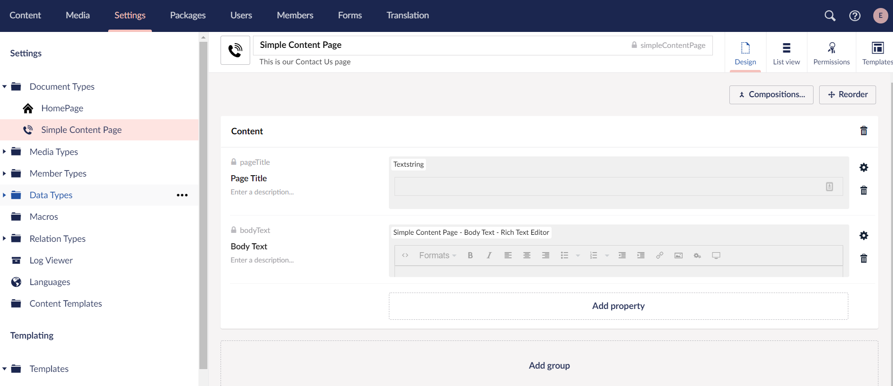

# Creating Pages and Using the Master Template - Part 2

## Creating a Contact Us Page

We are now going to create a page where we put our contact details. For added functionality, you might want to look at replacing this with a fully fledged contact us form.

Some potential solutions:

* If you're not a programmer you can use the Umbraco built-in package - Umbraco Forms. Umbraco Forms has the added benefit that editors can also create their own forms. Find more information and purchase the product through [Umbraco Apps](https://umbraco.com/apps/umbraco-forms/).
* Build your own contact form using [Surface Controllers](../../../Reference/Templating/Mvc/forms/#creating-the-surfacecontroller-action) or the [Surface Controller chapter](https://umbraco.tv/videos/umbraco-v7/developer/fundamentals/surface-controllers/the-surface-controller/) on UmbracoTV.

### Creating the Document Type and Template

Let's create a content-only contact page where we can provide a title and some rich text.

1. Go to **Settings**.
2. In the **Settings** pane, click the **...** next to the **Document Types** in the tree.
3. Click **Document Type with Template**. The document type opens in the content editor.
4. Select an **Icon** from the list of icons.
5. Enter a **Name**. Let's call it _Simple Content Page_.
6. Enter a Description.  
7. Let's add two fields with the following specifications:
    | Group   | Field Name | Alias     | Data Type        |
    |---------|------------|-----------|------------------|
    | Content | Page Title | pageTitle | Textstring       |
    | Content | Body Text  | bodyText  | Rich Text Editor |

    
8. Click **Save**.
9. Go to **Templates** to view your new Simple Content Page template that was created automatically with the Document Type.  
10. Click on the **Simple Content Page** template and then select **Master** as the **Master template**.
11. Click **Save**.  
12. Add the following HTML to the template and click **Save**.

    ```html
    <!-- Jumbotron, w title -->
        <div class="jumbotron text-center jumbotron-fluid">
                <div class="container">
                    <h1 class="display-1">Umbraco Support</h1>
                </div>
            </div>

    <!-- Main -->
    <section id="main" class="wrapper">
        <div class="container">

            <p>Are you a developer?</p>
            <p>Are you a marketer?</p>
            <p>Are you working at an agency?</p>
            <p>Let Umbraco unleash your talent</p>
        </div>
    </section>        
    ```

### Updating the Document Type Permissions

To update the document type permissions, follow these steps:

1. Go to **Settings**.
2. Open the **Homepage** document type and go to the **Permissions** tab.
3. In the **Allowed child node types**, click **Add child**. The **Choose child node** window opens.
4. Select **Simple Content Page** and click **Save**.
    

### Creating the content node

To create a content node:

1. Go to **Content**.
2. Click on **...** next to the **Homepage** and select **Simple Content Page**.
3. Enter a name for the document type. Let's call it _Contact Us_.
4. Fill in details for the **Page Title** and **Body Text**.
5. Click **Save and Publish**.

### Adding the Document Type Properties

To add the document type properties:

1. Go to **Settings**.
2. In the **Templating** section, select **Templates** and open the **Simple Content Page** template.
3. Scroll down to the `<!-- Jumbotron, w title -->` section and highlight the text `“Umbraco Support”`.
4. Click **Insert** and select **Value**.
5. In the **Value** window, select the **pageTitle** field from the drop-down list.
6. Repeat the same process for the content in the `<p></p>` tags of the `<div>` using the field **bodyText**.
7. Click **Save**.

## Using Document Type Properties from the Homepage

You may notice that the footer is now empty - we don't have the content from our Homepage node.

To use the document type properties from the homepage, do the following:

1. Go to **Settings**.
2. In the **Templating** section, select **Templates** and open the **Master** template.
3. Highlight `@Model.Value("footerText")` in the footer and click **Insert**.
4. Select **Value** and choose the footerText again from the **Choose field** dropdown.
5. Select **Yes, make it recursive** checkbox. This notifies Umbraco to look up the content tree if the field doesn't exist at the node level for the page we're requesting.
6. Click **Submit**.
7. Click **Save**.

---

Prev: [Creating Master Template Part 1](../Creating-Master-Template-Part-1) &emsp; &emsp; &emsp; &emsp; &emsp; &emsp; &emsp; &emsp; &emsp; &emsp; &emsp; &emsp; &emsp; &emsp; &emsp; &emsp; &emsp; &emsp; &emsp; &emsp; &emsp; &emsp; Next: [Master Template The Navigation Menu](../Master-Template-The-Navigation-Menu)