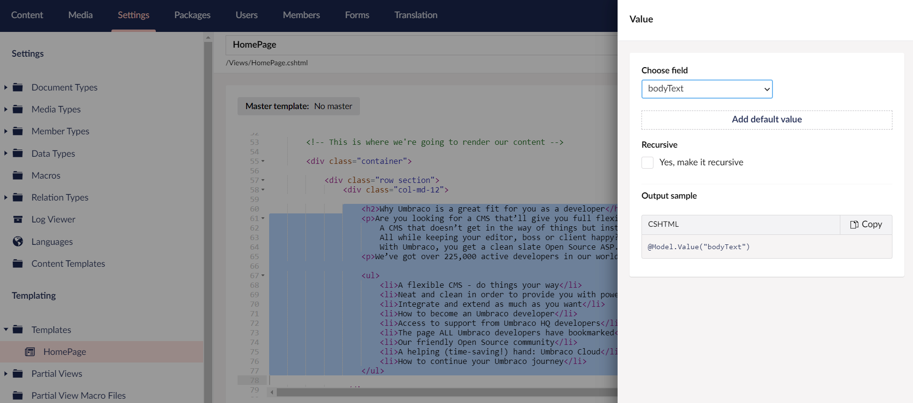
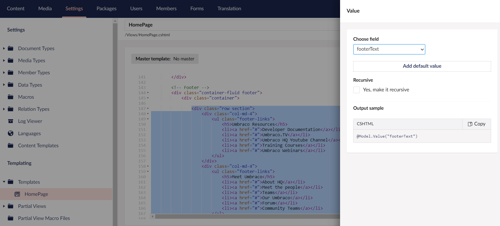

# Displaying the Document Type Properties

You might have noticed that the content we've added to the homepage is not being displayed. We need to wire up the data type properties to the template.  

Let’s look at our template and identify where the content should be displayed.

The top arrow in this image is the "Page Title" and the bottom arrow is the "Body Text", whereas the Footer is all the way at the bottom.

## Setting the Document Type Properties

To set the document type properties:

1. Go to **Settings**.
2. In the **Templating** section, select **Templates** and open the **Homepage** template.
3. Scroll down to the `<!-- Jumbotron, w title -->` section and highlight the text `“Welcome - UmbracoTV”`.
    
4. Click **Insert** and select **Value**.
5. In the **Value** window, select the **pageTitle** field from the drop-down list.
    
6. Repeat the same process for the content in the `

` tags on the next line using the field **bodyText**.
    
7. Finally, we will remove the static text and replace the content in the footer between the `<li></li>` tags.
    
8. Click **Save**.

Now, reload your homepage to view the content. You can go back and add additional fields in the document type, fill them out in the content node and then add them in the template to display the data in the website.

---

Prev: [CSS and Images](../CSS-And-Images) &emsp; &emsp; &emsp; &emsp; &emsp; &emsp; &emsp; &emsp; &emsp; &emsp; &emsp; &emsp; &emsp; &emsp; &emsp; &emsp; &emsp; &emsp; &emsp; &emsp; &emsp; &emsp; &emsp; &emsp; &emsp; &emsp; &emsp; &emsp; Next: [Creating Master Template Part 1](../Creating-Master-Template-Part-1)