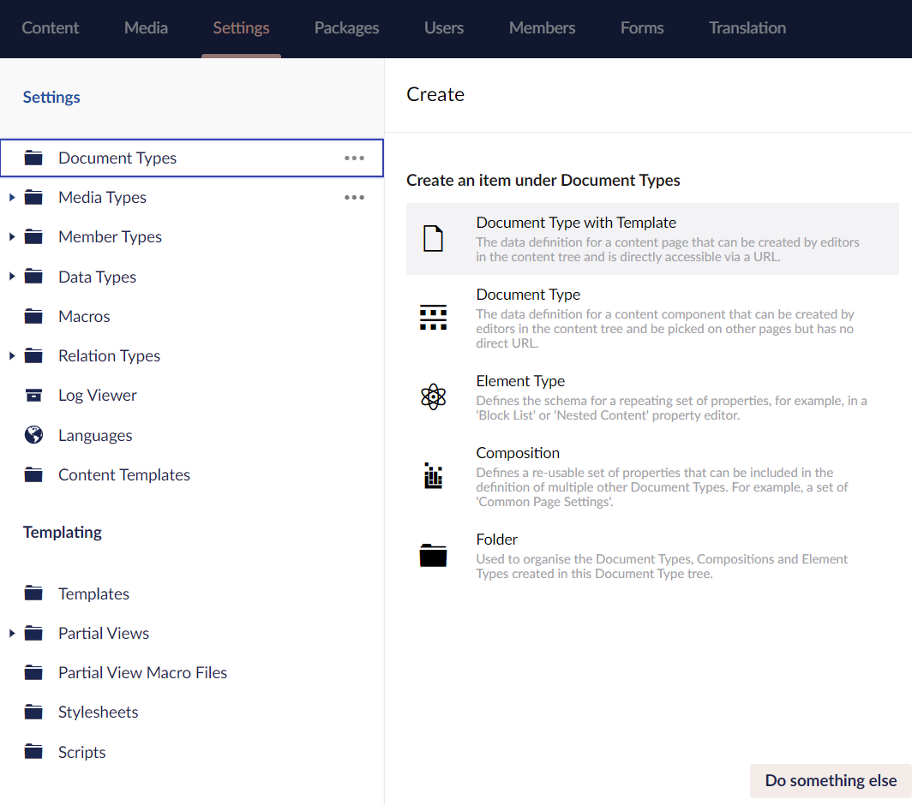
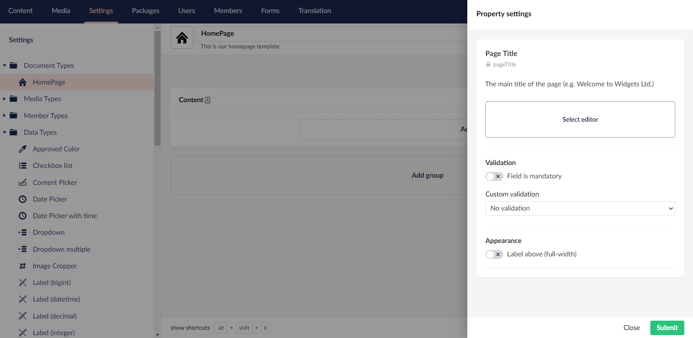
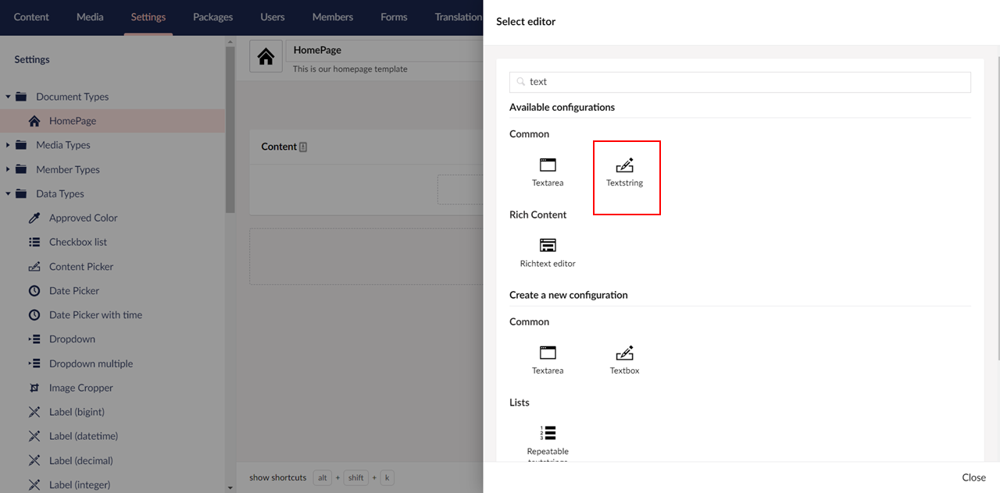
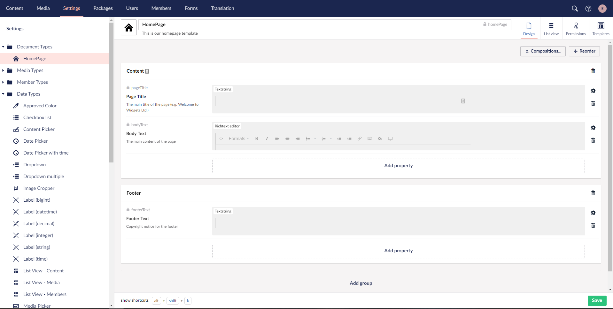

# Document Types

The first step in any Umbraco site is to create a **Document Type**. A **Document Type** is a data container in Umbraco where you can add **Properties** (data fields/attributes) to input data. Each **Property** has a **Data Type** like text string, number, or rich text body. Umbraco outputs the input data using **Templates**.

These are some of the most common properties you would add to a **Document Type**:

* Page title
* Sub Heading
* Body Text
* Meta Title
* Meta Description

## Creating a Document Type

To create a Document Type:

1. Go to **Settings**.
2. Select the **...** next to the **Document Types** in the **Settings** tree.
    
3. Select **Document Type with Template**.

    :::tip
    Using folders can help you organise your **Document Types**.
    :::
4. Enter a **Name** for the **Document Type**. Let's call it _HomePage_. You'll notice that an **Alias** is automatically created.
5. Enter the **Description**. For example: _This is our homepage template_. The description helps to identify the correct **Document Type** when creating new **Content Nodes** in the **Content Section**.
6. Click **Save**. Our new Document Type is now visible as a new item under **Document types**.
    

## Customizing the Document Type

### Adding icons

With the help of icons, you can identify different Document Types in the **Content Tree**. To add an icon:

1. Select the icon placeholder next to the document name. The **Select Icon** dialog appears on the right-side of the website.
   
2. Browse through the icon list and selct the icon of your choice.
3. Click **Submit**.  

### Setting Permissions

To create a Document Type at the root of the **Content Tree**:

1. Go to the **Permissions** tab.
    
2. Toggle the **Allow as root** button.  

    :::note
    If your **Document Types** do not have the **Allow as root** checked, you will not be able to create any content on your site.
    :::
3. Click **Save**.

### Adding Properties

To add properties to your Document Type, follow these steps:

1. Go to the **Design** tab.
2. Select **Add Group** and enter a name for the group. For this tutorial, we will call it _Content_.
    
3. Select **Add property**. The **Property Settings** dialog opens.
4. Enter a **Name**. For example: _Page Title_.
5. Enter a **Description**. For example: _The main title of the page (e.g. Welcome to Widgets Ltd.)_".
    
6. Select **Add Editor** and select the Data Type of your choice. We'll add _text_ in the search box and select the **Textstring** Data Type.
    
7. Click **Submit**.

    :::tip
    Remember to come back and explore the list of **_Data Types_** later.
    :::
8. Repeat Steps 3 to 7 using the specification below:

    | Name        | Body Text                     |
    |-------------|-------------------------------|
    | Group       | Content                       |
    | Alias       | bodyText                      |
    | Description | The main content of the page. |
    | Data Type   | Richtext Editor               |

9. Select **Add Group** to create a new group called Footer. Repeat Steps 3 to 7 using the specification below:

    | Name        | Footer Text                      |
    |-------------|----------------------------------|
    | Group       | Footer                           |
    | Alias       | footerText                       |
    | Description | Copyright notice for the footer. |
    | Data Type   | Textstring                       |

10. Your Document Type should now look like this:

11. Click **Save**.

We’ve now created our first **Document Type**. Umbraco takes the data from an instance of the **_Document Type_** (also called as **_Content Node_**) and merges it with a **_Template_** – we’ll create our template next.

---

Prev: [Getting Started](../Getting-Started) &emsp; &emsp; &emsp; &emsp; &emsp; &emsp; &emsp; &emsp; &emsp; &emsp; &emsp; &emsp; &emsp; &emsp; &emsp; &emsp; &emsp; &emsp; &emsp; &emsp; &emsp; &emsp; &emsp; Next: [Creating Your First Template and Content Node](../Creating-Your-First-Template-and-Content-Node)