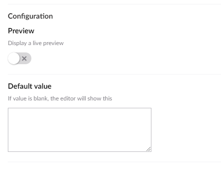

# Adding configuration to a property editor

## Overview

This is step 2 in our guide to building a property editor. This step continues work on the markdown editor we built in [step 1](index.md), but goes further to show how to add configuration options to our editor.

## Configuration

An important part of building good property editors is to build something relatively flexible, so we can reuse it many times, for different things. Like the Rich Text Editor in Umbraco, that allows us to choose which buttons and stylesheets we want to use on each instance of the editor.

So an editor can be used several times, with different configurations, and that is what we will be working on now. 

There are two ways to add configuration to the property editor. If in the previous step you chose to create the property editor using a `package.manifest` file, read the `package.manifest` section below. If you have chosen the `c#` variant, read the `c#` part of the article.

## package.manifest

To add configuration options to our markdown editor, open the `package.manifest` file. Right below the editor definition, paste in the prevalues block:

```javascript
...
editor: {
    view: "~/App_Plugins/MarkDownEditor/markdowneditor.html"
}, // Remeber a comma seperator here at the end of the editor block!
prevalues: {
    fields: [
        {
            label: "Preview",
            description: "Display a live preview",
            key: "preview",
            view: "boolean"
        },
        {
            label: "Default value",
            description: "If value is blank, the editor will show this",
            key: "defaultValue",
            view: "textarea"
        }
    ]
}
```


## C# 

It is also possible to add configuration if you have chosen to create a property editor using C#. Create two new files in the `/App_Code/` folder and update the existing `MarkdownEditor.cs` file to add configuration to the property editor.

First create a `MarkdownConfiguration.cs` file: 

```csharp
using Umbraco.Core.PropertyEditors;

namespace Umbraco.Web.UI
{
    public class MarkdownConfiguration
    {
        [ConfigurationField("preview", "Preview", "boolean", Description = "Display a live preview")]
        public bool Preview { get; set; }

        [ConfigurationField("defaultValue", "Default value", "textstring", Description = "Set the default value here")]
        public string DefaultValue { get; set; }
    }
}
```

Then create a `MarkdownConfigurationEditor.cs` file: 

```csharp
using Umbraco.Core.PropertyEditors;

namespace Umbraco.Web.UI
{
    public class MarkdownConfigurationEditor : ConfigurationEditor<MarkdownConfiguration>
    {
    }
}
```
Finally, edit the `MarkdownEditor.cs` file from step one until it looks like the example below:

```csharp
using Umbraco.Core.Logging;
using Umbraco.Core.PropertyEditors;

namespace Umbraco.Web.UI
{
    [DataEditor(
        alias:"My.MarkdownEditor",
        name:"My markdown editor",
        view:"~/App_Plugins/MarkDownEditor/markdowneditor.html",
        Group = "Rich Content",
        Icon = "icon-code")]
    public class MarkdownEditor : DataEditor
    {
        public MarkdownEditor(ILogger logger)
            : base(logger)
        { }
		
		protected override IConfigurationEditor CreateConfigurationEditor()
        {
            return new MarkdownConfigurationEditor();
        }

    }
}
```

So what did we add? We added a prevalue editor, with a `fields` collection. This collection contains information about the UI we will render on the data type configuration for this editor.

So the first one gets the label "Preview" and uses the view "boolean", so this will allow us to turn preview on/off and will provide the user with a checkbox. The name "boolean" comes from the convention that all preview editors are stored in `/umbraco/views/prevalueeditors/` and then found via `<name>.html`

Same with the next one, only that it will provide the user with a textarea to input a default value for the editor.

Save the manifest, **restart the app pool** and have a look at the markdown data type in Umbraco now. You should now see that you have 2 configuration options:



## Using the configuration

The next step is to gain access to our new configuration options. For this, open the `markdowneditor.controller.js` file.

Let's first add the default value functionality. When the `$scope.model.value` is empty or *undefined*, we want to use the default value. To do that, we add the following to the very beginning of the controller:

```javascript
if($scope.model.value === null || $scope.model.value === ""){
    $scope.model.value = $scope.model.config.defaultValue;
}
```

See what's new? - the `$scope.model.config` object is. Also, because of this configuration, we now have access to `$scope.model.config.defaultValue` which contains the configuration value for that key.

However, we may also use these values without using JavaScript, by opening the `markdowneditor.html` file instead.

Here we can use the configuration directly in our HTML instead, where we use it to toggle the preview `<div>`, using the `ng-show` attribute:

```html
<div id="wmd-preview-{{model.alias}}" ng-show="{{model.config.preview}}" class="wmd-panel wmd-preview"></div>
```

[Next - Integrating services with a property editor](part-3.md)
