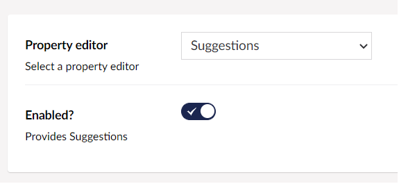

# Adding configuration to a property editor

## Overview

This is step 2 in our guide to building a property editor. This step continues work on the suggestion data type we built in [step 1](index-v9.md), but goes further to show how to add configuration options to our editor.

## Configuration

An important part of building good property editors is to build something relatively flexible, so we can reuse it many times, for different things. Like the Rich Text Editor in Umbraco, that allows us to choose which buttons and stylesheets we want to use on each instance of the editor.

So an editor can be used several times, with different configurations, and that is what we will be working on now.

There are two ways to add configuration to the property editor. If in the previous step you chose to create the property editor using a `package.manifest` file, read the `package.manifest` section below. If you have chosen the `c#` variant, read the `c#` part of the article.

## package.manifest

To add configuration options to our suggestion data type, open the `package.manifest` file. Right below the editor definition, paste in the prevalues block:

```json
...
"editor": {
                "view": "~/App_Plugins/Suggestions/suggestion.html"
            }, // Remeber a comma seperator here at the end of the editor block!
 "prevalues": {
                "fields": [
                    {
                        "label": "Enabled?",
                        "description": "Provides Suggestions",
                        "key": "isEnabled",
                        "view": "boolean"
                    }
                ]
            }
```

## C# 

It is also possible to add configuration if you have chosen to create a property editor using C#. Create two new files in the `/App_Code/` folder and update the existing `Suggestion.cs` file to add configuration to the property editor.

First create a `SuggestionConfiguration.cs` file:

```csharp
namespace Umbraco.Cms.Core.PropertyEditors
{
    public class SuggestionConfiguration
    {
        [ConfigurationField("isEnabled", "Enabled?", "boolean", Description = "Provides Suggestions")]
        public bool Enabled { get; set; }
    }
}
```

Then create a `SuggestionConfigurationEditor.cs` file:

```csharp
using Umbraco.Cms.Core.IO;

namespace Umbraco.Cms.Core.PropertyEditors
{
     public class SuggestionConfigurationEditor : ConfigurationEditor<SuggestionConfiguration>
    {
        public SuggestionConfigurationEditor(IIOHelper ioHelper) : base(ioHelper)
        {
        }
    }

}
```

Finally, edit the `Suggestion.cs` file from step one until it looks like the example below:

```csharp
using Umbraco.Cms.Core.IO;

namespace Umbraco.Cms.Core.PropertyEditors
{
    [DataEditor(
        alias: "Suggestions editor",
        name: "Suggestions Editor",
        view: "~/App_Plugins/Suggestions/suggestion.html",
        Group = "Common",
        Icon = "icon-list")]
    public class Suggestions : DataEditor
    {
        private readonly IIOHelper _ioHelper;
        public Suggestions(IDataValueEditorFactory dataValueEditorFactory,
            IIOHelper ioHelper)
            : base(dataValueEditorFactory)

        {
            _ioHelper = ioHelper;
        }
        protected override IConfigurationEditor CreateConfigurationEditor() => new SuggestionConfigurationEditor(_ioHelper);
        
    }
}
```

So what did we add? We added a prevalue editor, with a `fields` collection. This collection contains information about the UI we will render on the data type configuration for this editor.

The label "Enabled?" uses the view "boolean", so this will allow us to turn the suggestions on/off and will provide the user with a toggle button. The name "boolean" comes from the convention that all preview editors are stored in `/umbraco/views/prevalueeditors/` and then found via `boolean.html`

Save the manifest, restart the application and have a look at the markdown data type in Umbraco now. You should now see that you have 1 configuration option:



## Using the configuration

The next step is to gain access to our new configuration options. For this, open the `suggestion.controller.js` file.

Let's first add the default value functionality. When the `$scope.model.value` is empty or *undefined*, we want to use the default value. To do that, we add the following to the very beginning of the controller:

```javascript
if($scope.model.value === null || $scope.model.value === ""){
    $scope.model.value = $scope.model.config.defaultValue;
}
```

and then at the end we add a getState method:

```javascript
    // The controller assigns the behavior to scope as defined by the getState method, which is invoked when the user toggles the enable button in the data type settings.
    $scope.getState = function () {
        
        //If the data type is enabled in the Settings the 'Give me Suggestions!' button is enabled
        if ($scope.model.config.isEnabled === "1") {
            return false;
        }
        return true;
    }
```

See what's new? - the `$scope.model.config` object. Also, because of this configuration, we now have access to `$scope.model.config.defaultValue` which contains the configuration value for that key.

[Next - Integrating services with a property editor](part-3-v9.md)
