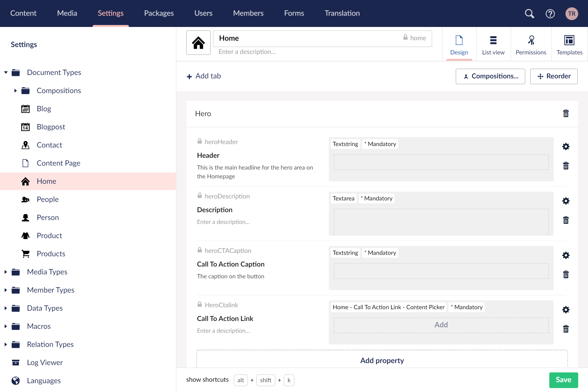

# Using Tabs

In this section, you will get an overview of how to add a tab, sort and reorder tabs, and convert a group to a tab.

## Adding a Tab

Using Tabs, you can organize properties in the backoffice to provide a tailored and efficient workflow for editors creating and maintaining Content, Media, and Members. 

Tabs allow you to add horizontal organization in your Document Types and is quite handy for Content Types that need a more defined hierarchy or have many properties and groups.

To add a Tab, follow these steps:

1. Go to **Settings**.
2. Create or Select a **Document Type/Media/Member Type** and click **Add Tab**.

    

:::note
When adding the first tab, all existing groups are automatically added to the tab.
:::

## Sorting and Reordering Tabs

To sort a Tab, follow these steps:

1. Go to **Settings**.
2. Select a **Document Type/Media/Member Type**.
3. Select **Reorder**.
4. You can manually add a numeric value next to the Tab name. This is important when using compositions, as you might want to always display a tab/group at a certain position by setting a manual numeric value.
    
5. Select **I am done reordering**.
6. Click **Save**.

To reorder Tabs, follow these steps:

1. Go to **Settings**.
2. Select a **Document Type/Media/Member Type**.
3. Select **Reorder**.
4. You can drag and position the Tab where you want.
    
5. Select **I am done reordering**.
6. Click **Save**.

## Convert a Group to a Tab

To convert a group to a tab, follow these steps:

1. Go to **Settings**.
2. Select a **Document Type/Media/Member Type**.
3. Select **Reorder**.
4. You can drag the Group to the **Convert to Tab** option.
    
5. Select **I am done reordering**.
6. Click **Save**.

---

Prev: [Creating, Saving and Publishing Content](../Creating-Saving-and-Publishing-Content/index.md) &emsp; &emsp; &emsp; &emsp; &emsp; &emsp; &emsp; &emsp; &emsp; &emsp; &emsp; &emsp; &emsp; &emsp; &emsp; &emsp; &emsp; Next: [Finding Content](../Finding-Content/index.md)
